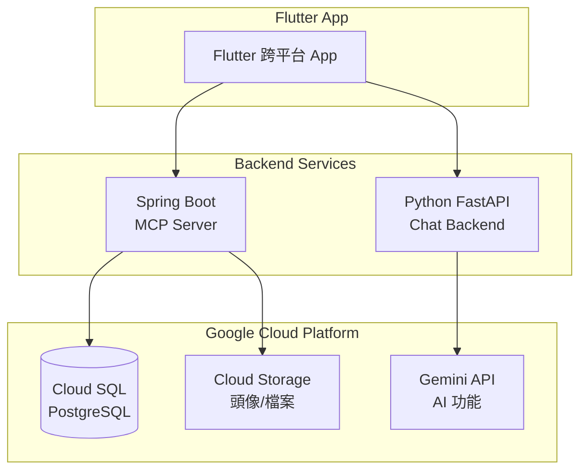

# Toastlabplus Project

> Flutter 跨平台會議管理 App + Google Cloud 後端服務

ToastLabPlus 是專為 Toastmasters 國際演講會設計的會議管理系統，支援多分會管理、會議角色報名、Agenda 自動產生等功能。

## 功能總覽

### ✅ 已實現功能

| 功能模組 | 說明 |
|----------|------|
| 🔐 **使用者認證** | 註冊、登入、JWT Token 驗證 |
| 👤 **個人檔案** | 頭像上傳 (GCP Storage)、個人資訊編輯 |
| 🏢 **分會管理** | 建立分會、編輯分會資訊、刪除分會 |
| 👥 **會員管理** | 會員加入申請、審核 (Approve/Reject) |
| 🎖️ **多分會管理** | Club Admin 可同時管理多個分會 |
| 🔔 **通知系統** | 通知圖示 (UI 占位符) |

### 🚧 開發中 / 未來功能

| 功能模組 | 說明 | 優先級 |
|----------|------|--------|
| 📅 **會議管理** | 建立會議、設定日期時間地點 | 高 |
| 🎭 **角色報名** | 會員報名會議角色 (TME, Speaker 等) | 高 |
| 📝 **Agenda 產生** | AI 自動產生會議議程 (Gemini) | 高 |
| 🗳️ **會議投票** | 即時投票機制 (SSE) | 中 |
| 💬 **即時聊天** | 分會內部聊天功能 | 中 |
| 📲 **推播通知** | Firebase Cloud Messaging | 中 |
| 📊 **數據分析** | 會員參與統計、角色報名趨勢 | 低 |

---

## 系統架構



### 權限架構

| 角色 | 說明 | 權限範圍 |
|------|------|----------|
| `PLATFORM_ADMIN` | 平台管理員 | 全域，可管理所有 clubs |
| `CLUB_ADMIN` | 分會管理員 | 可管理被指派的多個 clubs |
| `MEMBER` | 一般會員 | 可加入多個 clubs |

---

## 專案結構

```
toastlabplus/
├── backend/
│   ├── mcp-server/       # Spring Boot MCP Server
│   └── chat-backend/     # Python Chat Backend (FastAPI)
├── mobile/
│   └── toastlabplus_app/ # Flutter App
├── infrastructure/
│   ├── terraform/        # GCP IaC
│   └── scripts/          # 部署腳本
└── docs/                  # 實作計畫文件 (12 章節)
```

---

## 實作計畫文件

詳細設計文件請參考以下章節：

1. [系統架構與資料流](./docs/01-architecture.md)
2. [使用者註冊與身分選擇](./docs/02-user-registration.md)
3. [角色權限設計](./docs/03-permissions.md)
4. [會議管理細部流程](./docs/04-meeting-management.md)
5. [會議角色註冊流程](./docs/05-role-registration.md)
6. [Agenda 模板管理與產生](./docs/06-agenda.md)
7. [會議投票機制](./docs/07-voting.md)
8. [通知系統設計](./docs/08-notification.md)
9. [資料庫設計](./docs/09-database.md)
10. [技術棧與部署](./docs/10-deployment.md)
11. [功能雛型畫面](./docs/11-ui-mockups.md)
12. [附錄](./docs/12-appendix.md)

---

## 版本歷史

| 版本 | 日期 | 變更說明 |
|------|------|----------|
| **v1.8** | 2025-12-13 | 多分會管理架構（一位使用者可同時管理多個分會）|
| **v1.7** | 2025-12-10 | 功能細節完善與 UI 更新（FCM 通知、Gemini 3 Pro、宮崎駿風格 UI）|
| **v1.6** | 2025-12-10 | 文件拆分為多章節 |
| **v1.5** | 2025-12-09 | 改用 Gemini Developer API |
| **v1.4** | 2025-12-09 | 遷移至 Google Cloud Platform |
| **v1.3** | 2025-12-06 | 新增基礎設施與部署策略（Azure 版本）|
| **v1.2** | 2025-12-06 | 新增會議投票機制 |
| **v1.1** | 2025-12-06 | 新增細部流程設計 |
| **v1.0** | 2025-12-06 | 初版完成，包含完整系統架構與功能設計 |

---

## 開發環境設定

### Flutter App
```bash
cd mobile/toastlabplus_app
flutter run -d chrome
```

### MCP Server (Spring Boot)
```bash
cd backend/mcp-server
./mvnw spring-boot:run
```

### Chat Backend (Python)
```bash
cd backend/chat-backend
pip install -r requirements.txt
uvicorn src.main:app --reload
```

---

## GCP 服務設定

### Cloud Storage (頭像上傳)

#### 1. 建立 Storage Bucket
```bash
# 建立 bucket (asia-east1 區域)
gcloud storage buckets create gs://toastlabplus-avatars \
  --location=asia-east1 \
  --uniform-bucket-level-access

# 設定公開讀取權限 (讓頭像可被瀏覽器載入)
gcloud storage buckets add-iam-policy-binding gs://toastlabplus-avatars \
  --member=allUsers \
  --role=roles/storage.objectViewer

# 設定 CORS (允許 Flutter Web 載入圖片)
# 需先建立 cors.json 檔案:
# [{"origin": ["*"], "method": ["GET", "HEAD"], "responseHeader": ["Content-Type"], "maxAgeSeconds": 3600}]
gcloud storage buckets update gs://toastlabplus-avatars --cors-file=cors.json
```

#### 2. 建立 Service Account
```bash
# 建立服務帳號
gcloud iam service-accounts create toastlabplus-storage \
  --display-name="ToastLabPlus Storage Service"

# 授予 storage.objectAdmin 權限
gcloud storage buckets add-iam-policy-binding gs://toastlabplus-avatars \
  --member=serviceAccount:toastlabplus-storage@toastlabplus.iam.gserviceaccount.com \
  --role=roles/storage.objectAdmin

# 產生 JSON 金鑰檔案 (放在 resources 資料夾)
gcloud iam service-accounts keys create \
  backend/mcp-server/src/main/resources/gcp-storage-key.json \
  --iam-account=toastlabplus-storage@toastlabplus.iam.gserviceaccount.com
```

#### 3. 環境變數配置 (可選)
```bash
# 在其他環境設定金鑰路徑
export GOOGLE_APPLICATION_CREDENTIALS=/path/to/gcp-storage-key.json

# 變更 bucket 名稱
export GCP_BUCKET_NAME=your-bucket-name

# 停用 GCP Storage (預設為啟用)
export GCP_STORAGE_ENABLED=false
```

> ⚠️ **注意**: `gcp-storage-key.json` 已加入 `.gitignore`，不會被提交到 Git。