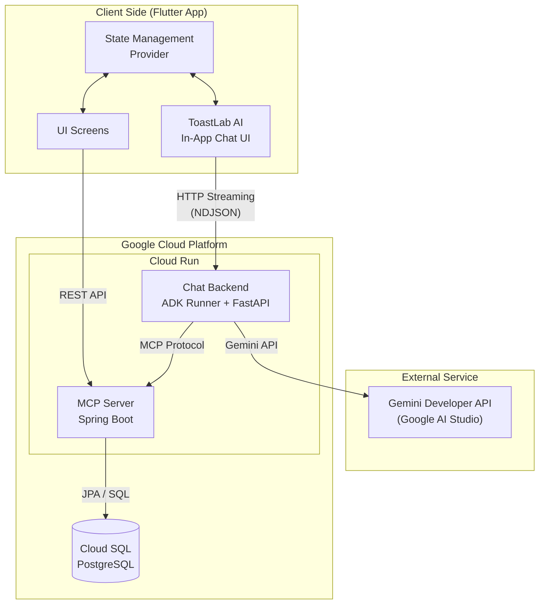

# 1. 系統架構與資料流

[← 返回目錄](../README.md)

---

## 1.1 架構概述

本系統採用前後端分離架構，以 Google Cloud Platform 為核心雲端平台。

**核心組件**:
- **Client Side**: 使用 Flutter 建構跨平台 App，包含標準 UI 操作介面與 ToastLab AI 聊天介面
- **AI Service**: 透過 Google Agent Development Kit (ADK) 建構 Chat Backend，整合 Gemini API 與 MCP 工具，支援 NDJSON 串流回應與思考過程透明化
- **Core Backend**: Spring Boot MCP Server 作為核心資料服務，處理所有業務邏輯與資料庫存取
- **Database**: 使用 Cloud SQL (PostgreSQL)，兼顧效能與成本效益

## 1.2 系統架構圖

---

[下一章：使用者註冊與身分選擇 →](./02-user-registration.md)
