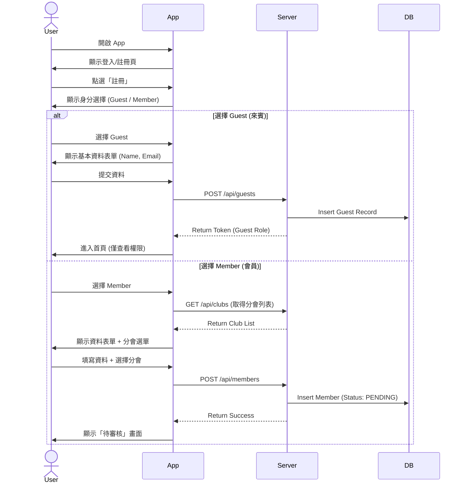
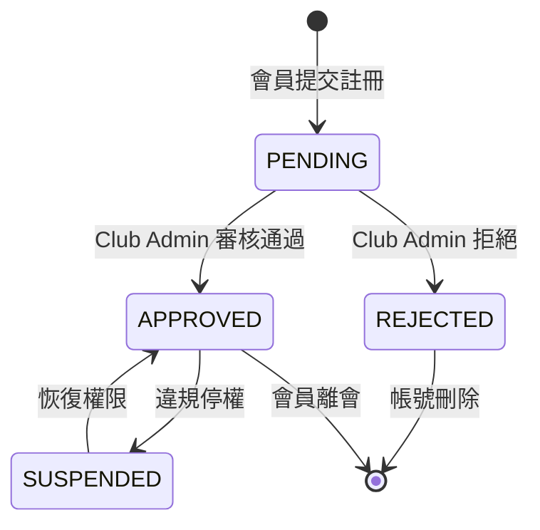
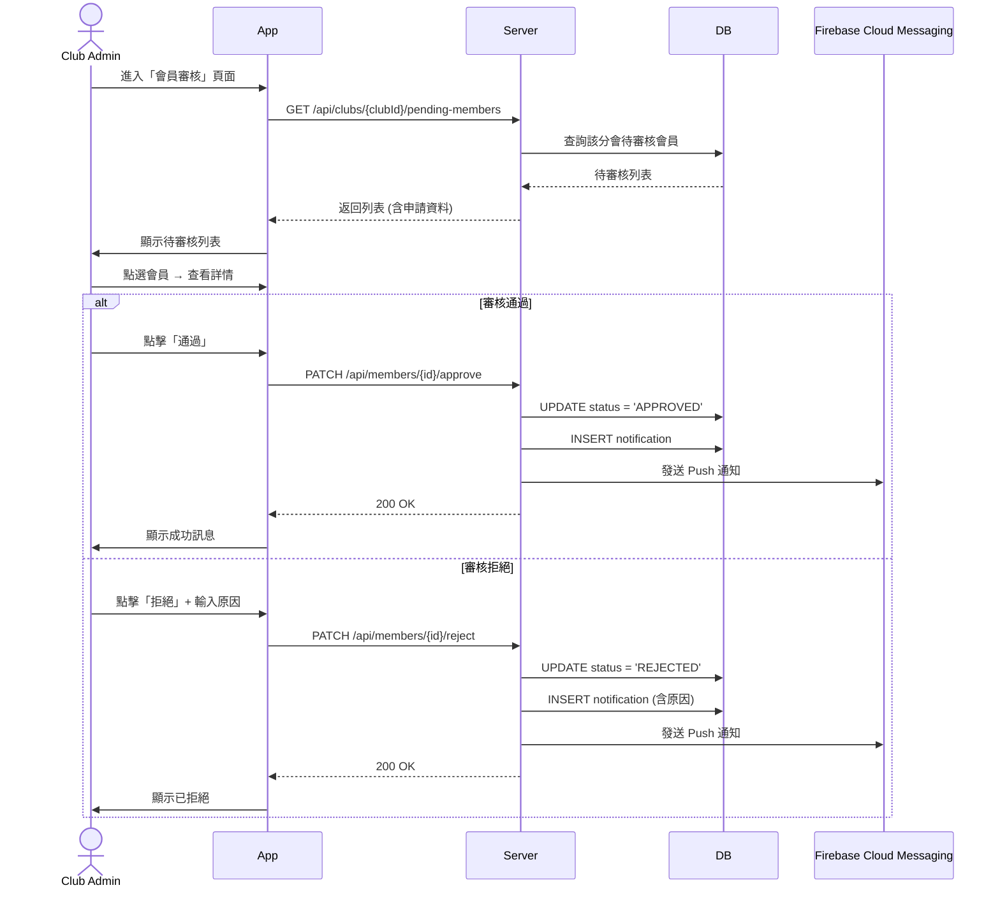
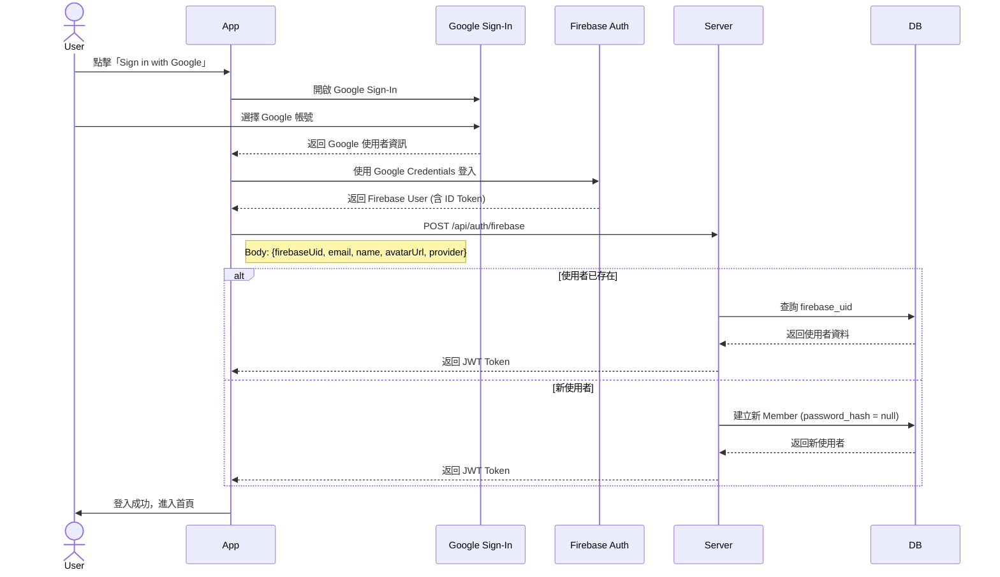

# 2. 使用者註冊與身分選擇

[← 返回目錄](../README.md) | [← 上一章](./01-architecture.md)

---

## 2.1 註冊流程

系統支援多種身分註冊，確保不同角色的使用者能獲得對應的權限與功能。

**註冊步驟**:

1. **註冊入口**: 使用者下載 App 後，可選擇「註冊新帳號」

2. **身分選擇**:
   - **Guest (來賓)**: 適用於非 Toastmasters 會員或參觀者
     - 僅需填寫基本姓名與 Email
     - 註冊後可瀏覽公開會議資訊
     - 無法報名角色
   
   - **Member (會員)**: 適用於正式會員
     - 註冊時需選擇所屬分會 (Club)
     - 提交後狀態為 `PENDING`
     - 需等待分會管理員審核通過後才能啟用完整功能（如報名角色）

3. **平台管理員**: 系統預設一組最高權限帳號，用於建立分會與指派初始管理員

## 2.2 註冊流程圖



## 2.3 會員審核狀態機



## 2.4 審核操作流程



## 2.5 審核通知機制

| 事件 | 通知對象 | 通知方式 | 內容 |
|:---|:---|:---|:---|
| 新申請提交 | Club Admin | App 通知 + Push | 「有新會員申請加入」 |
| 審核通過 | 申請者 | App 通知 + Push | 歡迎訊息 + 功能導覽 |
| 審核拒絕 | 申請者 | App 通知 + Push | 拒絕原因 + 重新申請引導 |
| 審核超時 (7天未處理) | Club Admin | App 通知 + Push | 提醒處理待審核申請 |

---

[下一章：角色權限設計 →](./03-permissions.md)

---

## 2.6 Google 登入 (v0.1.6+)

系統支援透過 Google 帳號快速登入，無需記憶密碼。

### 登入流程



### 設定 Google Sign-In

#### 1. Firebase Console 設定

1. 前往 [Firebase Console](https://console.firebase.google.com/)
2. 選擇專案 → **Authentication** → **Sign-in method**
3. 啟用 **Google** 登入提供者
4. 設定 Support email

#### 2. Flutter 前端設定

**pubspec.yaml:**
```yaml
dependencies:
  firebase_core: ^3.8.1
  firebase_auth: ^5.3.4
  google_sign_in: ^6.2.2
```

**web/index.html (Web 平台):**
```html
<meta name="google-signin-client_id" content="YOUR_WEB_CLIENT_ID.apps.googleusercontent.com">
```

**lib/firebase_options.dart:**
使用 FlutterFire CLI 自動產生：
```bash
flutterfire configure
```

#### 3. 後端設定

**FirebaseAuthController.java** 處理 Firebase 登入請求：
- 驗證 Firebase ID Token
- 建立或更新使用者資料
- 返回 JWT Token

**資料庫欄位 (V5 Migration):**
```sql
ALTER TABLE member ADD COLUMN auth_provider VARCHAR(20) DEFAULT 'LOCAL';
ALTER TABLE member ADD COLUMN firebase_uid VARCHAR(128);
ALTER TABLE member ALTER COLUMN password_hash DROP NOT NULL;
```

### 安全考量

| 項目 | 說明 |
|------|------|
| `firebase_uid` | 唯一索引，確保一個 Firebase 帳號只對應一個使用者 |
| `auth_provider` | 記錄登入方式 (`LOCAL` / `GOOGLE` / `FACEBOOK`) |
| `password_hash` | 社交登入使用者此欄位為 null |
| Token 驗證 | 後端使用 Firebase Admin SDK 驗證 ID Token |

---

[下一章：角色權限設計 →](./03-permissions.md)
