# 3. 角色權限設計

[← 返回目錄](../README.md) | [← 上一章](./02-user-registration.md)

---

## 3.1 權限階級

系統定義了四種權限階級，嚴格控管功能存取：
- **Platform Admin** (平台管理員)
- **Club Admin** (分會管理員)
- **Member** (會員)
- **Guest** (來賓)

## 3.2 資料可視範圍原則

系統採用「分會隔離」原則，確保各分會資料互不可見。

```mermaid
flowchart TB
    subgraph Visibility ["可視權限架構"]
        PA["Platform Admin<br/>👑 全平台可視"]
        CA["Club Admin<br/>🏠 本會可視"]
        MB["Member<br/>👤 本會資料"]
        GT["Guest<br/>👁️ 公開資料"]
    end
    
    PA --> |"管理所有分會"| AllClubs["所有分會資料"]
    CA --> |"僅管理本會"| OwnClub["本分會資料"]
    MB --> |"僅查看本會"| OwnClub
    GT --> |"僅公開資訊"| PublicInfo["公開會議資訊"]
```



## 3.3 Club Admin 可視權限詳細矩陣

| 資料類型 | 本會資料 | 他會資料 | 說明 |
|:---:|:---:|:---:|:---|
| **會員列表** | ✅ 完整資料 | ❌ 不可見 | 含姓名、Email、狀態、職位 |
| **待審核會員** | ✅ 完整資料 | ❌ 不可見 | 可執行審核操作 |
| **會議列表** | ✅ 完整 | 🔵 僅公開 | 他會僅見已發布的公開會議 |
| **角色報名狀態** | ✅ 含會員姓名 | 🔵 僅統計 | 他會僅見「已報名 X 人」 |
| **Agenda 模板** | ✅ 可編輯 | ❌ 不可見 | 模板屬於各分會私有 |
| **Agenda 文件** | ✅ 可編輯 | 🔵 僅已發布 | 他會僅見最終版 Agenda |
| **分會設定** | ✅ 可編輯 | 🔵 僅基本資訊 | 名稱、聯絡方式等公開資訊 |

## 3.4 API 資料過濾機制

```mermaid
sequenceDiagram
    participant App
    participant API as API Gateway
    participant Auth as Auth Service
    participant MCP as MCP Server
    participant DB
    
    App->>API: GET /api/members (with JWT)
    API->>Auth: 驗證 Token
    Auth-->>API: User Context<br/>(role, clubId)
    
    API->>MCP: 轉發請求 + Context
    
    alt Platform Admin
        MCP->>DB: SELECT * FROM members
        DB-->>MCP: 回傳所有會員
    else Club Admin / Member
        MCP->>DB: SELECT * FROM members<br/>WHERE club_id = :userClubId
        DB-->>MCP: 回傳本會會員
    else Guest
        MCP-->>API: 403 Forbidden
    end
    
    MCP-->>App: 過濾後的資料
```



## 3.5 功能權限矩陣

| 功能模組 | 功能項目 | Platform Admin | Club Admin | Member | Guest |
|:---:|:---|:---:|:---:|:---:|:---:|
| **系統管理** | 新增/刪除分會 | ✅ | ❌ | ❌ | ❌ |
| | 指定分會管理員 | ✅ | ❌ | ❌ | ❌ |
| | 維護角色定義 | ✅ | ❌ | ❌ | ❌ |
| **分會管理** | 審核會員註冊 | ✅ | ✅ | ❌ | ❌ |
| | 指派分會職位 (VPE等) | ✅ | ✅ | ❌ | ❌ |
| | 編輯分會資訊 | ✅ | ✅ | ❌ | ❌ |
| **會議管理** | 建立/編輯會議 | ✅ | ✅ | ❌ | ❌ |
| | 產生/匯出 Agenda | ✅ | ✅ | ❌ | ❌ |
| | 管理 Agenda 模板 | ✅ | ✅ | ❌ | ❌ |
| **角色報名** | 報名會議角色 | ✅ | ✅ | ✅ | ❌ |
| | 取消自己角色 | ✅ | ✅ | ✅ | ❌ |
| | 強制移除他人角色 | ✅ | ✅ | ❌ | ❌ |
| | 代理報名他人 | ✅ | ✅ | ❌ | ❌ |
| **資訊瀏覽** | 查看會議議程 | ✅ | ✅ | ✅ | ✅ |
| | 查看分會資訊 | ✅ | ✅ | ✅ | ✅ |

## 3.6 分會職位

分會管理員可將以下職位指派給會員（一職一人），這些職位在 App 中會有特殊標識，且 VPE 擁有產生 Agenda 的權限：

- **President** (會長)
- **VPE** (教育副會長) - *核心操作者*
- **VPM** (會員副會長)
- **VPPR** (公關副會長)
- **Secretary** (秘書)
- **Treasurer** (財務長)
- **SAA** (場控)

## 3.7 多分會管理架構 (Multi-Club Admin)

> **v1.8 更新** (2025-12-13): 支援一位使用者同時管理多個分會

### 資料庫設計

系統採用「混合方案」支援多分會管理：

```mermaid
erDiagram
    member ||--o{ club_admin : "administers"
    club ||--o{ club_admin : "managed by"
    member ||--o{ club_membership : "joins"
    club ||--o{ club_membership : "has"
    
    member {
        bigint id PK
        string email UK
        string name
        string role "PLATFORM_ADMIN/CLUB_ADMIN/MEMBER"
        bigint club_id FK "主要關聯分會"
        string status "PENDING/APPROVED"
    }
    
    club_admin {
        bigint id PK
        bigint member_id FK
        bigint club_id FK
        timestamp assigned_at
        bigint assigned_by FK
    }
    
    club_membership {
        bigint id PK
        bigint member_id FK
        bigint club_id FK
        string status "PENDING/APPROVED/REJECTED"
    }
```



### 權限判斷邏輯

| 欄位 | 用途 | 說明 |
|------|------|------|
| `member.role` | Spring Security | `@PreAuthorize("hasRole('CLUB_ADMIN')")` 權限檢查 |
| `member.club` | 向後兼容 | 主要關聯的分會 (第一個被指派的 club) |
| `club_admin` 表 | 多分會追蹤 | 所有管理的分會記錄 |
| `adminClubIds` | API 回傳 | 前端顯示管理的分會列表 |

### 指派 Club Admin 流程

```mermaid
sequenceDiagram
    participant PA as Platform Admin
    participant API as MCP Server
    participant DB
    
    PA->>API: PUT /api/members/{id}/assign-club-admin
    Note right of PA: { "clubId": 123 }
    
    API->>DB: 建立 club_admin 記錄
    API->>DB: member.role = 'CLUB_ADMIN'
    API->>DB: member.club = 指派的 club
    API->>DB: 自動建立 club_membership (APPROVED)
    
    API-->>PA: 回傳 MemberDto
    Note left of API: 含 adminClubIds 列表
```



### 前端顯示邏輯

```dart
// HomeScreen 判斷是否為 Club Admin
final adminClubIds = member?['adminClubIds'] as List<dynamic>? ?? [];
final isClubAdmin = adminClubIds.isNotEmpty;

// 過濾管理的分會
final managedClubs = _clubs
    .where((c) => adminClubIds.contains(c['id']))
    .toList();
```

---

[下一章：會議管理細部流程 →](./04-meeting-management.md)
