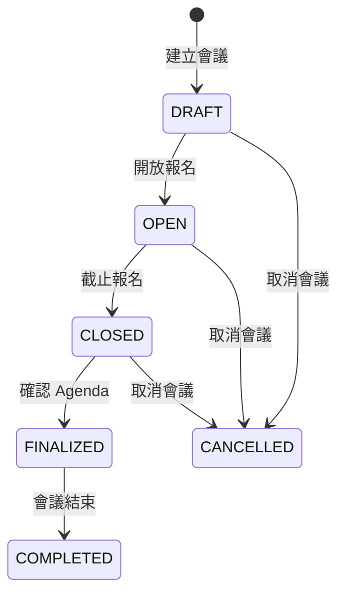
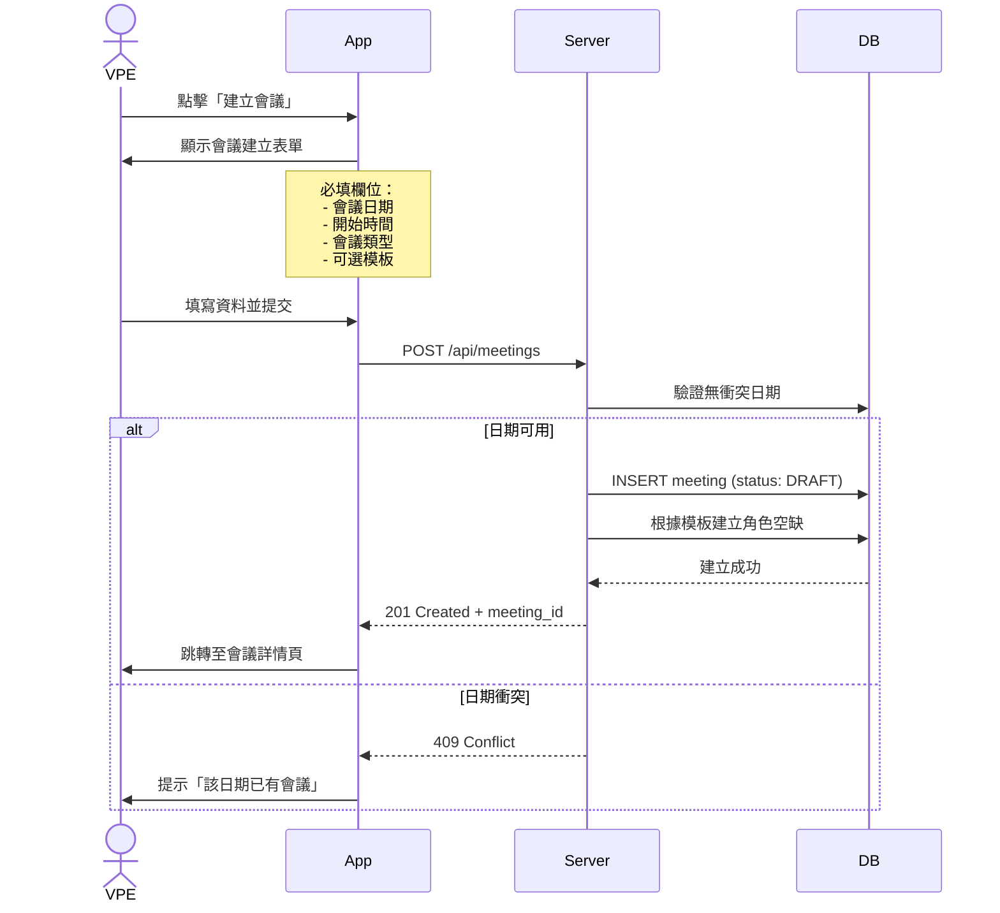

# 4. 會議管理細部流程

[← 返回目錄](../README.md) | [← 上一章](./03-permissions.md)

---

> ✅ **實作狀態**: 已於 v0.1.6 (2025-12-22) 更新

## 目前已實作功能

| 功能 | 狀態 | 說明 |
|------|------|------|
| **Meeting Schedule** | ✅ 完成 | 定義重複規律（每月第 N 週星期 X） |
| **編輯排程** | ✅ 完成 | 修改現有的會議排程設定 |
| **刪除排程** | ✅ 完成 | 刪除排程（不影響已產生的會議） |
| **自動產生會議** | ✅ 完成 | 根據 Schedule 批次產生未來 N 個月的會議 |
| **動態月數選擇** | ✅ 完成 | 可選擇 1-12 個月的產生範圍 |
| **刪除會議** | ✅ 完成 | Club Admin 可刪除會議 |
| **批量刪除會議** | ✅ 完成 | 多選模式，一次刪除多個會議 |
| **編輯會議主題** | ✅ 完成 | 可編輯 Meeting Theme 並套用至 Agenda |
| **會議詳情** | ✅ 完成 | 顯示會議時間、地點、角色報名狀態 |
| **Template-Based Role Slots** | ✅ 完成 | 新 Meeting 根據模板建立角色 |

## 4.1 會議生命週期

## 4.2 會議建立流程

## 4.3 會議編輯權限

| 操作 | DRAFT | OPEN | CLOSED | FINALIZED |
|:---|:---:|:---:|:---:|:---:|
| 修改日期/時間 | ✅ | ⚠️ 需通知 | ❌ | ❌ |
| 修改會議類型 | ✅ | ❌ | ❌ | ❌ |
| 增減角色 | ✅ | ✅ | ⚠️ 需確認 | ❌ |
| 開放報名 | ✅ | - | - | - |
| 截止報名 | - | ✅ | - | - |
| 產生 Agenda | - | - | ✅ | ✅ (微調) |
| 取消會議 | ✅ | ✅ 需通知 | ✅ 需確認 | ❌ |

---

[下一章：會議角色註冊流程 →](./05-role-registration.md)
