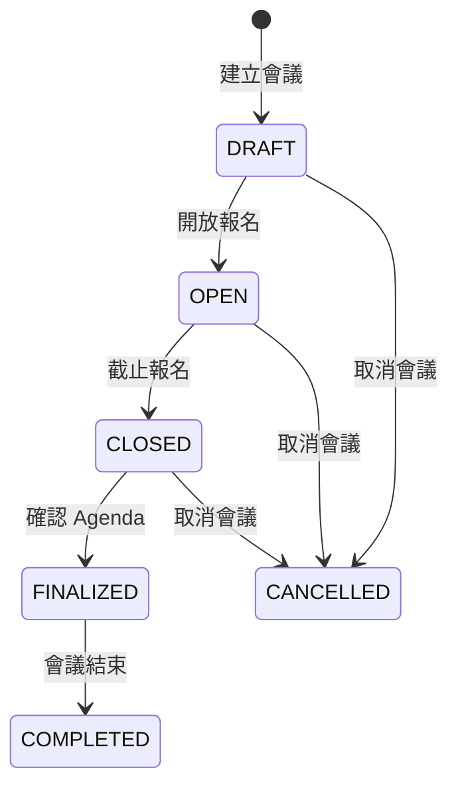
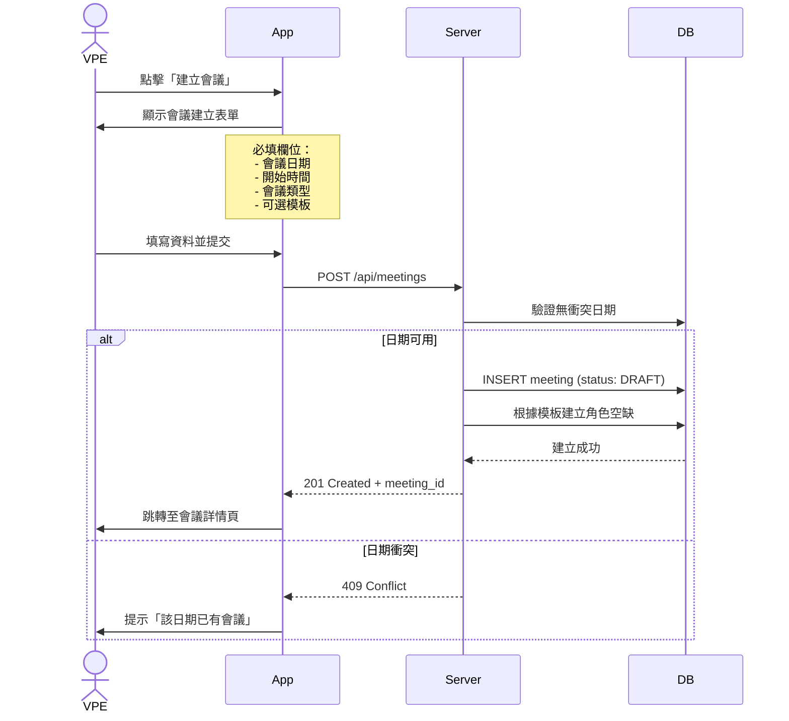

# 4. 會議管理細部流程

[← 返回目錄](./README.md) | [← 上一章](./03-permissions.md)

---

## 4.1 會議生命週期

## 4.2 會議建立流程

## 4.3 會議編輯權限

| 操作 | DRAFT | OPEN | CLOSED | FINALIZED |
|:---|:---:|:---:|:---:|:---:|
| 修改日期/時間 | ✅ | ⚠️ 需通知 | ❌ | ❌ |
| 修改會議類型 | ✅ | ❌ | ❌ | ❌ |
| 增減角色 | ✅ | ✅ | ⚠️ 需確認 | ❌ |
| 開放報名 | ✅ | - | - | - |
| 截止報名 | - | ✅ | - | - |
| 產生 Agenda | - | - | ✅ | ✅ (微調) |
| 取消會議 | ✅ | ✅ 需通知 | ✅ 需確認 | ❌ |

---

[下一章：會議角色註冊流程 →](./05-role-registration.md)
