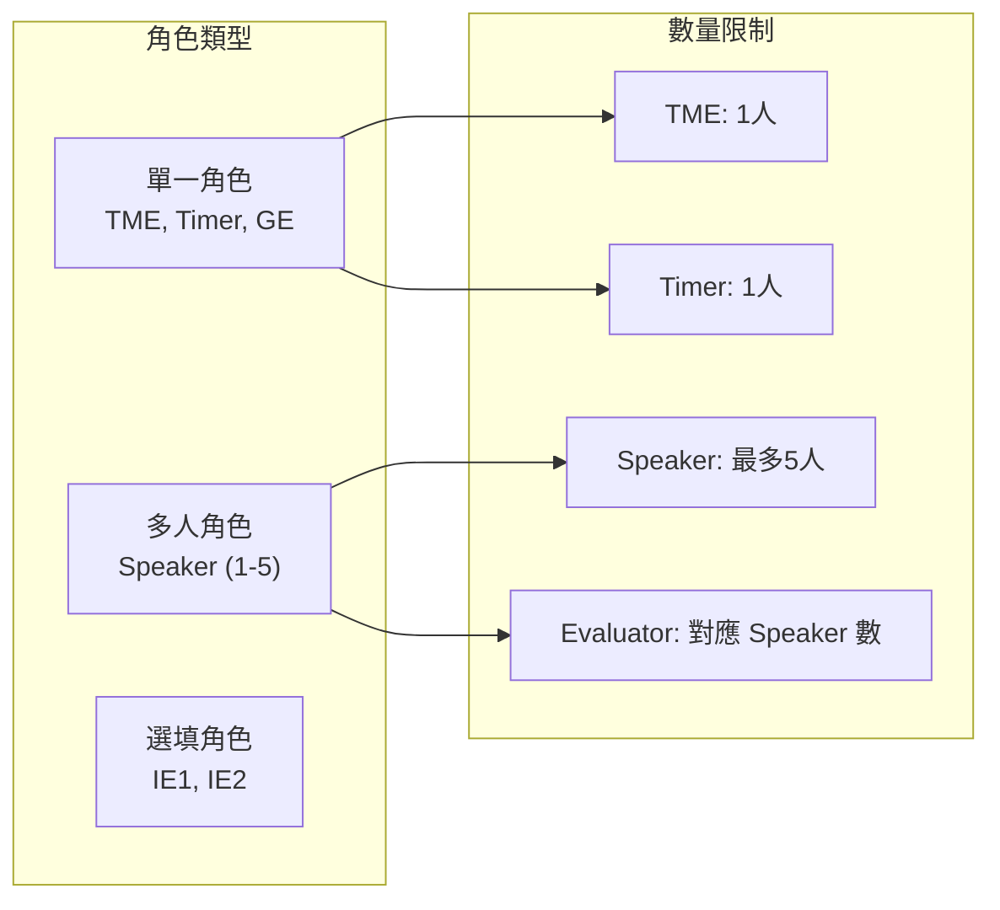
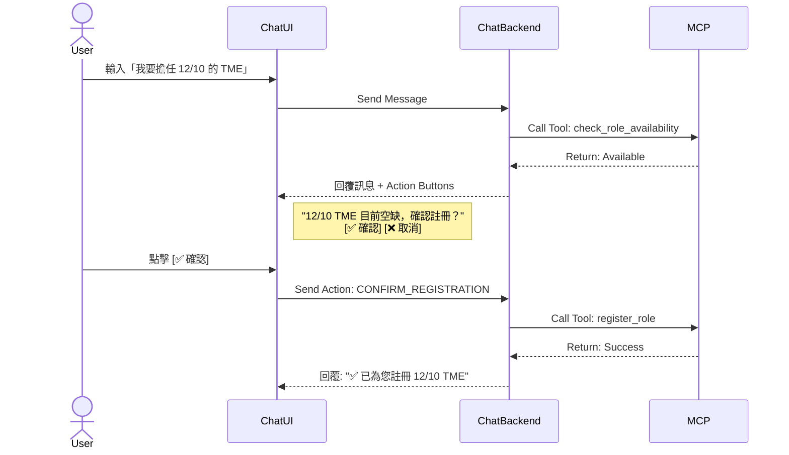
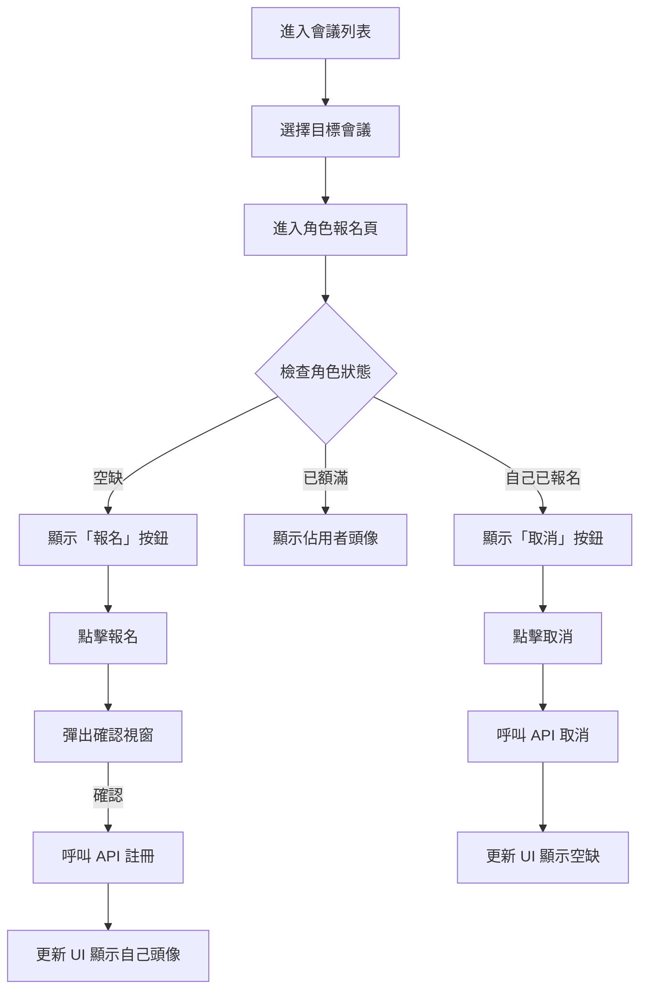
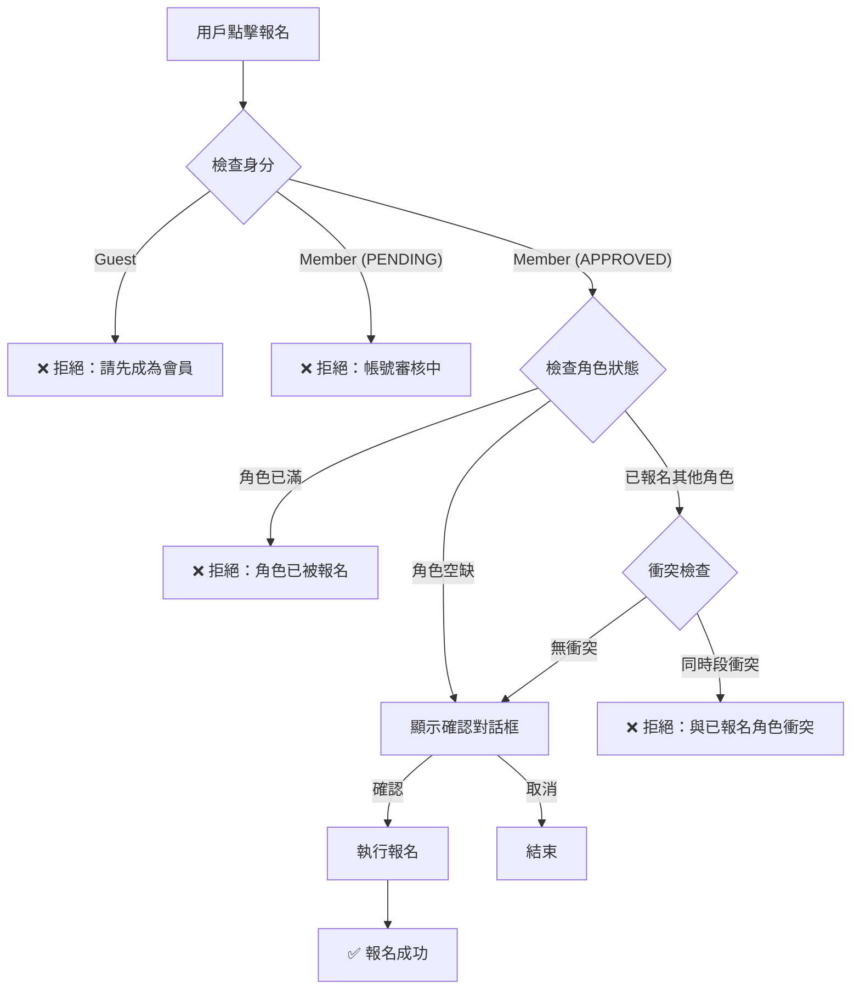
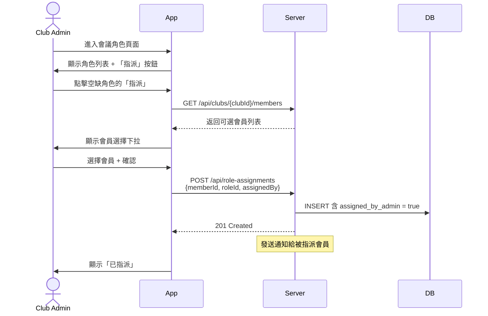

# 5. 會議角色註冊流程

[← 返回目錄](../README.md) | [← 上一章](./04-meeting-management.md)

---

> ✅ **實作狀態**: 已於 v0.1.6 (2025-12-22) 完成 Admin 代理報名功能

## 目前已實作功能

| 功能 | 狀態 | 說明 |
|------|------|------|
| **UI 角色報名** | ✅ 完成 | 會員在 Meeting Detail 頁面點擊報名/取消 |
| **Template-Based Roles** | ✅ 完成 | 只顯示模板中存在的角色 |
| **Admin 代理報名** | ✅ 完成 | Club Admin 可指派會員到角色、取消任意報名 |
| **Chat 對話報名** | 🚧 待開發 | 透過自然語言與 AI 互動報名 |

提供「Chat 對話」與「UI 介面」兩種操作方式，資料即時同步。

## 5.1 角色類型與限制

## 5.2 Chat 對話式註冊

透過自然語言與 AI 互動。AI 會先檢查角色空缺狀態，若有空缺則顯示互動式按鈕（Button）供用戶確認，避免誤操作。

**功能特點**:
- **指令範例**: 「我要報名下週五的 Timer」、「取消我的 TME 角色」
- **防呆機制**: 若角色已滿，AI 會建議其他空缺角色或候補

**對話流程圖**:

## 5.3 UI 介面註冊

視覺化的角色列表，提供直覺的操作體驗。

**功能特點**:
- **狀態顯示**: 每個角色卡片會顯示「空缺（可報名）」、「已額滿（顯示頭像）」或「已報名（顯示取消按鈕）」
- **操作流程**: 點擊空缺卡片 → 彈出確認窗 → 完成報名

**操作流程圖**:

## 5.4 角色報名防呆流程

## 5.5 角色衝突規則

| 角色 A | 可兼任 | 不可兼任 |
|:---|:---|:---|
| **TME** | - | Speaker, GE, Timer, Evaluator |
| **Speaker** | IE (非同場) | TME, Evaluator (同一人) |
| **Timer** | AH Counter, Grammarian | TME |
| **GE** | - | TME, Speaker, Evaluator |
| **Evaluator** | Timer, AH Counter | TME, GE, 對應 Speaker |

## 5.6 管理員代理報名

Club Admin 可代替會員報名或取消報名：

---

[下一章：Agenda 模板管理與產生 →](./06-agenda.md)
