# 6. Agenda 模板管理與產生

[← 返回目錄](../README.md) | [← 上一章](./05-role-registration.md)

---

> ✅ **實作狀態**: 已於 v2.0 (2025-12-16) 完成核心功能實作

此功能專為 VPE（教育副會長）設計，用於快速產生標準化的會議議程。

## 目前已實作功能

| 功能 | 狀態 | 說明 |
|------|------|------|
| **模板上傳** | ✅ 完成 | 上傳 Excel 至 GCS，存入 Cloud SQL |
| **AI 模板解析** | ✅ 完成 | 使用 Gemini 2.5 Flash 辨識角色變數位置 (`variable_mappings`) |
| **角色報名** | ✅ 完成 | 會員可報名 TME, Speaker, Evaluator 等角色 |
| **Agenda 產生** | ✅ 完成 | 讀取原始 Excel 模板，填入角色資料，產生 Excel 下載 |
| **Template-Based Role Slots** | ✅ 完成 | 新 Meeting 只建立模板中存在的角色 |
| **結構化 UI 編輯** | 🚧 待開發 | 可視化編輯模板區塊與順序 |
| **PDF 匯出** | 🚧 待開發 | 將 Excel 轉換為 PDF |

## 6.1 模板管理

**功能流程**:

1. **上傳**: 支援上傳 Excel 格式的議程範本
2. **儲存原始檔**: 將原始 Excel 檔案儲存至 Cloud Storage（保留排版樣式）
3. **解析與編輯**: 後端解析 Excel 結構後，VPE 可在 App 介面上調整時段順序、時間長度與負責職位
4. **儲存結構**: 將解析後的結構儲存為 JSON（用於 UI 編輯與角色對應）

**儲存架構**:

| 資料類型 | 儲存位置 | 用途 |
|:---|:---|:---|
| 原始 Excel 檔 | Cloud Storage | PDF 產生時作為排版模板 |
| 結構 JSON | Cloud SQL | UI 編輯、角色對應 |

## 6.2 模板結構設計

```json
{
  "templateId": "standard-meeting-v1",
  "name": "標準例會",
  "sections": [
    {
      "order": 1,
      "name": "開場",
      "duration": 10,
      "items": [
        { "name": "Sergeant at Arms", "role": "SAA", "duration": 3 },
        { "name": "Opening", "role": "President", "duration": 2 },
        { "name": "TME Welcome", "role": "TME", "duration": 5 }
      ]
    },
    {
      "order": 2,
      "name": "準備演講",
      "duration": 35,
      "items": [
        { "name": "Speaker 1", "role": "Speaker", "duration": 7 },
        { "name": "Speaker 2", "role": "Speaker", "duration": 7 },
        { "name": "Speaker 3", "role": "Speaker", "duration": 7 }
      ]
    }
  ]
}
```

## 6.3 議程產生

**功能流程**:

1. **選擇**: 選擇會議日期與要套用的模板
2. **自動合併**: 系統自動將該次會議「已報名的角色」（如 TME, Speaker 1, Timer）填入模板對應的欄位
3. **微調與發布**: VPE 可手動修改講題、調整臨時變動，確認無誤後匯出 PDF 或產生分享連結

## 6.4 議程產生流程

```mermaid
sequenceDiagram
    actor VPE
    participant App
    participant Server
    participant DB
    participant PDF as PDF Service
    
    VPE->>App: 進入「產生 Agenda」
    App->>Server: GET /api/meetings/{id}/roles
    Server-->>App: 返回已報名角色列表
    
    App->>Server: GET /api/templates
    Server-->>App: 返回可用模板列表
    
    App->>VPE: 顯示模板選擇 + 角色填充預覽
    VPE->>App: 選擇模板
    
    App->>Server: POST /api/agendas/preview
    Server->>Server: 合併模板 + 角色資料
    Server-->>App: 返回預覽 HTML
    
    App->>VPE: 顯示 Agenda 預覽
    VPE->>App: 微調內容 (講題等)
    
    VPE->>App: 點擊「確認並產生」
    App->>Server: POST /api/agendas
    Server->>DB: INSERT agenda_item (s)
    Server->>PDF: 產生 PDF
    PDF-->>Server: 返回 PDF URL
    Server-->>App: 返回 Agenda + PDF Link
    
    App->>VPE: 顯示成功 + 分享選項
```



## 6.5 Agenda 狀態與權限

| 狀態 | VPE 操作 | Club Admin 操作 | 會員可見 |
|:---|:---|:---|:---|
| **DRAFT** | 編輯、刪除、預覽 | 查看、編輯 | ❌ |
| **PUBLISHED** | 小幅修正、發布更新 | 查看、修正 | ✅ 查看 |
| **ARCHIVED** | 查看 | 查看 | ✅ 查看 |

## 6.6 模板與產生流程圖

```mermaid
flowchart LR
    subgraph Upload ["1. 模板上傳"]
        A["上傳 Excel"] --> B["Cloud Storage<br/>(原始檔)"]
        A --> C["Cloud SQL<br/>(JSON 結構)"]
    end
    
    subgraph Generate ["2. 議程產生"]
        D["選擇模板"] --> E["載入角色"]
        E --> F["預覽/微調"]
    end
    
    subgraph Export ["3. PDF 匯出"]
        G["讀取原始 Excel"] --> H["填入資料"]
        H --> I["產生 PDF"]
    end
    
    B --> G
    C --> D
    F --> G
```



---

[下一章：會議投票機制 →](./07-voting.md)
