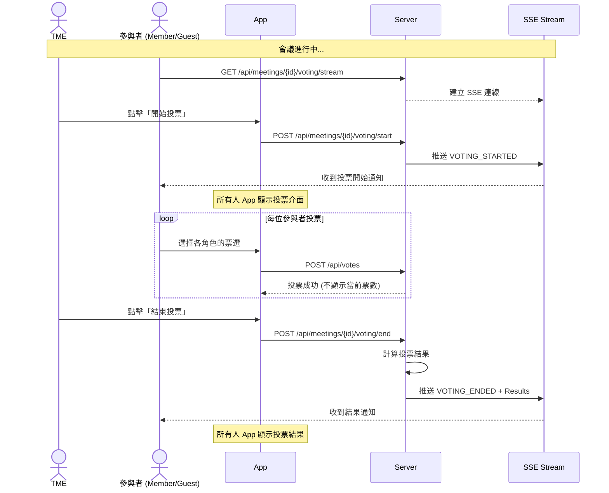
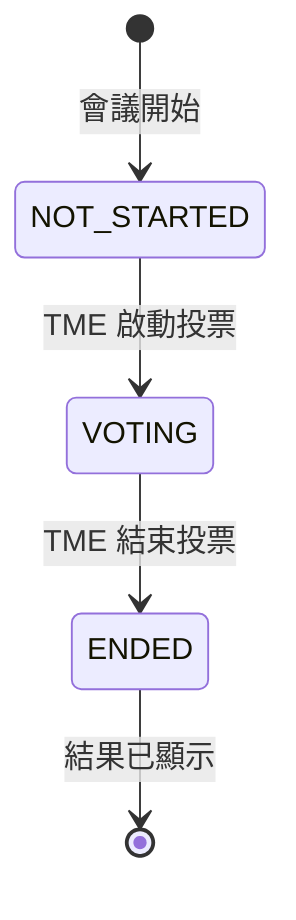
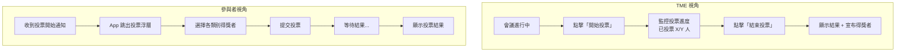
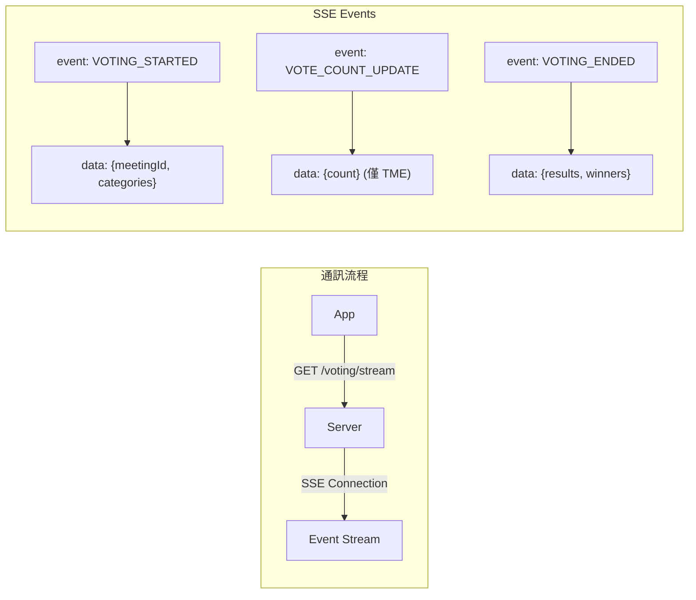
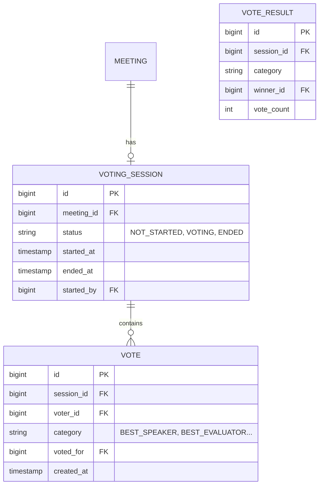

# 7. 會議投票機制 (Voting System)

[← 返回目錄](../README.md) | [← 上一章](./06-agenda.md)

---

會議進行中的即時投票功能，由 TME 控制投票流程，所有會議參與者皆可投票。

## 7.1 投票流程概述

## 7.2 投票狀態機

## 7.3 投票類別與獎項

| 投票類別 | 對象 | 說明 |
|:---|:---|:---|
| **Best Speaker** | 所有 Speaker | 最佳演講者 |
| **Best Evaluator** | 所有 Evaluator | 最佳講評者 |
| **Best Table Topic** | Table Topic 回答者 | 最佳即席演講 |
| **Best Support Role** | Timer, AH Counter, Grammarian | 最佳輔助角色 |

## 7.4 投票權限

| 角色 | 操作 | 說明 |
|:---|:---|:---|
| **TME** | ✅ 啟動/結束投票 | 唯一控制者 |
| **Member (APPROVED)** | ✅ 投票 | 需為會議參與者 |
| **Guest** | ✅ 投票 | 需為會議參與者 |
| **Role Taker** | ❌ 自己類別 | 不能投票給自己 |

## 7.5 投票介面流程

## 7.6 投票 API 設計

| Method | Endpoint | 說明 | 權限 |
|:---|:---|:---|:---|
| `GET` | `/api/meetings/{id}/voting/stream` | SSE 連線（即時推送） | 參與者 |
| `POST` | `/api/meetings/{id}/voting/start` | 啟動投票 | TME only |
| `POST` | `/api/meetings/{id}/voting/end` | 結束投票 | TME only |
| `GET` | `/api/meetings/{id}/voting/status` | 查詢投票狀態 | 參與者 |
| `POST` | `/api/votes` | 提交投票 | 參與者 |
| `GET` | `/api/meetings/{id}/voting/results` | 查詢結果 | 投票結束後 |

## 7.7 即時通訊設計 (Server-Sent Events)

使用 SSE 實現即時推送，由 Server 向 Client 單向傳送事件：

**SSE 特點**：
- 單向通訊（Server → Client）
- HTTP 原生支援，簡化實作
- 自動重連機制
- Spring Boot 內建 `SseEmitter` 支援

## 7.8 資料庫設計

---

[下一章：通知系統設計 →](./08-notification.md)
