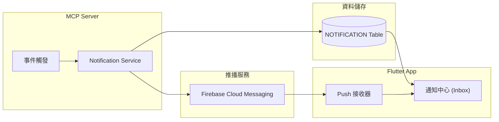
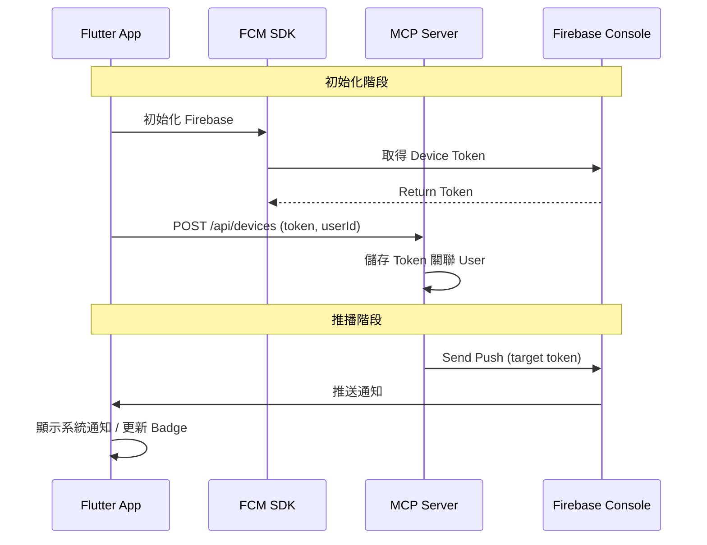
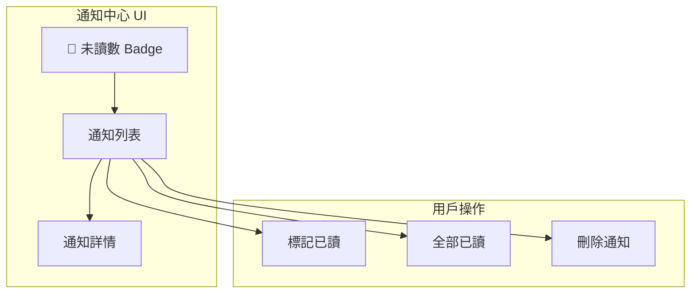

# 8. 通知系統設計

[← 返回目錄](../README.md) | [← 上一章](./07-voting.md)

---

本系統採用 **App 內通知 + Firebase Cloud Messaging (FCM) Push** 雙軌機制。

## 8.1 通知架構



## 8.2 通知類型與觸發條件

| 類別 | 事件 | 通知對象 | Push 優先級 |
|:---|:---|:---|:---:|
| **會員** | 審核通過/拒絕 | 申請者 | HIGH |
| **會議** | 新會議建立 | 全體會員 | NORMAL |
| | 會議取消 | 已報名者 | HIGH |
| | 報名截止提醒 | 未報名會員 | NORMAL |
| **角色** | 被指派角色 | 被指派者 | HIGH |
| | 角色被移除 | 原報名者 | HIGH |
| **Agenda** | Agenda 發布 | 全體會員 | NORMAL |
| | Agenda 更新 | 全體會員 | NORMAL |

## 8.3 FCM 整合設計



**Flutter 套件**：
- `firebase_core`
- `firebase_messaging`

**Spring Boot 套件**：
- `firebase-admin` SDK

## 8.4 Firebase 前置作業設定

### Step 1: 建立 Firebase 專案

1. 前往 [Firebase Console](https://console.firebase.google.com/)
2. 點擊「新增專案」→ 輸入專案名稱 `toastlabplus`
3. 啟用 Google Analytics（可選）
4. 完成建立

### Step 2: 新增 Flutter App

**Android**:
1. 在 Firebase Console 點擊「新增應用程式」→ 選擇 Android
2. 輸入 Package Name: `com.example.toastlabplus`
3. 下載 `google-services.json`
4. 放到 `android/app/google-services.json`

**iOS**:
1. 點擊「新增應用程式」→ 選擇 iOS
2. 輸入 Bundle ID: `com.example.toastlabplus`
3. 下載 `GoogleService-Info.plist`
4. 放到 `ios/Runner/GoogleService-Info.plist`

### Step 3: Flutter 專案設定

```yaml
# pubspec.yaml
dependencies:
  firebase_core: ^2.24.0
  firebase_messaging: ^14.7.0
```

```dart
// main.dart
import 'package:firebase_core/firebase_core.dart';
import 'package:firebase_messaging/firebase_messaging.dart';

void main() async {
  WidgetsFlutterBinding.ensureInitialized();
  await Firebase.initializeApp();
  
  // 取得 FCM Token
  String? token = await FirebaseMessaging.instance.getToken();
  print('FCM Token: $token');
  
  runApp(MyApp());
}
```

### Step 4: Spring Boot Server 設定

1. 在 Firebase Console → 專案設定 → 服務帳戶
2. 點擊「產生新的私密金鑰」→ 下載 JSON
3. 將 JSON 存入 Secret Manager

```java
// build.gradle
implementation 'com.google.firebase:firebase-admin:9.2.0'
```

```java
// FirebaseConfig.java
@Configuration
public class FirebaseConfig {
    @PostConstruct
    public void init() {
        FirebaseOptions options = FirebaseOptions.builder()
            .setCredentials(GoogleCredentials.fromStream(
                new FileInputStream("firebase-service-account.json")))
            .build();
        FirebaseApp.initializeApp(options);
    }
}
```

```java
// NotificationService.java
public void sendPush(String token, String title, String body) {
    Message message = Message.builder()
        .setToken(token)
        .setNotification(Notification.builder()
            .setTitle(title)
            .setBody(body)
            .build())
        .build();
    FirebaseMessaging.getInstance().send(message);
}
```

### Step 5: 建置檢查清單

| 項目 | 狀態 |
|:---|:---:|
| 建立 Firebase 專案 | ⬜ |
| 新增 Android App + 下載 google-services.json | ⬜ |
| 新增 iOS App + 下載 GoogleService-Info.plist | ⬜ |
| Flutter 安裝 firebase_core, firebase_messaging | ⬜ |
| 產生 Service Account JSON | ⬜ |
| 將 JSON 存入 Secret Manager | ⬜ |
| Spring Boot 整合 firebase-admin SDK | ⬜ |

## 8.5 App 通知中心設計



## 8.6 通知偏好設定

用戶可在設定中調整通知偏好：

| 設定項目 | 選項 | 預設值 |
|:---|:---|:---:|
| **Push 通知** | 開啟 / 關閉 | 開啟 |
| **會議提醒** | 開啟 / 關閉 | 開啟 |
| **角色變動通知** | 開啟 / 關閉 | 開啟 |
| **Agenda 更新** | 開啟 / 關閉 | 開啟 |

---

[下一章：資料庫設計 →](./09-database.md)
