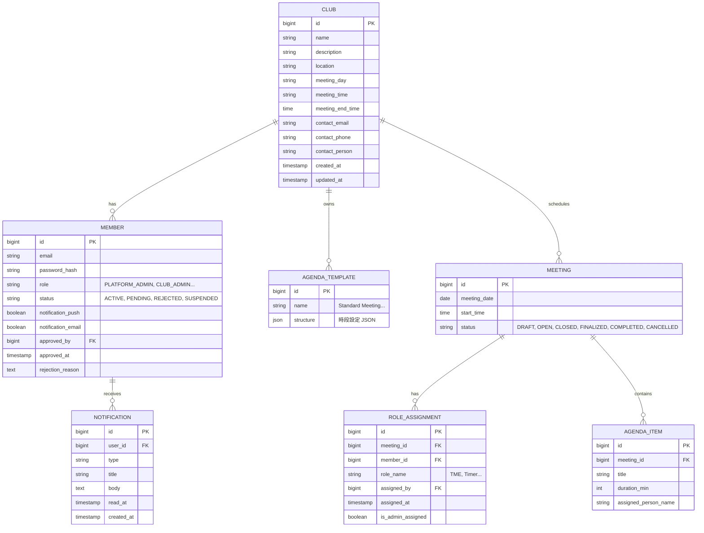

# 9. 資料庫設計

[← 返回目錄](../README.md) | [← 上一章](./08-notification.md)

---

## 9.1 主要實體

- **CLUB**: 分會基本資料
- **MEMBER**: 會員資料，包含權限角色（Role）與狀態
- **MEETING**: 會議主檔，包含日期、主題
- **ROLE_ASSIGNMENT**: 記錄誰在該次會議擔任什麼角色
- **AGENDA_TEMPLATE**: 儲存議程結構的 JSON 定義
- **AGENDA_ITEM**: 議程項目明細
- **NOTIFICATION**: 通知記錄

## 9.2 實體關係圖

---

[下一章：技術棧與部署 →](./10-deployment.md)
