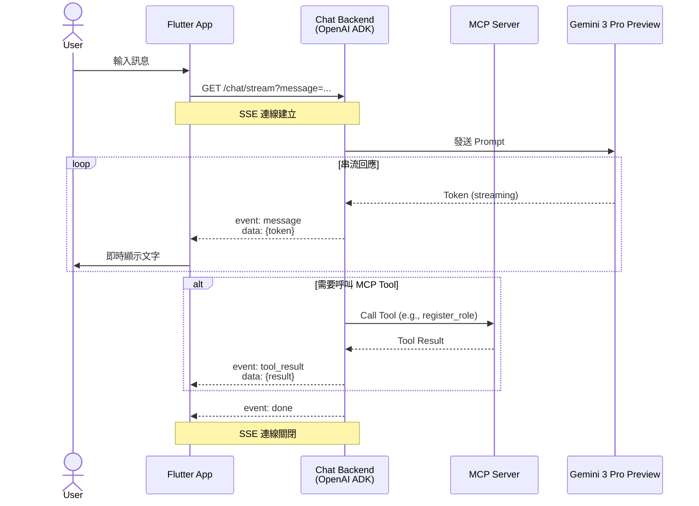
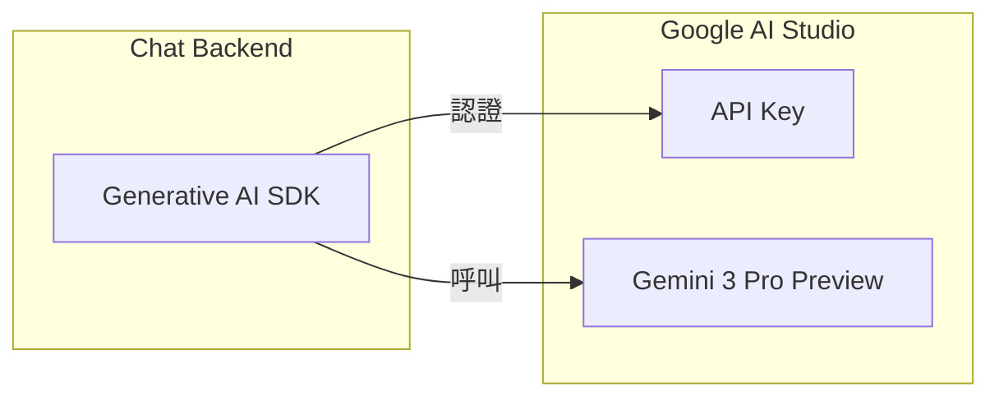
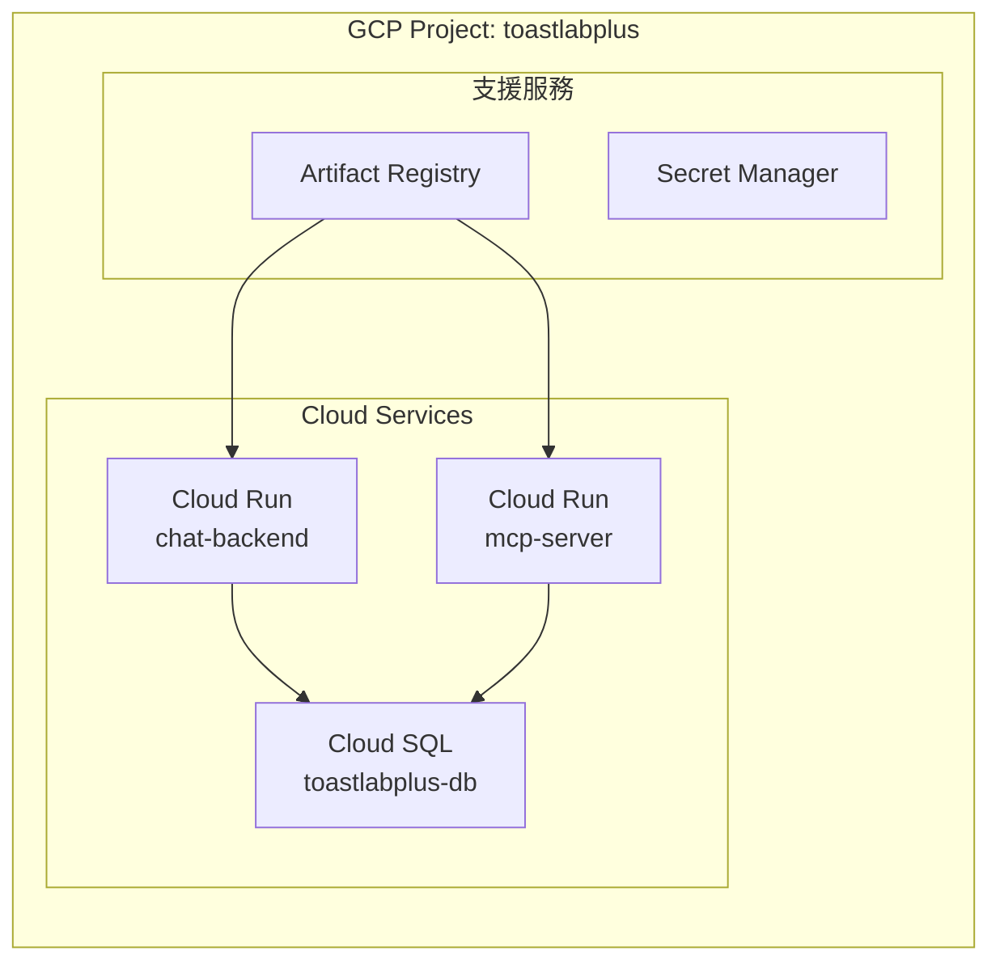
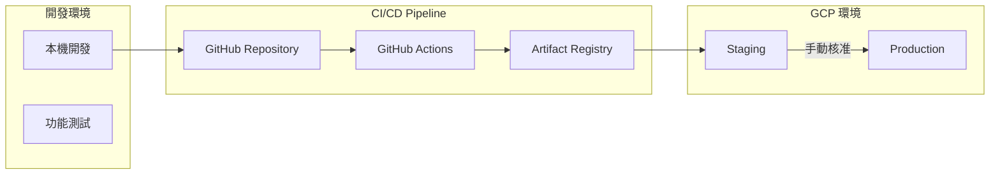

# 10. 技術棧與部署

[← 返回目錄](../README.md) | [← 上一章](./09-database.md)

---

## 10.1 技術選型

| 組件 | 技術 | 服務 | 規格 |
|------|------|-----------|------|
| **Mobile App** | Flutter 3.x, Provider, Dio | - | iOS / Android |
| **MCP Server** | Spring Boot 3.x, JPA | Cloud Run | 0.5 vCPU, 512MB |
| **Chat Backend** | Generative AI SDK (Python) | Cloud Run | 0.5 vCPU, 512MB |
| **Database** | PostgreSQL | Cloud SQL | db-f1-micro |
| **AI Model** | Gemini 3 Pro Preview | Gemini API | Pay-as-you-go |
| **Push 通知** | Firebase Cloud Messaging | Firebase (免費) | - |

## 10.2 In-App Chat SSE 通訊設計

Chat UI 透過 SSE 與 Chat Backend 連線，實現串流式對話回應：



## 10.3 MCP Server 功能清單

Spring Boot MCP Server 提供以下 Tools 供 Chat Backend 調用：

| 功能模組 | Tool 名稱 | 說明 |
|:---|:---|:---|
| **會員管理** | `get_member_info` | 查詢會員資料 |
| | `list_club_members` | 列出分會會員 |
| | `update_member_status` | 更新會員狀態 |
| **會議管理** | `list_meetings` | 查詢會議列表 |
| | `get_meeting_detail` | 取得會議詳情 |
| | `create_meeting` | 建立新會議 |
| | `update_meeting` | 更新會議資料 |
| **角色報名** | `check_role_availability` | 檢查角色空缺 |
| | `register_role` | 報名角色 |
| | `cancel_role` | 取消報名 |
| | `list_role_assignments` | 列出角色分配 |
| **Agenda** | `list_templates` | 列出議程模板 |
| | `generate_agenda` | 產生議程 |
| | `get_agenda` | 取得議程內容 |
| **投票** | `start_voting` | 啟動投票 |
| | `end_voting` | 結束投票 |
| | `get_voting_results` | 查詢投票結果 |

**MCP Server REST API**（供 UI 直接呼叫）：

| 模組 | Method | Endpoint | 說明 |
|:---|:---|:---|:---|
| **Auth** | POST | `/api/auth/login` | 登入 |
| | POST | `/api/auth/register` | 註冊 |
| **Clubs** | GET | `/api/clubs` | 分會列表 |
| | GET | `/api/clubs/{id}` | 分會詳情 |
| **Members** | GET | `/api/members` | 會員列表 |
| | PATCH | `/api/members/{id}/approve` | 審核通過 |
| **Meetings** | GET | `/api/meetings` | 會議列表 |
| | POST | `/api/meetings` | 建立會議 |
| **Roles** | POST | `/api/role-assignments` | 報名角色 |
| **Voting** | GET | `/api/meetings/{id}/voting/stream` | SSE 連線 |
| **Agenda** | POST | `/api/agendas` | 產生議程 |

## 10.4 Gemini Developer API 設定



**Gemini Developer API 建置步驟**：

1. **取得 API Key**
   - 前往 [Google AI Studio](https://aistudio.google.com/)
   - 點擊 "Get API Key" 取得 Key
   - 將 Key 存入 Secret Manager

2. **安裝 SDK**
   ```bash
   pip install google-generativeai
   ```

3. **使用範例**
   ```python
   import google.generativeai as genai
   
   genai.configure(api_key="YOUR_API_KEY")
   model = genai.GenerativeModel('gemini-3-pro-preview')
   response = model.generate_content("你好")
   ```

**Gemini 3 Pro Preview 定價**：

| 項目 | 價格 |
|:---|:---|
| Input (≤200K tokens) | $2.00 / 百萬 tokens |
| Input (>200K tokens) | $4.00 / 百萬 tokens |
| Output (≤200K tokens) | $12.00 / 百萬 tokens |
| Output (>200K tokens) | $18.00 / 百萬 tokens |

**特點**：
- 🚀 Google 最強大的 AI 模型
- 📚 100 萬 Token 上下文視窗
- 🧠 進階推理能力（可調整思考等級）
- ✅ Google AI Studio 提供免費額度供開發測試

## 10.5 GCP 環境建置



**資源清單與規格**：

| 資源 | 名稱 | 規格 | 估計月費 (USD) |
|:---|:---|:---|---:|
| Project | `toastlabplus` | - | - |
| Cloud Run (Chat) | `chat-backend` | 0.5 vCPU, 512MB | ~$5-15 |
| Cloud Run (MCP) | `mcp-server` | 0.5 vCPU, 512MB | ~$5-15 |
| Cloud SQL (PostgreSQL) | `toastlabplus-db` | db-f1-micro | ~$8 |
| Artifact Registry | `toastlabplus-repo` | Standard | ~$0.10/GB |
| Secret Manager | - | 依用量 | ~$0.03/secret |
| Gemini API | Gemini 3 Pro Preview | Pay-as-you-go | ~$10-30 (依用量) |
| VPC Connector | `serverless-connector` | f1-micro | ~$7 |
| **預估總計** | | | **~$35-80** |

## 10.6 部署策略



**部署流程**：

1. **本機開發**
   - Podman Compose 模擬完整環境
   - 連接 Cloud SQL 開發資料庫

2. **CI/CD Pipeline** (GitHub Actions)
   ```yaml
   # .github/workflows/deploy.yml 流程概述
   - Build Container Images (Podman/Buildah)
   - Push to Artifact Registry
   - Deploy to Cloud Run (Staging)
   - Run Integration Tests
   - Manual Approval
   - Deploy to Cloud Run (Production)
   ```

3. **環境變數管理**
   - 使用 Secret Manager 存放敏感資訊
   - Cloud Run 引用 Secret Manager Secrets

## 10.7 建置檢查清單

| 階段 | 項目 | 狀態 |
|:---|:---|:---:|
| **GCP 基礎** | 建立 GCP Project | ✅ |
| | 啟用必要 API | ⬜ |
| | 設定 VPC Network | ⬜ |
| | 建立 Artifact Registry | ⬜ |
| **Workload Identity** | 建立 Workload Identity Pool | ⬜ |
| | 建立 OIDC Provider | ⬜ |
| | 建立 Service Account | ⬜ |
| | 綁定 GitHub Repo | ⬜ |
| **資料庫** | 建立 Cloud SQL Instance | ⬜ |
| | 建立 Database | ⬜ |
| | 設定私有 IP 連線 | ⬜ |
| | 執行 Schema Migration | ⬜ |
| **Gemini API** | 取得 API Key (Google AI Studio) | ⬜ |
| | 將 Key 存入 Secret Manager | ⬜ |
| **Cloud Run** | 部署 MCP Server | ⬜ |
| | 部署 Chat Backend | ⬜ |
| | 設定環境變數 | ⬜ |
| | 設定 VPC Connector | ⬜ |
| **CI/CD** | 設定 GitHub Actions | ⬜ |
| | 測試自動部署 | ⬜ |

## 10.8 快速開始指令

### Step 1: GCP 基礎資源

```bash
# 執行 GCP 基礎設定腳本
cd infrastructure/scripts
chmod +x setup-gcp.sh
./setup-gcp.sh
```

### Step 2: Workload Identity Federation

```bash
# ⚠️ 先編輯腳本，修改 GITHUB_ORG 和 GITHUB_REPO 變數
chmod +x setup-workload-identity.sh
./setup-workload-identity.sh
```

### Step 3: Secret Manager 設定

```bash
# 建立 DB 密碼 Secret
echo -n "YOUR_DB_PASSWORD" | gcloud secrets create DB_PASSWORD --data-file=-

# 建立 Gemini API Key Secret (從 Google AI Studio 取得)
echo -n "YOUR_GEMINI_API_KEY" | gcloud secrets create GEMINI_API_KEY --data-file=-
```

### Step 4: 本機 Docker 測試

```bash
# 測試 MCP Server Docker build
cd backend/mcp-server
docker build -t mcp-server:test .

# 測試 Chat Backend Docker build
cd backend/chat-backend
docker build -t chat-backend:test .
```

### Step 5: 觸發 CI/CD

```bash
# Push 到 main branch 觸發自動部署
git add .
git commit -m "feat: add deployment configuration"
git push origin main
```

---

[下一章：功能雛型畫面 →](./11-ui-mockups.md)
