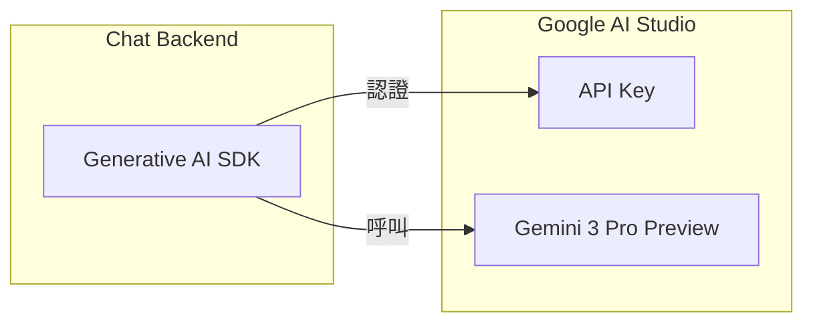
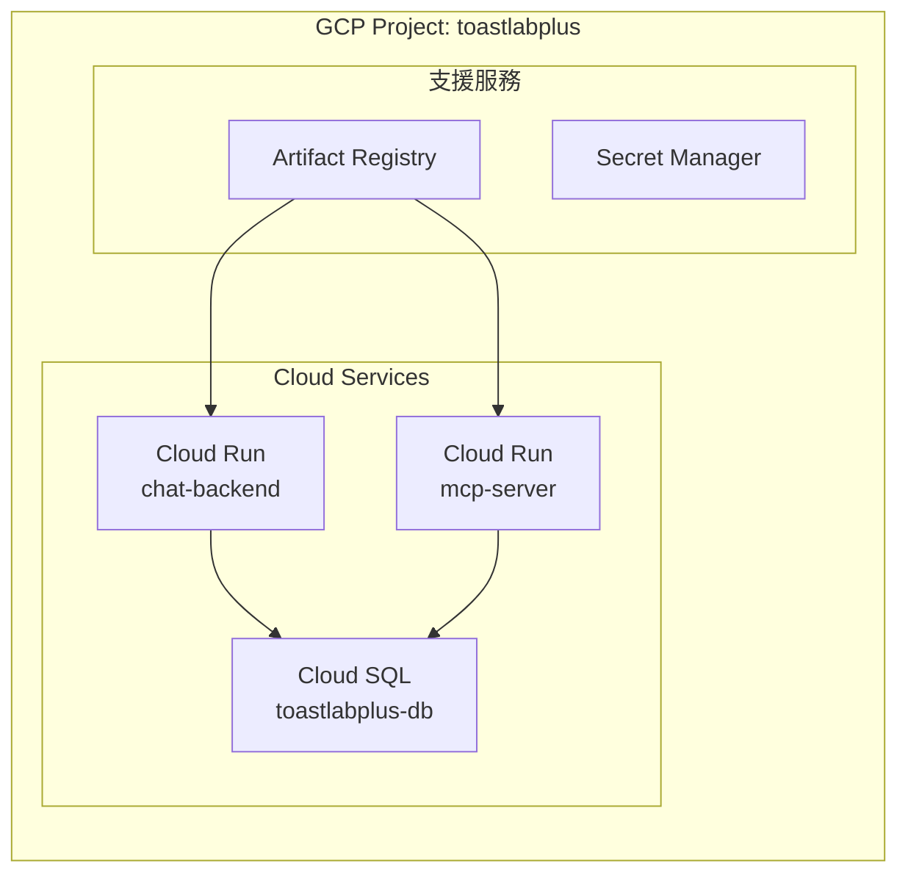

# 10. 技術棧與部署

[← 返回目錄](../README.md) | [← 上一章](./09-database.md)

---

## 10.1 技術選型

| 組件 | 技術 | 服務 | 規格 |
|------|------|-----------|------|
| **Mobile App** | Flutter 3.x, Provider, Dio | - | iOS / Android |
| **MCP Server** | Spring Boot 3.x, JPA | Cloud Run | 0.5 vCPU, 512MB |
| **Chat Backend** | Generative AI SDK (Python) | Cloud Run | 0.5 vCPU, 512MB |
| **Database** | PostgreSQL | Cloud SQL | db-f1-micro |
| **AI Model** | Gemini 3 Pro Preview | Gemini API | Pay-as-you-go |
| **Push 通知** | Firebase Cloud Messaging | Firebase (免費) | - |

## 10.2 In-App Chat SSE 通訊設計

Chat UI 透過 SSE 與 Chat Backend 連線，實現串流式對話回應：

```mermaid
sequenceDiagram
    actor User
    participant App as Flutter App
    participant ChatBackend as Chat Backend<br/>(OpenAI ADK)
    participant MCP as MCP Server
    participant Gemini as Gemini 3 Pro Preview

    User->>App: 輸入訊息
    App->>ChatBackend: GET /chat/stream?message=...
    Note over App,ChatBackend: SSE 連線建立
    
    ChatBackend->>Gemini: 發送 Prompt
    
    loop 串流回應
        Gemini-->>ChatBackend: Token (streaming)
        ChatBackend-->>App: event: message<br/>data: {token}
        App->>User: 即時顯示文字
    end
    
    alt 需要呼叫 MCP Tool
        ChatBackend->>MCP: Call Tool (e.g., register_role)
        MCP-->>ChatBackend: Tool Result
        ChatBackend-->>App: event: tool_result<br/>data: {result}
    end
    
    ChatBackend-->>App: event: done
    Note over App,ChatBackend: SSE 連線關閉
```



## 10.3 MCP Server 功能清單

Spring Boot MCP Server 提供以下 Tools 供 Chat Backend 調用：

| 功能模組 | Tool 名稱 | 說明 |
|:---|:---|:---|
| **會員管理** | `get_member_info` | 查詢會員資料 |
| | `list_club_members` | 列出分會會員 |
| | `update_member_status` | 更新會員狀態 |
| **會議管理** | `list_meetings` | 查詢會議列表 |
| | `get_meeting_detail` | 取得會議詳情 |
| | `create_meeting` | 建立新會議 |
| | `update_meeting` | 更新會議資料 |
| **角色報名** | `check_role_availability` | 檢查角色空缺 |
| | `register_role` | 報名角色 |
| | `cancel_role` | 取消報名 |
| | `list_role_assignments` | 列出角色分配 |
| **Agenda** | `list_templates` | 列出議程模板 |
| | `generate_agenda` | 產生議程 |
| | `get_agenda` | 取得議程內容 |
| **投票** | `start_voting` | 啟動投票 |
| | `end_voting` | 結束投票 |
| | `get_voting_results` | 查詢投票結果 |

**MCP Server REST API**（供 UI 直接呼叫）：

| 模組 | Method | Endpoint | 說明 |
|:---|:---|:---|:---|
| **Auth** | POST | `/api/auth/login` | 登入 |
| | POST | `/api/auth/register` | 註冊 |
| **Clubs** | GET | `/api/clubs` | 分會列表 |
| | GET | `/api/clubs/{id}` | 分會詳情 |
| **Members** | GET | `/api/members` | 會員列表 |
| | PATCH | `/api/members/{id}/approve` | 審核通過 |
| **Meetings** | GET | `/api/meetings` | 會議列表 |
| | POST | `/api/meetings` | 建立會議 |
| **Roles** | POST | `/api/role-assignments` | 報名角色 |
| **Voting** | GET | `/api/meetings/{id}/voting/stream` | SSE 連線 |
| **Agenda** | POST | `/api/agendas` | 產生議程 |

## 10.4 Gemini Developer API 設定



**Gemini Developer API 建置步驟**：

1. **取得 API Key**
   - 前往 [Google AI Studio](https://aistudio.google.com/)
   - 點擊 "Get API Key" 取得 Key
   - 將 Key 存入 Secret Manager

2. **安裝 SDK**
   ```bash
   pip install google-generativeai
   ```

3. **使用範例**
   ```python
   import google.generativeai as genai
   
   genai.configure(api_key="YOUR_API_KEY")
   model = genai.GenerativeModel('gemini-3-pro-preview')
   response = model.generate_content("你好")
   ```

**Gemini 3 Pro Preview 定價**：

| 項目 | 價格 |
|:---|:---|
| Input (≤200K tokens) | $2.00 / 百萬 tokens |
| Input (>200K tokens) | $4.00 / 百萬 tokens |
| Output (≤200K tokens) | $12.00 / 百萬 tokens |
| Output (>200K tokens) | $18.00 / 百萬 tokens |

**特點**：
- 🚀 Google 最強大的 AI 模型
- 📚 100 萬 Token 上下文視窗
- 🧠 進階推理能力（可調整思考等級）
- ✅ Google AI Studio 提供免費額度供開發測試

## 10.5 GCP 環境建置



**資源清單與規格**：

| 資源 | 名稱 | 規格 | 估計月費 (USD) |
|:---|:---|:---|---:|
| Project | `toastlabplus` | - | - |
| Cloud Run (Chat) | `chat-backend` | 0.5 vCPU, 512MB | ~$5-15 |
| Cloud Run (MCP) | `mcp-server` | 0.5 vCPU, 512MB | ~$5-15 |
| Cloud SQL (PostgreSQL) | `toastlabplus-db` | db-f1-micro | ~$8 |
| Artifact Registry | `toastlabplus-repo` | Standard | ~$0.10/GB |
| Secret Manager | - | 依用量 | ~$0.03/secret |
| Gemini API | Gemini 3 Pro Preview | Pay-as-you-go | ~$10-30 (依用量) |
| VPC Connector | `serverless-connector` | f1-micro | ~$7 |
| **預估總計** | | | **~$35-80** |

## 10.6 部署策略 (v1.1.0)

目前專案採用雙軌部署策略，分為前端 (Flutter Web) 與後端 (Cloud Run)，並嚴格隔離 Staging 與 Production 環境。

### 10.6.1 環境隔離

| 環境 | 分支 | 前端 URL | 後端 API | 資料庫 |
|---|---|---|---|---|
| **Staging** | `develop` | `toastlabplus--staging-xxxx.web.app` | `mcp-server-staging` | `toastlabplus_staging` |
| **Production** | `main` | `toastlabplus.web.app` | `mcp-server` | `toastlabplus` |

### 10.6.2 CI/CD Pipeline

**1. Backend Pipeline (`deploy.yml`)**
- **觸發**: `backend/**`, `infrastructure/**` 變更
- **流程**:
  - Build Java/Python Docker Image
  - Push to Artifact Registry
  - **Deploy to Staging**: 部署至 `mcp-server-staging` (連結 `toastlabplus_staging` DB)
  - **Deploy to Production**: 部署至 `mcp-server` (連結 `toastlabplus` DB，僅限 `main` 分支)

**2. Frontend Pipeline (`firebase-deploy.yml`)**
- **觸發**: `mobile/**` 變更
- **流程**:
  - Setup Flutter (**3.38.5**, Dart 3.10.4)
  - Build Web App (注入對應環境的 API URL)
  - **Deploy to Staging**: Firebase Hosting Preview Channel (`staging`)
  - **Deploy to Production**: Firebase Hosting Live Channel (僅限 `main` 分支)

## 10.7 建置檢查清單 (2025-12 Updated)

| 階段 | 項目 | 狀態 | 備註 |
|:---|:---|:---:|:---|
| **GCP 基礎** | 建立 GCP Project | ✅ | `toastlabplus` |
| | 啟用必要 API | ✅ | Cloud Run, SQL, Artifact Registry |
| | 設定 VPC Network | ✅ | Serverless VPC Connector |
| | 建立 Artifact Registry | ✅ | `asia-east1` |
| **Workload Identity** | 設定 GitHub Actions 驗證 | ✅ | 無需存取 Key 檔案 |
| **資料庫** | 建立 Cloud SQL Instance | ✅ | PotgreSQL 14 |
| | 建立 Database | ✅ | `toastlabplus` & `toastlabplus_staging` |
| | 設定私有 IP 連線 | ✅ | 透過 VPC Connector |
| **Cloud Run** | 部署 MCP Server | ✅ | Staging & Prod |
| | 部署 Chat Backend | ✅ | Staging & Prod |
| **CI/CD** | Backend Workflow | ✅ | `deploy.yml` |
| | Frontend Workflow | ✅ | `firebase-deploy.yml` |

## 10.8 運維管理 (Operations)

為了節省成本，可在非工作時間暫停 Staging/Production 環境的收費資源。

### 10.8.1 快速啟閉服務

專案根目錄提供了 `scripts/gcp-ops.sh` 腳本，可用於快速管理 Cloud Run 與 Cloud SQL。

**使用方式 (Git Bash)**:

```bash
# 暫停所有服務 (Scale to 0, Stop SQL) - 節省成本
./scripts/gcp-ops.sh stop

# 恢復所有服務 (Start SQL, Restore Scaling)
./scripts/gcp-ops.sh start
```

**暫停後的狀態**:
- **Cloud Run**: Max Instances = 1 (實際上設為 min=0 以停止計費，除了 request 費用)
- **Cloud SQL**: Stopped (不計運算費，僅計存儲費)
- **Firebase Hosting**: 保持運作 (靜態託管，費用極低)

### 10.8.2 版本升級指南

發布新版本 (`v1.2.0`) 流程：
1. 更新 `mobile/toastlabplus_app/pubspec.yaml` 版本號。
2. 更新 `backend/mcp-server/pom.xml` 版本號。
3. 提交變更並 Push 到 `develop`。
4. 驗證 Staging 環境無誤。
5. Merge `develop` -> `main` 觸發 Production 部署。
6. `git tag v1.2.0` 並 Push tag。

---

[下一章：功能雛型畫面 →](./11-ui-mockups.md)
