# Toastlabplus 專案實作計畫

> **專案概述**: Flutter App（宮崎駿風 UI + Chat）+ Google Cloud 雲端服務

---

## 1. 系統架構與資料流

### 1.1 架構概述

本系統採用前後端分離架構，以 Google Cloud Platform 為核心雲端平台。

**核心組件**:
- **Client Side**: 使用 Flutter 建構跨平台 App，包含標準 UI 操作介面與 In-App Chat 聊天介面
- **AI Service**: 透過 Google Generative AI SDK 建構 Chat Backend，連接 Gemini Developer API，負責理解用戶自然語言指令並調度 MCP Server
- **Core Backend**: Spring Boot MCP Server 作為核心資料服務，處理所有業務邏輯與資料庫存取
- **Database**: 使用 Cloud SQL (PostgreSQL)，兼顧效能與成本效益

### 1.2 系統架構圖

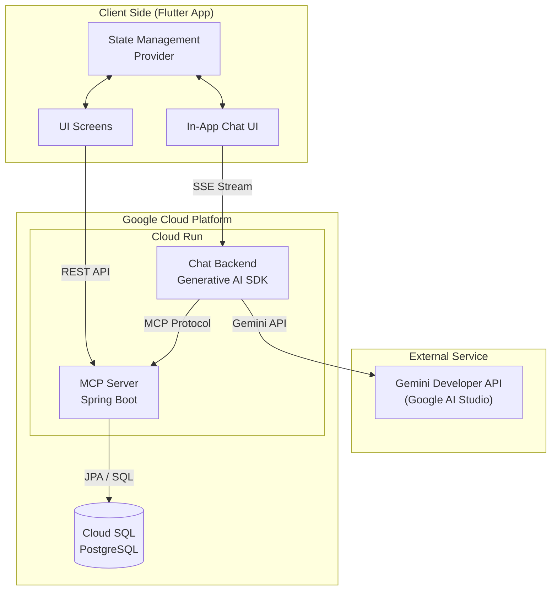
```mermaid
flowchart TB
    subgraph ClientSide ["Client Side (Flutter App)"]
        UI["UI Screens"]
        ChatUI["In-App Chat UI"]
        State["State Management<br/>Provider"]
    end
    
    subgraph External ["External Service"]
        GeminiAPI["Gemini Developer API<br/>(Google AI Studio)"]
    end
    
    subgraph GCP ["Google Cloud Platform"]
        subgraph CloudRun ["Cloud Run"]
            ChatBackend["Chat Backend<br/>Generative AI SDK"]
            MCP["MCP Server<br/>Spring Boot"]
        end
        
        DB[("Cloud SQL<br/>PostgreSQL")]
    end
    
    UI -->|"REST API"| MCP
    ChatUI -->|"SSE Stream"| ChatBackend
    ChatBackend -->|"Gemini API"| GeminiAPI
    ChatBackend -->|"MCP Protocol"| MCP
    MCP -->|"JPA / SQL"| DB
    
    State <--> UI
    State <--> ChatUI
```

---

## 2. 使用者註冊與身分選擇

### 2.1 註冊流程

系統支援多種身分註冊，確保不同角色的使用者能獲得對應的權限與功能。

**註冊步驟**:

1. **註冊入口**: 使用者下載 App 後，可選擇「註冊新帳號」

2. **身分選擇**:
   - **Guest (來賓)**: 適用於非 Toastmasters 會員或參觀者
     - 僅需填寫基本姓名與 Email
     - 註冊後可瀏覽公開會議資訊
     - 無法報名角色
   
   - **Member (會員)**: 適用於正式會員
     - 註冊時需選擇所屬分會 (Club)
     - 提交後狀態為 `PENDING`
     - 需等待分會管理員審核通過後才能啟用完整功能（如報名角色）

3. **平台管理員**: 系統預設一組最高權限帳號，用於建立分會與指派初始管理員

### 2.2 註冊流程圖

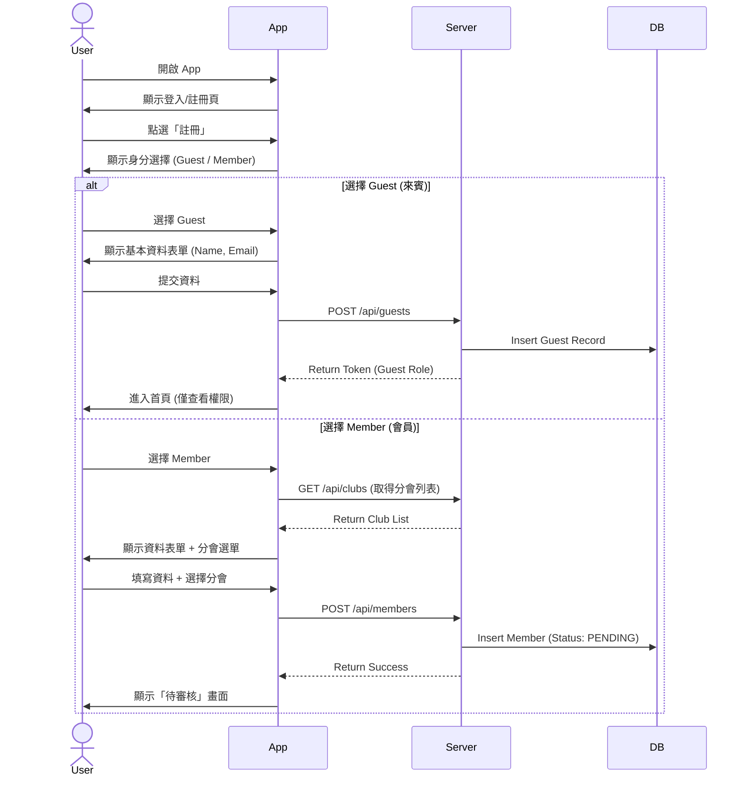
```mermaid
sequenceDiagram
    actor User
    participant App
    participant Server
    participant DB
    
    User->>App: 開啟 App
    App->>User: 顯示登入/註冊頁
    User->>App: 點選「註冊」
    App->>User: 顯示身分選擇 (Guest / Member)
    
    alt 選擇 Guest (來賓)
        User->>App: 選擇 Guest
        App->>User: 顯示基本資料表單 (Name, Email)
        User->>App: 提交資料
        App->>Server: POST /api/guests
        Server->>DB: Insert Guest Record
        Server-->>App: Return Token (Guest Role)
        App->>User: 進入首頁 (僅查看權限)
        
    else 選擇 Member (會員)
        User->>App: 選擇 Member
        App->>Server: GET /api/clubs (取得分會列表)
        Server-->>App: Return Club List
        App->>User: 顯示資料表單 + 分會選單
        User->>App: 填寫資料 + 選擇分會
        App->>Server: POST /api/members
        Server->>DB: Insert Member (Status: PENDING)
        Server-->>App: Return Success
        App->>User: 顯示「待審核」畫面
    end
```

### 2.3 會員審核狀態機

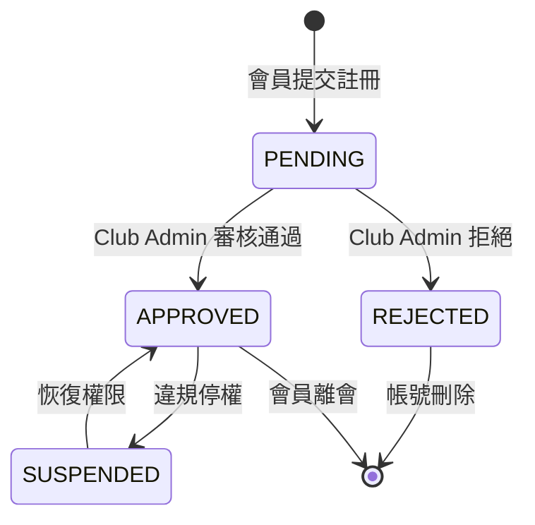
```mermaid
stateDiagram-v2
    [*] --> PENDING: 會員提交註冊
    PENDING --> APPROVED: Club Admin 審核通過
    PENDING --> REJECTED: Club Admin 拒絕
    APPROVED --> SUSPENDED: 違規停權
    SUSPENDED --> APPROVED: 恢復權限
    REJECTED --> [*]: 帳號刪除
    APPROVED --> [*]: 會員離會
```

### 2.4 審核操作流程

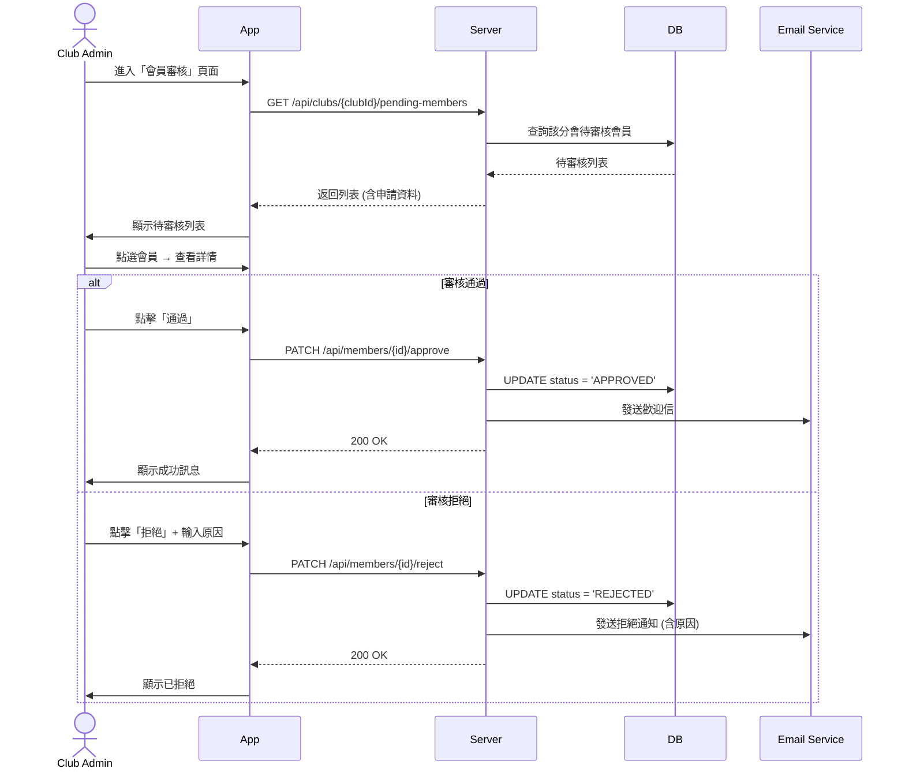
```mermaid
sequenceDiagram
    actor CA as Club Admin
    participant App
    participant Server
    participant DB
    participant Email as Email Service
    
    CA->>App: 進入「會員審核」頁面
    App->>Server: GET /api/clubs/{clubId}/pending-members
    Server->>DB: 查詢該分會待審核會員
    DB-->>Server: 待審核列表
    Server-->>App: 返回列表 (含申請資料)
    
    App->>CA: 顯示待審核列表
    CA->>App: 點選會員 → 查看詳情
    
    alt 審核通過
        CA->>App: 點擊「通過」
        App->>Server: PATCH /api/members/{id}/approve
        Server->>DB: UPDATE status = 'APPROVED'
        Server->>Email: 發送歡迎信
        Server-->>App: 200 OK
        App->>CA: 顯示成功訊息
        
    else 審核拒絕
        CA->>App: 點擊「拒絕」+ 輸入原因
        App->>Server: PATCH /api/members/{id}/reject
        Server->>DB: UPDATE status = 'REJECTED'
        Server->>Email: 發送拒絕通知 (含原因)
        Server-->>App: 200 OK
        App->>CA: 顯示已拒絕
    end
```

### 2.5 審核通知機制

| 事件 | 通知對象 | 通知方式 | 內容 |
|:---|:---|:---|:---|
| 新申請提交 | Club Admin | App Push + Email | 「有新會員申請加入」 |
| 審核通過 | 申請者 | Email + App 通知 | 歡迎信 + 功能導覽連結 |
| 審核拒絕 | 申請者 | Email | 拒絕原因 + 重新申請引導 |
| 審核超時 (7天未處理) | Club Admin | App Push | 提醒處理待審核申請 |

---

## 3. 角色權限設計

### 3.1 權限階級

系統定義了四種權限階級，嚴格控管功能存取：
- **Platform Admin** (平台管理員)
- **Club Admin** (分會管理員)
- **Member** (會員)
- **Guest** (來賓)

### 3.2 資料可視範圍原則

系統採用「分會隔離」原則，確保各分會資料互不可見。

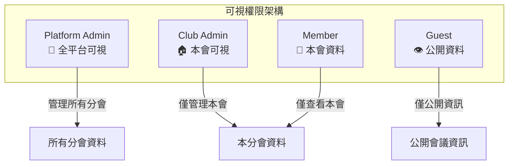
```mermaid
flowchart TB
    subgraph Visibility ["可視權限架構"]
        PA["Platform Admin<br/>👑 全平台可視"]
        CA["Club Admin<br/>🏠 本會可視"]
        MB["Member<br/>👤 本會資料"]
        GT["Guest<br/>👁️ 公開資料"]
    end
    
    PA --> |"管理所有分會"| AllClubs["所有分會資料"]
    CA --> |"僅管理本會"| OwnClub["本分會資料"]
    MB --> |"僅查看本會"| OwnClub
    GT --> |"僅公開資訊"| PublicInfo["公開會議資訊"]
```

### 3.3 Club Admin 可視權限詳細矩陣

| 資料類型 | 本會資料 | 他會資料 | 說明 |
|:---:|:---:|:---:|:---|
| **會員列表** | ✅ 完整資料 | ❌ 不可見 | 含姓名、Email、狀態、職位 |
| **待審核會員** | ✅ 完整資料 | ❌ 不可見 | 可執行審核操作 |
| **會議列表** | ✅ 完整 | 🔵 僅公開 | 他會僅見已發布的公開會議 |
| **角色報名狀態** | ✅ 含會員姓名 | 🔵 僅統計 | 他會僅見「已報名 X 人」 |
| **Agenda 模板** | ✅ 可編輯 | ❌ 不可見 | 模板屬於各分會私有 |
| **Agenda 文件** | ✅ 可編輯 | 🔵 僅已發布 | 他會僅見最終版 Agenda |
| **分會設定** | ✅ 可編輯 | 🔵 僅基本資訊 | 名稱、聯絡方式等公開資訊 |

### 3.4 API 資料過濾機制

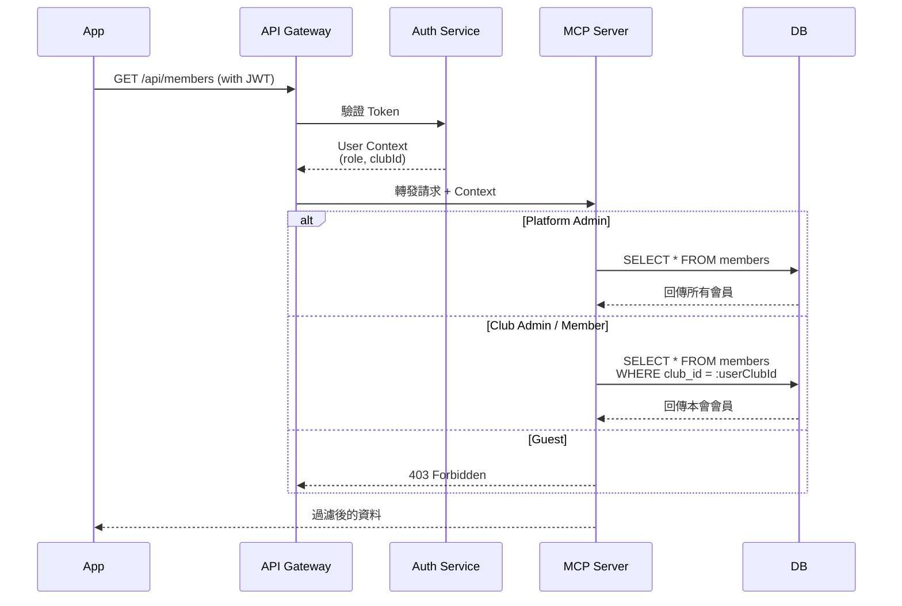
```mermaid
sequenceDiagram
    participant App
    participant API as API Gateway
    participant Auth as Auth Service
    participant MCP as MCP Server
    participant DB
    
    App->>API: GET /api/members (with JWT)
    API->>Auth: 驗證 Token
    Auth-->>API: User Context<br/>(role, clubId)
    
    API->>MCP: 轉發請求 + Context
    
    alt Platform Admin
        MCP->>DB: SELECT * FROM members
        DB-->>MCP: 回傳所有會員
    else Club Admin / Member
        MCP->>DB: SELECT * FROM members<br/>WHERE club_id = :userClubId
        DB-->>MCP: 回傳本會會員
    else Guest
        MCP-->>API: 403 Forbidden
    end
    
    MCP-->>App: 過濾後的資料
```

### 3.5 功能權限矩陣

| 功能模組 | 功能項目 | Platform Admin | Club Admin | Member | Guest |
|:---:|:---|:---:|:---:|:---:|:---:|
| **系統管理** | 新增/刪除分會 | ✅ | ❌ | ❌ | ❌ |
| | 指定分會管理員 | ✅ | ❌ | ❌ | ❌ |
| | 維護角色定義 | ✅ | ❌ | ❌ | ❌ |
| **分會管理** | 審核會員註冊 | ✅ | ✅ | ❌ | ❌ |
| | 指派分會職位 (VPE等) | ✅ | ✅ | ❌ | ❌ |
| | 編輯分會資訊 | ✅ | ✅ | ❌ | ❌ |
| **會議管理** | 建立/編輯會議 | ✅ | ✅ | ❌ | ❌ |
| | 產生/匯出 Agenda | ✅ | ✅ | ❌ | ❌ |
| | 管理 Agenda 模板 | ✅ | ✅ | ❌ | ❌ |
| **角色報名** | 報名會議角色 | ✅ | ✅ | ✅ | ❌ |
| | 取消自己角色 | ✅ | ✅ | ✅ | ❌ |
| | 強制移除他人角色 | ✅ | ✅ | ❌ | ❌ |
| | 代理報名他人 | ✅ | ✅ | ❌ | ❌ |
| **資訊瀏覽** | 查看會議議程 | ✅ | ✅ | ✅ | ✅ |
| | 查看分會資訊 | ✅ | ✅ | ✅ | ✅ |

### 3.6 分會職位

分會管理員可將以下職位指派給會員（一職一人），這些職位在 App 中會有特殊標識，且 VPE 擁有產生 Agenda 的權限：

- **President** (會長)
- **VPE** (教育副會長) - *核心操作者*
- **VPM** (會員副會長)
- **VPPR** (公關副會長)
- **Secretary** (秘書)
- **Treasurer** (財務長)
- **SAA** (場控)

---

## 4. 會議管理細部流程

### 4.1 會議生命週期

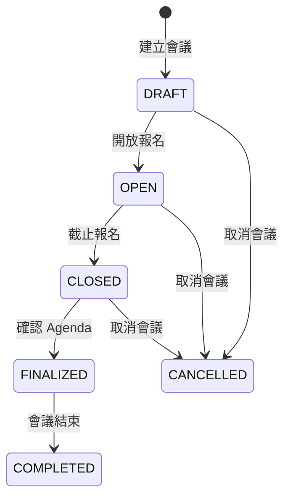
```mermaid
stateDiagram-v2
    [*] --> DRAFT: 建立會議
    DRAFT --> OPEN: 開放報名
    OPEN --> CLOSED: 截止報名
    CLOSED --> FINALIZED: 確認 Agenda
    FINALIZED --> COMPLETED: 會議結束
    
    DRAFT --> CANCELLED: 取消會議
    OPEN --> CANCELLED: 取消會議
    CLOSED --> CANCELLED: 取消會議
```

### 4.2 會議建立流程

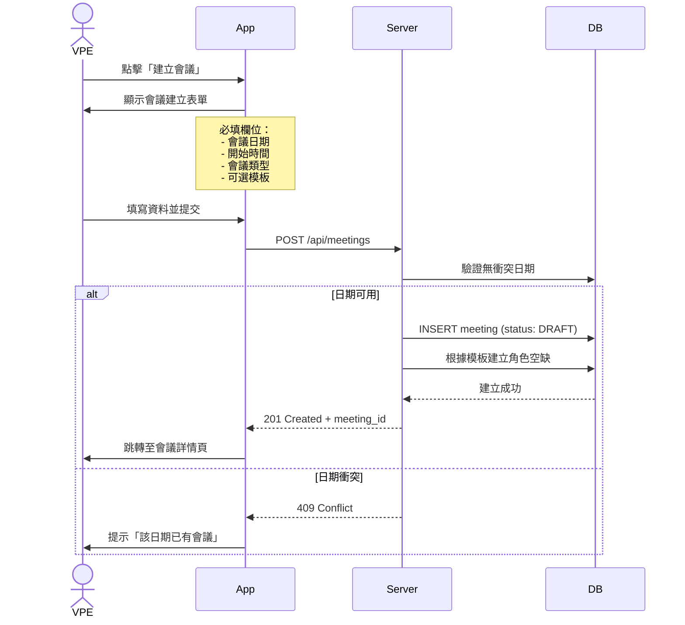
```mermaid
sequenceDiagram
    actor VPE
    participant App
    participant Server
    participant DB
    
    VPE->>App: 點擊「建立會議」
    App->>VPE: 顯示會議建立表單
    
    Note over App: 必填欄位：<br/>- 會議日期<br/>- 開始時間<br/>- 會議類型<br/>- 可選模板
    
    VPE->>App: 填寫資料並提交
    App->>Server: POST /api/meetings
    
    Server->>DB: 驗證無衝突日期
    
    alt 日期可用
        Server->>DB: INSERT meeting (status: DRAFT)
        Server->>DB: 根據模板建立角色空缺
        DB-->>Server: 建立成功
        Server-->>App: 201 Created + meeting_id
        App->>VPE: 跳轉至會議詳情頁
    else 日期衝突
        Server-->>App: 409 Conflict
        App->>VPE: 提示「該日期已有會議」
    end
```

### 4.3 會議編輯權限

| 操作 | DRAFT | OPEN | CLOSED | FINALIZED |
|:---|:---:|:---:|:---:|:---:|
| 修改日期/時間 | ✅ | ⚠️ 需通知 | ❌ | ❌ |
| 修改會議類型 | ✅ | ❌ | ❌ | ❌ |
| 增減角色 | ✅ | ✅ | ⚠️ 需確認 | ❌ |
| 開放報名 | ✅ | - | - | - |
| 截止報名 | - | ✅ | - | - |
| 產生 Agenda | - | - | ✅ | ✅ (微調) |
| 取消會議 | ✅ | ✅ 需通知 | ✅ 需確認 | ❌ |

---

## 5. 會議角色註冊流程

提供「Chat 對話」與「UI 介面」兩種操作方式，資料即時同步。

### 5.1 角色類型與限制

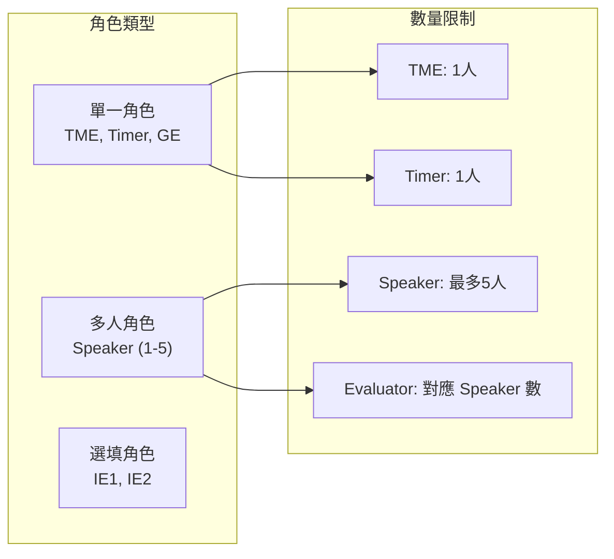
```mermaid
flowchart LR
    subgraph RoleTypes ["角色類型"]
        Single["單一角色<br/>TME, Timer, GE"]
        Multi["多人角色<br/>Speaker (1-5)"]
        Optional["選填角色<br/>IE1, IE2"]
    end
    
    subgraph Rules ["數量限制"]
        R1["TME: 1人"]
        R2["Speaker: 最多5人"]
        R3["Timer: 1人"]
        R4["Evaluator: 對應 Speaker 數"]
    end
    
    Single --> R1
    Single --> R3
    Multi --> R2
    Multi --> R4
```

### 5.2 Chat 對話式註冊

透過自然語言與 AI 互動。AI 會先檢查角色空缺狀態，若有空缺則顯示互動式按鈕（Button）供用戶確認，避免誤操作。

**功能特點**:
- **指令範例**: 「我要報名下週五的 Timer」、「取消我的 TME 角色」
- **防呆機制**: 若角色已滿，AI 會建議其他空缺角色或候補

**對話流程圖**:

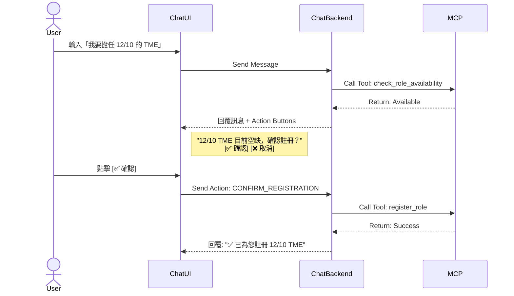
```mermaid
sequenceDiagram
    actor User
    participant ChatUI
    participant ChatBackend
    participant MCP
    
    User->>ChatUI: 輸入「我要擔任 12/10 的 TME」
    ChatUI->>ChatBackend: Send Message
    ChatBackend->>MCP: Call Tool: check_role_availability
    MCP-->>ChatBackend: Return: Available
    
    ChatBackend-->>ChatUI: 回覆訊息 + Action Buttons
    Note right of ChatUI: "12/10 TME 目前空缺，確認註冊？"<br/>[✅ 確認] [❌ 取消]
    
    User->>ChatUI: 點擊 [✅ 確認]
    ChatUI->>ChatBackend: Send Action: CONFIRM_REGISTRATION
    ChatBackend->>MCP: Call Tool: register_role
    MCP-->>ChatBackend: Return: Success
    ChatBackend-->>ChatUI: 回覆: "✅ 已為您註冊 12/10 TME"
```

### 5.3 UI 介面註冊

視覺化的角色列表，提供直覺的操作體驗。

**功能特點**:
- **狀態顯示**: 每個角色卡片會顯示「空缺（可報名）」、「已額滿（顯示頭像）」或「已報名（顯示取消按鈕）」
- **操作流程**: 點擊空缺卡片 → 彈出確認窗 → 完成報名

**操作流程圖**:

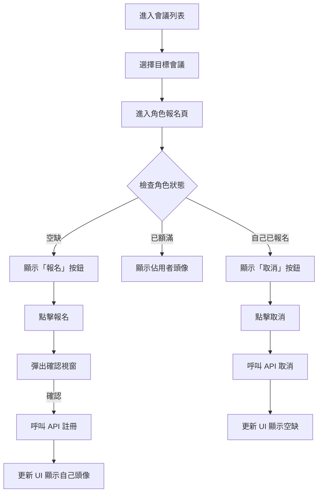
```mermaid
flowchart TD
    A["進入會議列表"] --> B["選擇目標會議"]
    B --> C["進入角色報名頁"]
    C --> D{"檢查角色狀態"}
    
    D -->|"空缺"| E["顯示「報名」按鈕"]
    D -->|"已額滿"| F["顯示佔用者頭像"]
    D -->|"自己已報名"| G["顯示「取消」按鈕"]
    
    E --> H["點擊報名"]
    H --> I["彈出確認視窗"]
    I -->|"確認"| J["呼叫 API 註冊"]
    J --> K["更新 UI 顯示自己頭像"]
    
    G --> L["點擊取消"]
    L --> M["呼叫 API 取消"]
    M --> N["更新 UI 顯示空缺"]
```

### 5.4 角色報名防呆流程

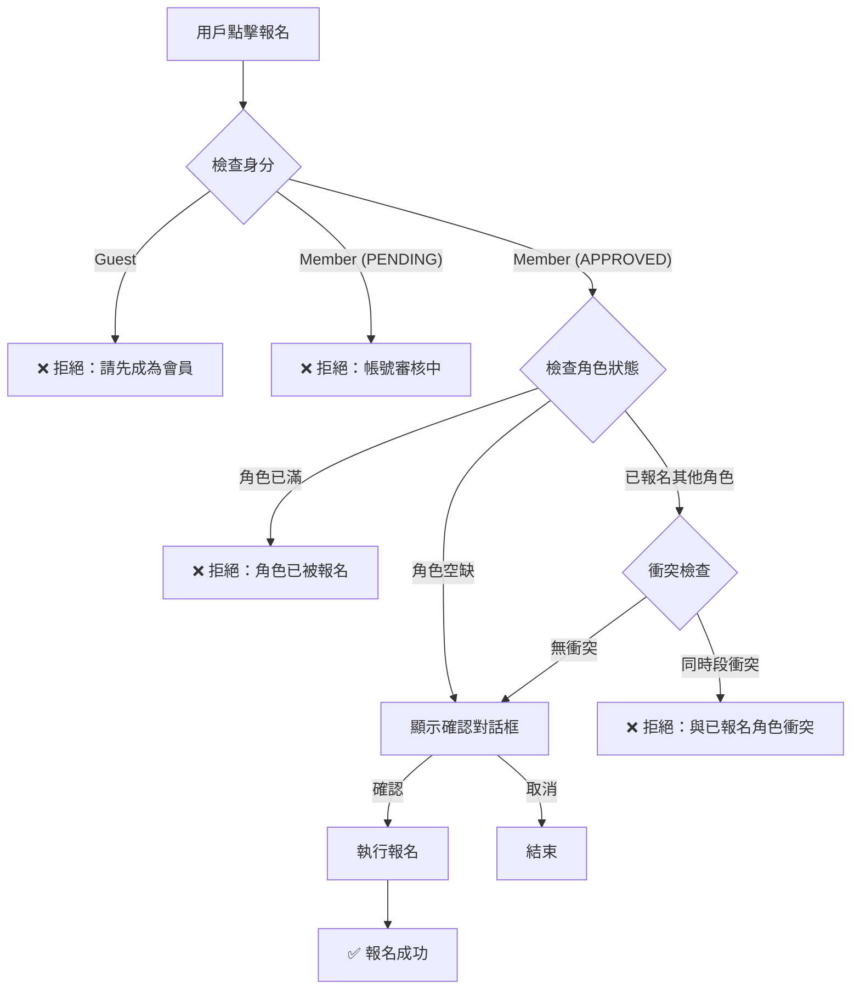
```mermaid
flowchart TD
    Start["用戶點擊報名"] --> CheckAuth{"檢查身分"}
    
    CheckAuth -->|"Guest"| Deny1["❌ 拒絕：請先成為會員"]
    CheckAuth -->|"Member (PENDING)"| Deny2["❌ 拒絕：帳號審核中"]
    CheckAuth -->|"Member (APPROVED)"| CheckRole{"檢查角色狀態"}
    
    CheckRole -->|"角色已滿"| Deny3["❌ 拒絕：角色已被報名"]
    CheckRole -->|"已報名其他角色"| CheckConflict{"衝突檢查"}
    CheckRole -->|"角色空缺"| Confirm["顯示確認對話框"]
    
    CheckConflict -->|"同時段衝突"| Deny4["❌ 拒絕：與已報名角色衝突"]
    CheckConflict -->|"無衝突"| Confirm
    
    Confirm -->|"確認"| Register["執行報名"]
    Confirm -->|"取消"| End["結束"]
    
    Register --> Success["✅ 報名成功"]
```

### 5.5 角色衝突規則

| 角色 A | 可兼任 | 不可兼任 |
|:---|:---|:---|
| **TME** | - | Speaker, GE, Timer, Evaluator |
| **Speaker** | IE (非同場) | TME, Evaluator (同一人) |
| **Timer** | AH Counter, Grammarian | TME |
| **GE** | - | TME, Speaker, Evaluator |
| **Evaluator** | Timer, AH Counter | TME, GE, 對應 Speaker |

### 5.6 管理員代理報名

Club Admin 可代替會員報名或取消報名：

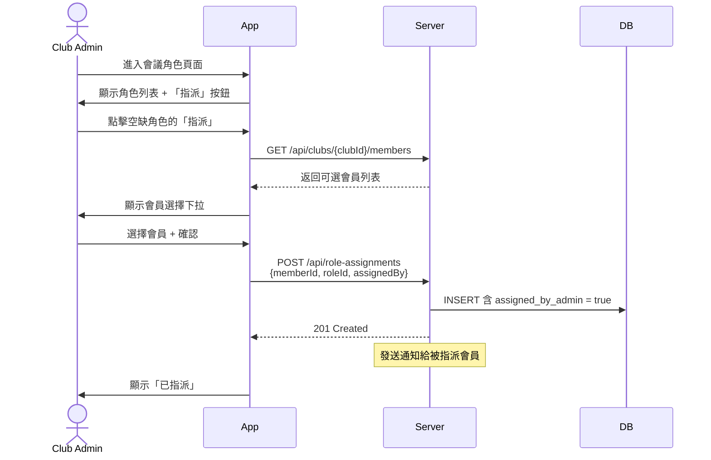
```mermaid
sequenceDiagram
    actor CA as Club Admin
    participant App
    participant Server
    participant DB
    
    CA->>App: 進入會議角色頁面
    App->>CA: 顯示角色列表 + 「指派」按鈕
    
    CA->>App: 點擊空缺角色的「指派」
    App->>Server: GET /api/clubs/{clubId}/members
    Server-->>App: 返回可選會員列表
    
    App->>CA: 顯示會員選擇下拉
    CA->>App: 選擇會員 + 確認
    App->>Server: POST /api/role-assignments<br/>{memberId, roleId, assignedBy}
    
    Server->>DB: INSERT 含 assigned_by_admin = true
    Server-->>App: 201 Created
    
    Note over Server: 發送通知給被指派會員
    App->>CA: 顯示「已指派」
```

---

## 6. Agenda 模板管理與產生

此功能專為 VPE（教育副會長）設計，用於快速產生標準化的會議議程。

### 6.1 模板管理

**功能流程**:

1. **上傳**: 支援上傳 Excel 格式的議程範本
2. **解析與編輯**: 後端解析 Excel 後，VPE 可在 App 介面上調整時段順序、時間長度與負責職位
3. **儲存**: 將調整好的結構儲存為「標準例會」、「比賽」、「特別活動」等不同模板

### 6.2 模板結構設計

```json
{
  "templateId": "standard-meeting-v1",
  "name": "標準例會",
  "sections": [
    {
      "order": 1,
      "name": "開場",
      "duration": 10,
      "items": [
        { "name": "Sergeant at Arms", "role": "SAA", "duration": 3 },
        { "name": "Opening", "role": "President", "duration": 2 },
        { "name": "TME Welcome", "role": "TME", "duration": 5 }
      ]
    },
    {
      "order": 2,
      "name": "準備演講",
      "duration": 35,
      "items": [
        { "name": "Speaker 1", "role": "Speaker", "duration": 7 },
        { "name": "Speaker 2", "role": "Speaker", "duration": 7 },
        { "name": "Speaker 3", "role": "Speaker", "duration": 7 }
      ]
    }
  ]
}
```

### 6.3 議程產生

**功能流程**:

1. **選擇**: 選擇會議日期與要套用的模板
2. **自動合併**: 系統自動將該次會議「已報名的角色」（如 TME, Speaker 1, Timer）填入模板對應的欄位
3. **微調與發布**: VPE 可手動修改講題、調整臨時變動，確認無誤後匯出 PDF 或產生分享連結

### 6.4 議程產生流程

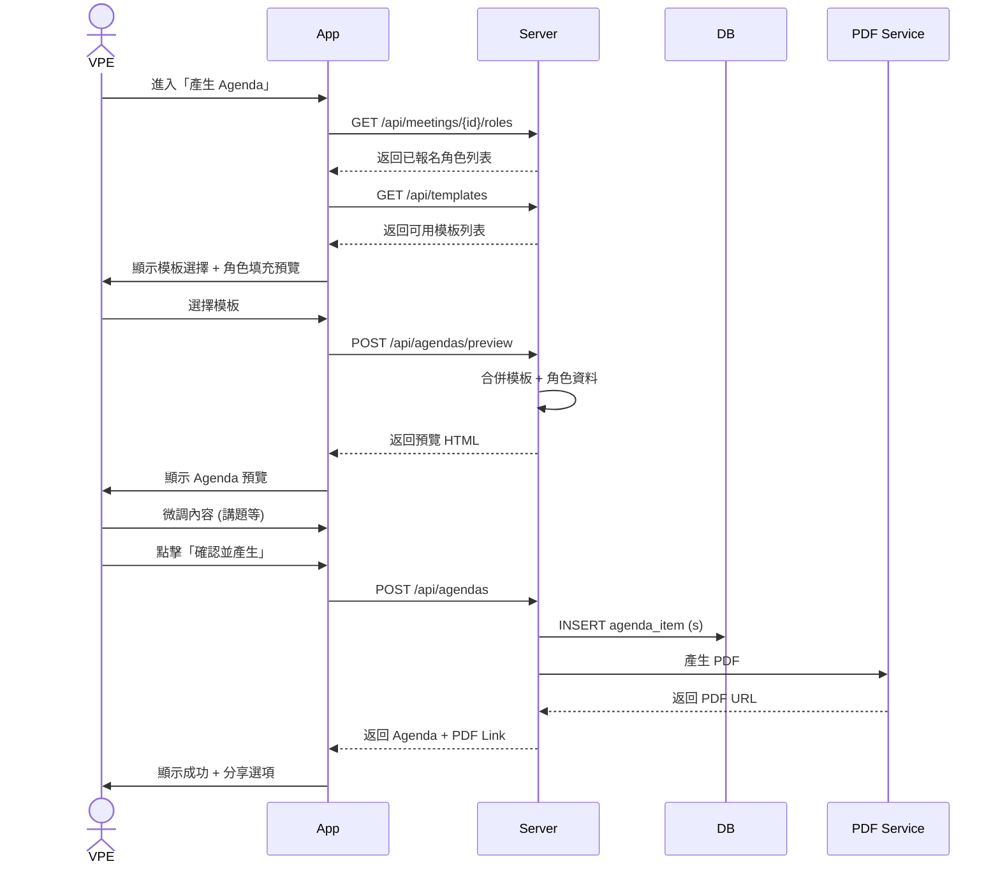
```mermaid
sequenceDiagram
    actor VPE
    participant App
    participant Server
    participant DB
    participant PDF as PDF Service
    
    VPE->>App: 進入「產生 Agenda」
    App->>Server: GET /api/meetings/{id}/roles
    Server-->>App: 返回已報名角色列表
    
    App->>Server: GET /api/templates
    Server-->>App: 返回可用模板列表
    
    App->>VPE: 顯示模板選擇 + 角色填充預覽
    VPE->>App: 選擇模板
    
    App->>Server: POST /api/agendas/preview
    Server->>Server: 合併模板 + 角色資料
    Server-->>App: 返回預覽 HTML
    
    App->>VPE: 顯示 Agenda 預覽
    VPE->>App: 微調內容 (講題等)
    
    VPE->>App: 點擊「確認並產生」
    App->>Server: POST /api/agendas
    Server->>DB: INSERT agenda_item (s)
    Server->>PDF: 產生 PDF
    PDF-->>Server: 返回 PDF URL
    Server-->>App: 返回 Agenda + PDF Link
    
    App->>VPE: 顯示成功 + 分享選項
```

### 6.5 Agenda 狀態與權限

| 狀態 | VPE 操作 | Club Admin 操作 | 會員可見 |
|:---|:---|:---|:---|
| **DRAFT** | 編輯、刪除、預覽 | 查看、編輯 | ❌ |
| **PUBLISHED** | 小幅修正、發布更新 | 查看、修正 | ✅ 查看 |
| **ARCHIVED** | 查看 | 查看 | ✅ 查看 |

### 6.6 模板與產生流程圖

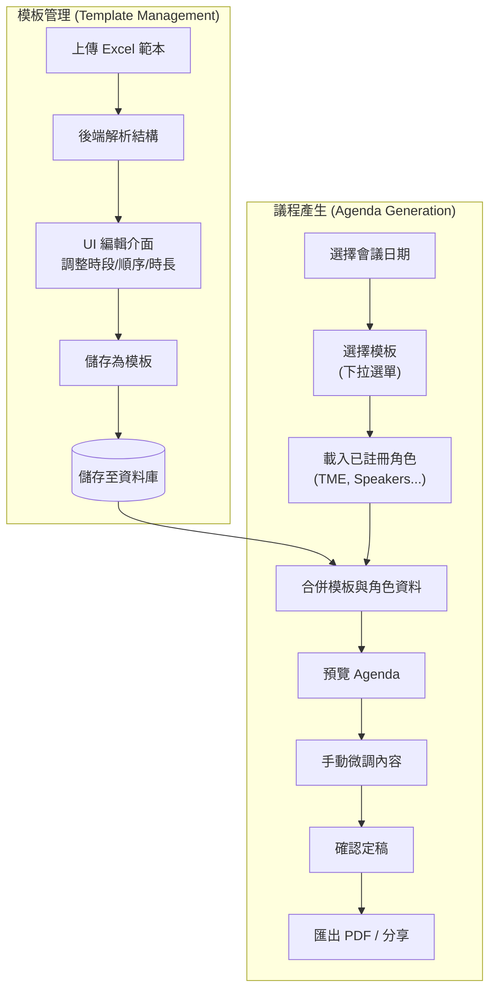
```mermaid
flowchart TD
    subgraph TemplateMgmt ["模板管理 (Template Management)"]
        Upload["上傳 Excel 範本"] --> Parse["後端解析結構"]
        Parse --> Edit["UI 編輯介面<br/>調整時段/順序/時長"]
        Edit --> Save["儲存為模板"]
        Save --> DB_Template[("儲存至資料庫")]
    end
    
    subgraph AgendaGen ["議程產生 (Agenda Generation)"]
        SelectMeeting["選擇會議日期"] --> SelectTemplate["選擇模板<br/>(下拉選單)"]
        SelectTemplate --> LoadRoles["載入已註冊角色<br/>(TME, Speakers...)"]
        DB_Template --> Merge
        LoadRoles --> Merge["合併模板與角色資料"]
        
        Merge --> Preview["預覽 Agenda"]
        Preview --> ManualEdit["手動微調內容"]
        ManualEdit --> Finalize["確認定稿"]
        Finalize --> Export["匯出 PDF / 分享"]
    end
```

---

## 7. 會議投票機制 (Voting System)

會議進行中的即時投票功能，由 TME 控制投票流程，所有會議參與者皆可投票。

### 7.1 投票流程概述

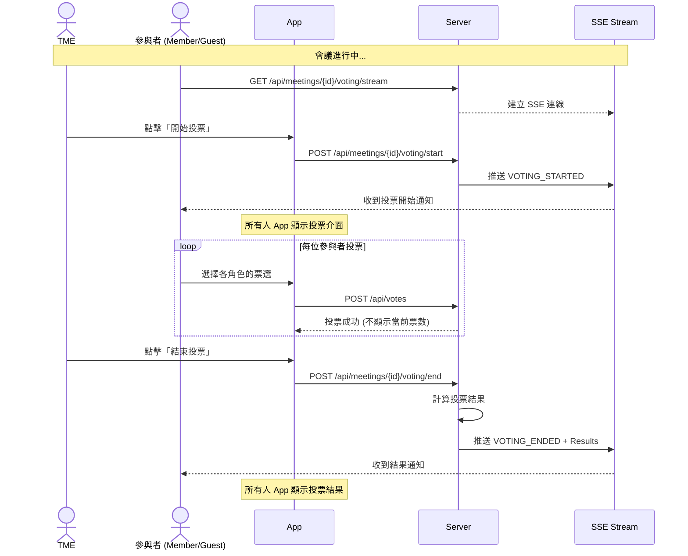
```mermaid
sequenceDiagram
    actor TME
    actor Participants as 參與者 (Member/Guest)
    participant App
    participant Server
    participant SSE as SSE Stream
    
    Note over TME,SSE: 會議進行中...
    
    Participants->>Server: GET /api/meetings/{id}/voting/stream
    Server-->>SSE: 建立 SSE 連線
    
    TME->>App: 點擊「開始投票」
    App->>Server: POST /api/meetings/{id}/voting/start
    Server->>SSE: 推送 VOTING_STARTED
    SSE-->>Participants: 收到投票開始通知
    
    Note over App: 所有人 App 顯示投票介面
    
    loop 每位參與者投票
        Participants->>App: 選擇各角色的票選
        App->>Server: POST /api/votes
        Server-->>App: 投票成功 (不顯示當前票數)
    end
    
    TME->>App: 點擊「結束投票」
    App->>Server: POST /api/meetings/{id}/voting/end
    Server->>Server: 計算投票結果
    Server->>SSE: 推送 VOTING_ENDED + Results
    SSE-->>Participants: 收到結果通知
    
    Note over App: 所有人 App 顯示投票結果
```

### 7.2 投票狀態機

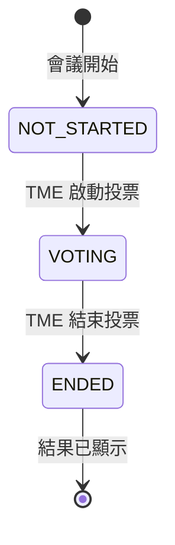
```mermaid
stateDiagram-v2
    [*] --> NOT_STARTED: 會議開始
    NOT_STARTED --> VOTING: TME 啟動投票
    VOTING --> ENDED: TME 結束投票
    ENDED --> [*]: 結果已顯示
```

### 7.3 投票類別與獎項

| 投票類別 | 對象 | 說明 |
|:---|:---|:---|
| **Best Speaker** | 所有 Speaker | 最佳演講者 |
| **Best Evaluator** | 所有 Evaluator | 最佳講評者 |
| **Best Table Topic** | Table Topic 回答者 | 最佳即席演講 |
| **Best Support Role** | Timer, AH Counter, Grammarian | 最佳輔助角色 |

### 7.4 投票權限

| 角色 | 操作 | 說明 |
|:---|:---|:---|
| **TME** | ✅ 啟動/結束投票 | 唯一控制者 |
| **Member (APPROVED)** | ✅ 投票 | 需為會議參與者 |
| **Guest** | ✅ 投票 | 需為會議參與者 |
| **Role Taker** | ❌ 自己類別 | 不能投票給自己 |

### 7.5 投票介面流程

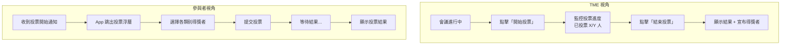
```mermaid
flowchart TD
    subgraph TMEView ["TME 視角"]
        T1["會議進行中"] --> T2["點擊「開始投票」"]
        T2 --> T3["監控投票進度<br/>已投票 X/Y 人"]
        T3 --> T4["點擊「結束投票」"]
        T4 --> T5["顯示結果 + 宣布得獎者"]
    end
    
    subgraph ParticipantView ["參與者視角"]
        P1["收到投票開始通知"] --> P2["App 跳出投票浮層"]
        P2 --> P3["選擇各類別得獎者"]
        P3 --> P4["提交投票"]
        P4 --> P5["等待結果..."]
        P5 --> P6["顯示投票結果"]
    end
```

### 7.6 投票 API 設計

| Method | Endpoint | 說明 | 權限 |
|:---|:---|:---|:---|
| `GET` | `/api/meetings/{id}/voting/stream` | SSE 連線（即時推送） | 參與者 |
| `POST` | `/api/meetings/{id}/voting/start` | 啟動投票 | TME only |
| `POST` | `/api/meetings/{id}/voting/end` | 結束投票 | TME only |
| `GET` | `/api/meetings/{id}/voting/status` | 查詢投票狀態 | 參與者 |
| `POST` | `/api/votes` | 提交投票 | 參與者 |
| `GET` | `/api/meetings/{id}/voting/results` | 查詢結果 | 投票結束後 |

### 7.7 即時通訊設計 (Server-Sent Events)

使用 SSE 實現即時推送，由 Server 向 Client 單向傳送事件：

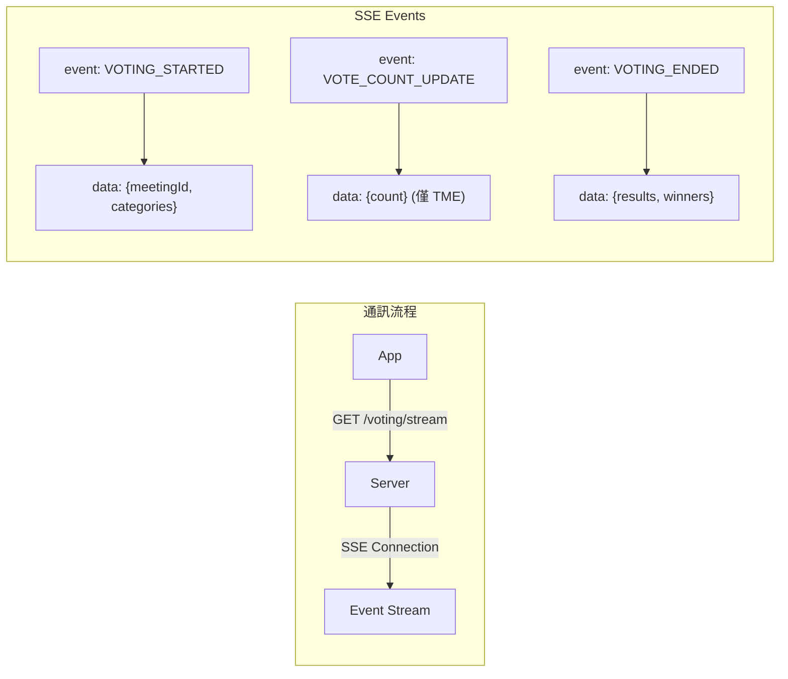
```mermaid
flowchart LR
    subgraph SSE_Flow ["通訊流程"]
        Client["App"] -->|"GET /voting/stream"| Server
        Server -->|"SSE Connection"| Stream["Event Stream"]
    end
    
    subgraph Events ["SSE Events"]
        E1["event: VOTING_STARTED"] --> D1["data: {meetingId, categories}"]
        E2["event: VOTE_COUNT_UPDATE"] --> D2["data: {count} (僅 TME)"]
        E3["event: VOTING_ENDED"] --> D3["data: {results, winners}"]
    end
```

**SSE 特點**：
- 單向通訊（Server → Client）
- HTTP 原生支援，簡化實作
- 自動重連機制
- Spring Boot 內建 `SseEmitter` 支援

### 7.8 資料庫設計

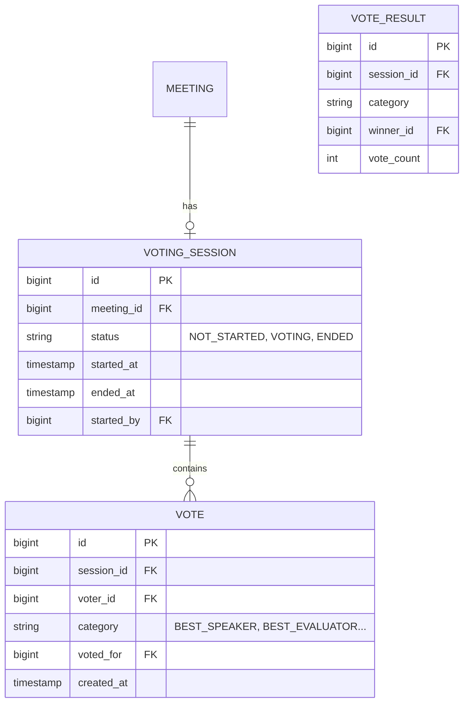
```mermaid
erDiagram
    MEETING ||--o| VOTING_SESSION : has
    VOTING_SESSION ||--o{ VOTE : contains
    
    VOTING_SESSION {
        bigint id PK
        bigint meeting_id FK
        string status "NOT_STARTED, VOTING, ENDED"
        timestamp started_at
        timestamp ended_at
        bigint started_by FK
    }
    
    VOTE {
        bigint id PK
        bigint session_id FK
        bigint voter_id FK
        string category "BEST_SPEAKER, BEST_EVALUATOR..."
        bigint voted_for FK
        timestamp created_at
    }
    
    VOTE_RESULT {
        bigint id PK
        bigint session_id FK
        string category
        bigint winner_id FK
        int vote_count
    }
```

---

## 8. 通知系統設計

### 8.1 通知類型與觸發條件

| 類別 | 事件 | 通知對象 | 通知管道 |
|:---|:---|:---|:---|
| **會員** | 審核通過/拒絕 | 申請者 | Push + Email |
| **會議** | 新會議建立 | 全體會員 | Push |
| | 會議取消 | 已報名者 | Push + Email |
| | 報名截止提醒 | 未報名會員 | Push |
| **角色** | 被指派角色 | 被指派者 | Push |
| | 角色被移除 | 原報名者 | Push + Email |
| **Agenda** | Agenda 發布 | 全體會員 | Push |
| | Agenda 更新 | 全體會員 | Push |

### 8.2 通知偏好設定

用戶可在設定中調整通知偏好：

```mermaid
flowchart LR
    subgraph Settings ["通知設定"]
        A["Push 通知"] --> |"開/關"| A1["全部"]
        A --> A2["僅重要"]
        A --> A3["關閉"]
        
        B["Email 通知"] --> |"開/關"| B1["全部"]
        B --> B2["僅重要"]
        B --> B3["關閉"]
    end
```

---

## 9. 資料庫設計

### 9.1 主要實體

- **CLUB**: 分會基本資料
- **MEMBER**: 會員資料，包含權限角色（Role）與狀態
- **MEETING**: 會議主檔，包含日期、主題
- **ROLE_ASSIGNMENT**: 記錄誰在該次會議擔任什麼角色
- **AGENDA_TEMPLATE**: 儲存議程結構的 JSON 定義
- **AGENDA_ITEM**: 議程項目明細
- **NOTIFICATION**: 通知記錄

### 9.2 實體關係圖

```mermaid
erDiagram
    CLUB ||--o{ MEMBER : has
    CLUB ||--o{ AGENDA_TEMPLATE : owns
    CLUB ||--o{ MEETING : schedules
    
    MEMBER {
        bigint id PK
        string email
        string password_hash
        string role "PLATFORM_ADMIN, CLUB_ADMIN..."
        string status "ACTIVE, PENDING, REJECTED, SUSPENDED"
        boolean notification_push
        boolean notification_email
        bigint approved_by FK
        timestamp approved_at
        text rejection_reason
    }

    MEETING {
        bigint id PK
        date meeting_date
        time start_time
        string status "DRAFT, OPEN, CLOSED, FINALIZED, COMPLETED, CANCELLED"
    }

    ROLE_ASSIGNMENT {
        bigint id PK
        bigint meeting_id FK
        bigint member_id FK
        string role_name "TME, Timer..."
        bigint assigned_by FK
        timestamp assigned_at
        boolean is_admin_assigned
    }

    AGENDA_TEMPLATE {
        bigint id PK
        string name "Standard Meeting..."
        json structure "時段設定 JSON"
    }
    
    AGENDA_ITEM {
        bigint id PK
        bigint meeting_id FK
        string title
        int duration_min
        string assigned_person_name
    }
    
    NOTIFICATION {
        bigint id PK
        bigint user_id FK
        string type
        string title
        text body
        timestamp read_at
        timestamp created_at
    }

    MEETING ||--o{ ROLE_ASSIGNMENT : has
    MEETING ||--o{ AGENDA_ITEM : contains
    MEMBER ||--o{ NOTIFICATION : receives
```

---

## 10. 技術棧與部署

### 10.1 技術選型

| 組件 | 技術 | 服務 | 規格 |
|------|------|-----------|------|
| **Mobile App** | Flutter 3.x, Provider, Dio | - | iOS / Android |
| **MCP Server** | Spring Boot 3.x, JPA | Cloud Run | 0.5 vCPU, 512MB |
| **Chat Backend** | Generative AI SDK (Python) | Cloud Run | 0.5 vCPU, 512MB |
| **Database** | PostgreSQL | Cloud SQL | db-f1-micro |
| **AI Model** | Gemini 2.0 Flash | Gemini Developer API | Google AI Pro 訂閱 |

### 10.2 In-App Chat SSE 通訊設計

Chat UI 透過 SSE 與 Chat Backend 連線，實現串流式對話回應：

```mermaid
sequenceDiagram
    actor User
    participant App as Flutter App
    participant ChatBackend as Chat Backend<br/>(OpenAI ADK)
    participant MCP as MCP Server
    participant Gemini as Gemini 2.0 Flash

    User->>App: 輸入訊息
    App->>ChatBackend: GET /chat/stream?message=...
    Note over App,ChatBackend: SSE 連線建立
    
    ChatBackend->>Gemini: 發送 Prompt
    
    loop 串流回應
        Gemini-->>ChatBackend: Token (streaming)
        ChatBackend-->>App: event: message<br/>data: {token}
        App->>User: 即時顯示文字
    end
    
    alt 需要呼叫 MCP Tool
        ChatBackend->>MCP: Call Tool (e.g., register_role)
        MCP-->>ChatBackend: Tool Result
        ChatBackend-->>App: event: tool_result<br/>data: {result}
    end
    
    ChatBackend-->>App: event: done
    Note over App,ChatBackend: SSE 連線關閉
```

### 10.3 MCP Server 功能清單

Spring Boot MCP Server 提供以下 Tools 供 Chat Backend 調用：

| 功能模組 | Tool 名稱 | 說明 |
|:---|:---|:---|
| **會員管理** | `get_member_info` | 查詢會員資料 |
| | `list_club_members` | 列出分會會員 |
| | `update_member_status` | 更新會員狀態 |
| **會議管理** | `list_meetings` | 查詢會議列表 |
| | `get_meeting_detail` | 取得會議詳情 |
| | `create_meeting` | 建立新會議 |
| | `update_meeting` | 更新會議資料 |
| **角色報名** | `check_role_availability` | 檢查角色空缺 |
| | `register_role` | 報名角色 |
| | `cancel_role` | 取消報名 |
| | `list_role_assignments` | 列出角色分配 |
| **Agenda** | `list_templates` | 列出議程模板 |
| | `generate_agenda` | 產生議程 |
| | `get_agenda` | 取得議程內容 |
| **投票** | `start_voting` | 啟動投票 |
| | `end_voting` | 結束投票 |
| | `get_voting_results` | 查詢投票結果 |

**MCP Server REST API**（供 UI 直接呼叫）：

| 模組 | Method | Endpoint | 說明 |
|:---|:---|:---|:---|
| **Auth** | POST | `/api/auth/login` | 登入 |
| | POST | `/api/auth/register` | 註冊 |
| **Clubs** | GET | `/api/clubs` | 分會列表 |
| | GET | `/api/clubs/{id}` | 分會詳情 |
| **Members** | GET | `/api/members` | 會員列表 |
| | PATCH | `/api/members/{id}/approve` | 審核通過 |
| **Meetings** | GET | `/api/meetings` | 會議列表 |
| | POST | `/api/meetings` | 建立會議 |
| **Roles** | POST | `/api/role-assignments` | 報名角色 |
| **Voting** | GET | `/api/meetings/{id}/voting/stream` | SSE 連線 |
| **Agenda** | POST | `/api/agendas` | 產生議程 |

### 10.4 Gemini Developer API 設定

```mermaid
flowchart LR
    subgraph GoogleAI ["Google AI Studio"]
        APIKey["API Key"]
        Model["Gemini 2.0 Flash"]
    end
    
    subgraph ChatBackend ["Chat Backend"]
        SDK["Generative AI SDK"]
    end
    
    SDK -->|"認證"| APIKey
    SDK -->|"呼叫"| Model
```

**Gemini Developer API 建置步驟**：

1. **取得 API Key**
   - 前往 [Google AI Studio](https://aistudio.google.com/)
   - 點擊 "Get API Key" 取得 Key
   - 將 Key 存入 Secret Manager

2. **安裝 SDK**
   ```bash
   pip install google-generativeai
   ```

3. **使用範例**
   ```python
   import google.generativeai as genai
   
   genai.configure(api_key="YOUR_API_KEY")
   model = genai.GenerativeModel('gemini-2.0-flash')
   response = model.generate_content("你好")
   ```

**優點**：
- ✅ Google AI Pro 訂閱已包含
- ✅ 不需額外設定 GCP Project
- ✅ 簡化架構，降低成本

### 10.5 GCP 環境建置

```mermaid
flowchart TB
    subgraph GCPProject ["GCP Project: toastlabplus"]
        subgraph VPC ["VPC Network"]
            Subnet1["Subnet: cloud-run-connector"]
            Subnet2["Subnet: database"]
        end
        
        CloudRun["Cloud Run"]
        CR1["Service:<br/>chat-backend"]
        CR2["Service:<br/>mcp-server"]
        
        CloudSQL["Cloud SQL"]
        SQLDB["Instance:<br/>toastlabplus-db"]
        
        GAR["Artifact Registry"]
        
        VertexAI["Vertex AI"]
        SecretManager["Secret Manager"]
    end
    
    CloudRun --> CR1
    CloudRun --> CR2
    CloudSQL --> SQLDB
    GAR --> CR1
    GAR --> CR2
```

**資源清單與規格**：

| 資源 | 名稱 | 規格 | 估計月費 (USD) |
|:---|:---|:---|---:|
| Project | `toastlabplus` | - | - |
| Cloud Run (Chat) | `chat-backend` | 0.5 vCPU, 512MB | ~$5-15 |
| Cloud Run (MCP) | `mcp-server` | 0.5 vCPU, 512MB | ~$5-15 |
| Cloud SQL (PostgreSQL) | `toastlabplus-db` | db-f1-micro | ~$8 |
| Artifact Registry | `toastlabplus-repo` | Standard | ~$0.10/GB |
| Secret Manager | - | 依用量 | ~$0.03/secret |
| Gemini API | - | Google AI Pro 訂閱 | $0 (已包含) |
| VPC Connector | `serverless-connector` | f1-micro | ~$7 |
| **預估總計** | | | **~$25-50** |

### 10.6 部署策略

```mermaid
flowchart LR
    subgraph Dev ["開發環境"]
        LocalDev["本機開發"]
        DevTest["功能測試"]
    end
    
    subgraph CI_CD ["CI/CD Pipeline"]
        GitHub["GitHub Repository"]
        Actions["GitHub Actions"]
        GAR["Artifact Registry"]
    end
    
    subgraph GCP ["GCP 環境"]
        Staging["Staging"]
        Prod["Production"]
    end
    
    LocalDev --> GitHub
    GitHub --> Actions
    Actions --> GAR
    GAR --> Staging
    Staging -->|"手動核准"| Prod
```

**部署流程**：

1. **本機開發**
   - Podman Compose 模擬完整環境
   - 連接 Cloud SQL 開發資料庫

2. **CI/CD Pipeline** (GitHub Actions)
   ```yaml
   # .github/workflows/deploy.yml 流程概述
   - Build Container Images (Podman/Buildah)
   - Push to Artifact Registry
   - Deploy to Cloud Run (Staging)
   - Run Integration Tests
   - Manual Approval
   - Deploy to Cloud Run (Production)
   ```

3. **環境變數管理**
   - 使用 Secret Manager 存放敏感資訊
   - Cloud Run 引用 Secret Manager Secrets

### 10.7 建置檢查清單

| 階段 | 項目 | 狀態 |
|:---|:---|:---:|
| **GCP 基礎** | 建立 GCP Project | ⬜ |
| | 啟用必要 API | ⬜ |
| | 設定 VPC Network | ⬜ |
| | 建立 Artifact Registry | ⬜ |
| **資料庫** | 建立 Cloud SQL Instance | ⬜ |
| | 建立 Database | ⬜ |
| | 設定私有 IP 連線 | ⬜ |
| | 執行 Schema Migration | ⬜ |
| **Gemini API** | 取得 API Key (Google AI Studio) | ⬜ |
| | 將 Key 存入 Secret Manager | ⬜ |
| **Cloud Run** | 部署 MCP Server | ⬜ |
| | 部署 Chat Backend | ⬜ |
| | 設定環境變數 | ⬜ |
| | 設定 VPC Connector | ⬜ |
| **CI/CD** | 設定 GitHub Actions | ⬜ |
| | 設定 Workload Identity | ⬜ |
| | 測試自動部署 | ⬜ |


---

## 11. 功能雛型畫面

以下為 App 的核心功能畫面設計，採用宮崎駿風格的簡約可愛設計語言。

### 11.1 首頁

包含主要功能入口（Make Agenda）與快速導航。


### 11.2 角色報名

視覺化的角色列表，清晰顯示空缺與已佔用狀態。


### 11.3 In-App Chat

對話式操作介面，支援互動式按鈕以簡化確認流程。


### 11.4 議程產生

VPE 專用介面，支援模板選擇與預覽匯出。


---

## 附錄

### 版本歷史

- **v1.0** (2025-12-06): 初版完成，包含完整系統架構與功能設計
- **v1.1** (2025-12-06): 新增細部流程設計
  - 新增 Club Admin 可視權限詳細矩陣
  - 新增 API 資料過濾機制
  - 新增會員審核狀態機與操作流程
  - 新增審核通知機制
  - 新增會議生命週期與編輯權限
  - 新增角色類型與衝突規則
  - 新增管理員代理報名流程
  - 新增模板結構設計（JSON 格式）
  - 新增 Agenda 狀態與權限
  - 新增通知系統設計
  - 更新資料庫設計（補充欄位）
- **v1.2** (2025-12-06): 新增會議投票機制
  - 新增第 7 章 Voting System
  - 新增 TME 控制的投票流程
  - 新增投票狀態機與權限設計
  - 新增即時 SSE（Server-Sent Events）通訊設計
  - 新增投票相關資料表（VOTING_SESSION, VOTE, VOTE_RESULT）
- **v1.3** (2025-12-06): 新增基礎設施與部署策略（Azure 版本）
  - 新增 In-App Chat SSE 串流通訊設計
  - 新增 MCP Server 功能清單（17 個 Tools + REST API）
  - 新增 Azure AI Foundry 設定指南
  - 新增 Azure 環境建置圖與資源清單
  - 新增 CI/CD 部署策略（GitHub Actions）
  - 新增建置檢查清單
- **v1.4** (2025-12-09): 遷移至 Google Cloud Platform
  - 更新系統架構圖（GCP：Cloud Run、Cloud SQL）
  - Container 部署改用 Cloud Run
  - Database 改用 Cloud SQL (PostgreSQL)
  - 新增 `.github/workflows/deploy.yml` CI/CD workflow
  - 更新建置檢查清單為 GCP 服務
- **v1.5** (2025-12-09): 改用 Gemini Developer API
  - AI Model 改用 Gemini Developer API（Google AI Studio）
  - 移除 Vertex AI 依賴，使用現有 Google AI Pro 訂閱
  - 更新月費估算（~$25-50 USD，Gemini API 費用 $0）
  - 更新建置檢查清單（簡化 API Key 設定）