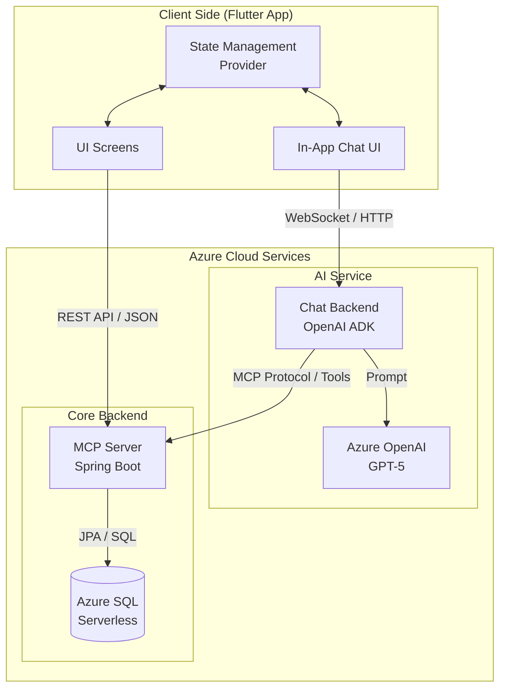
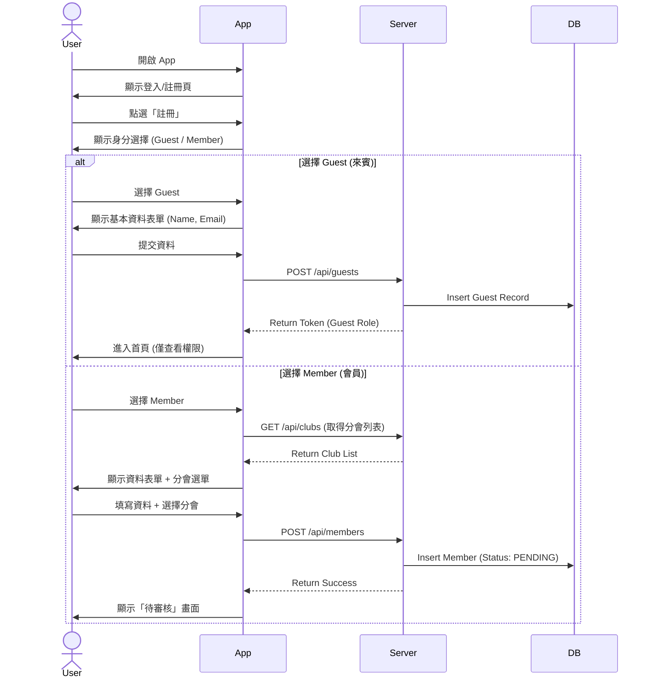
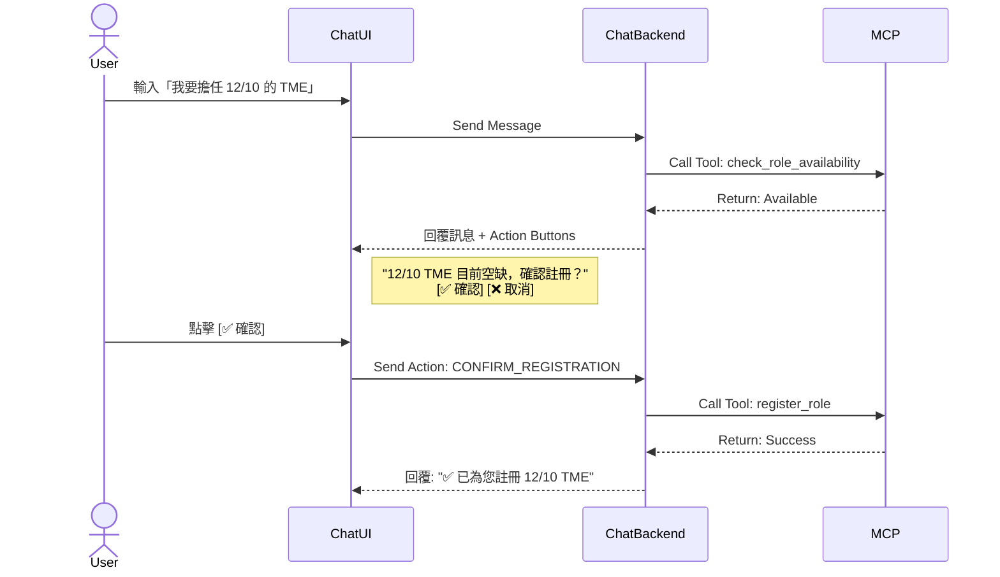
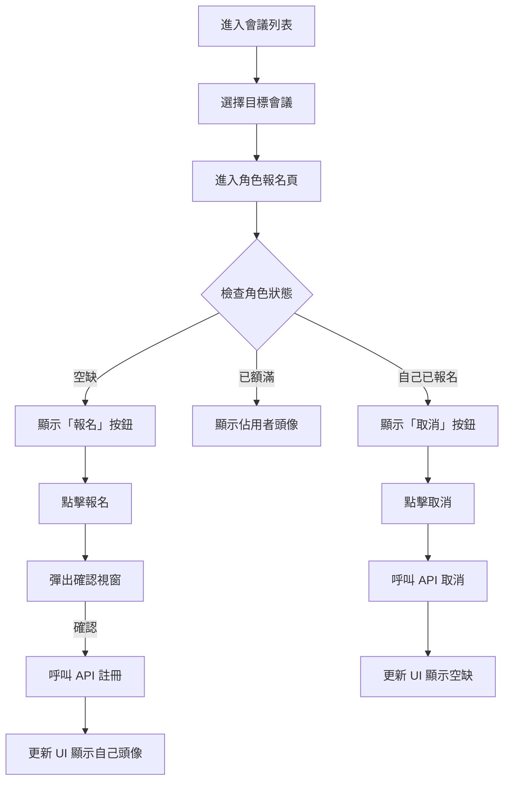
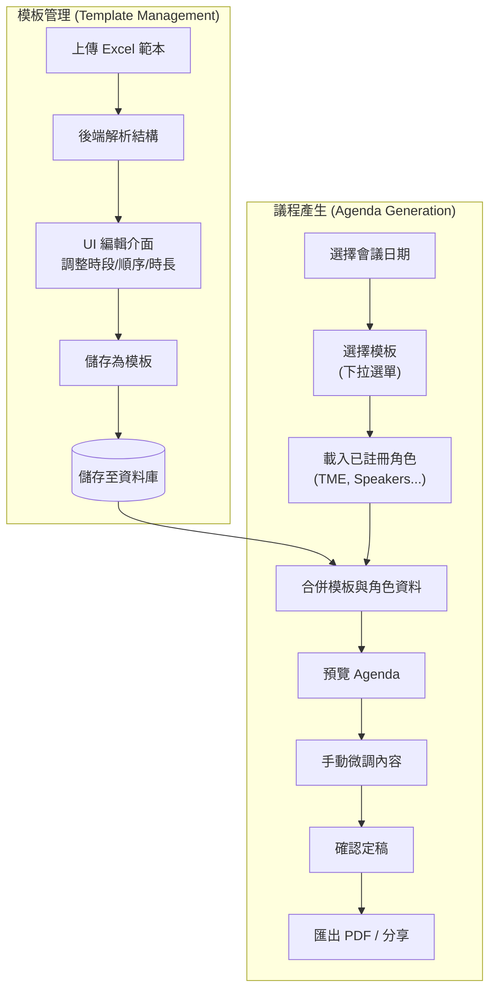
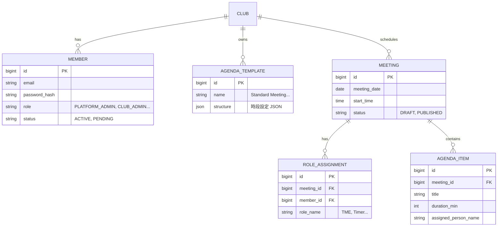
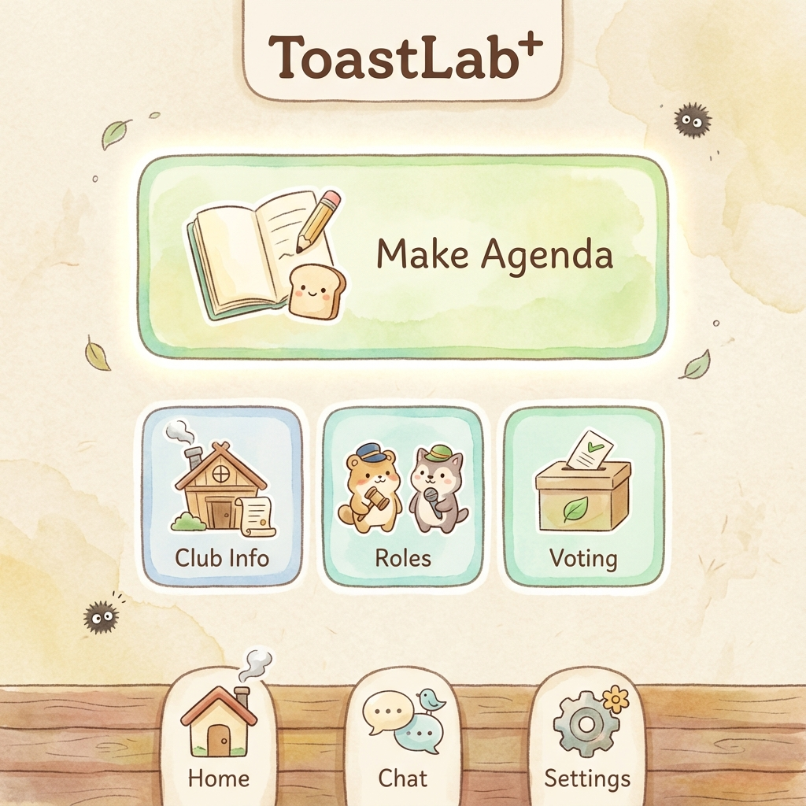
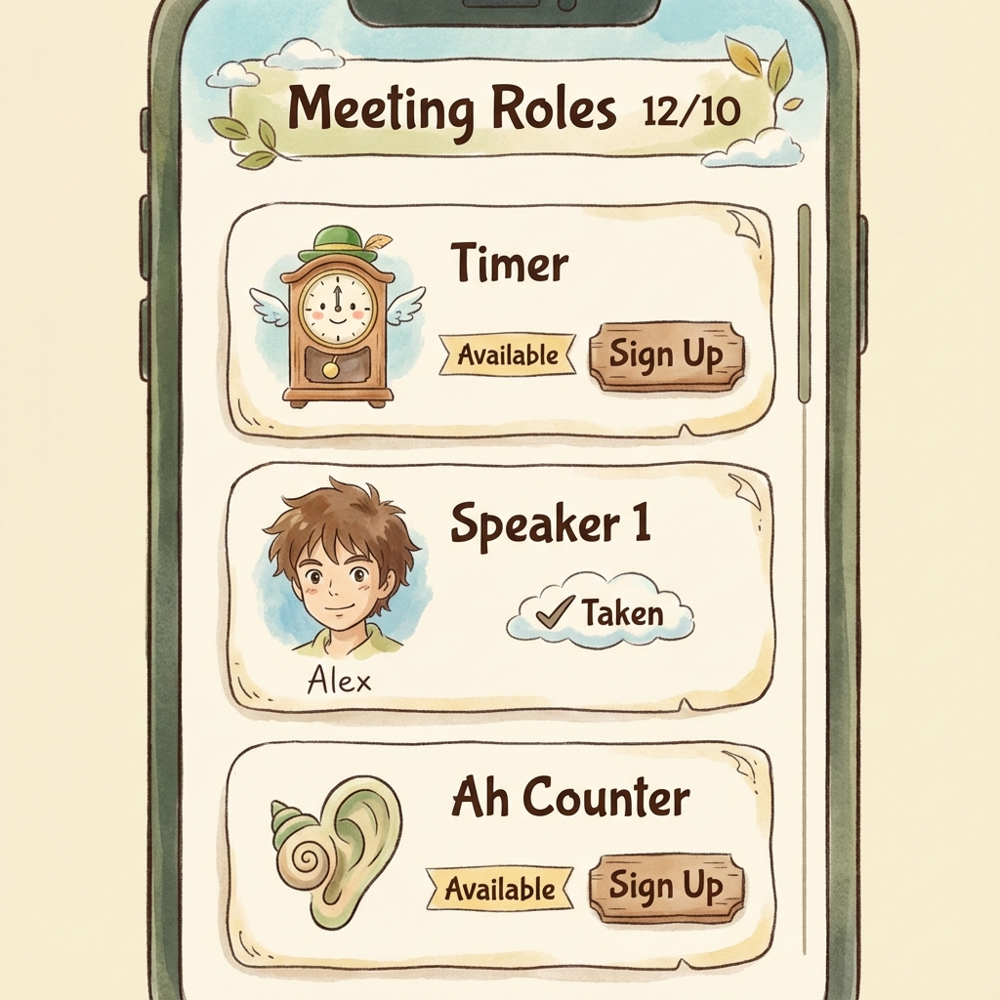
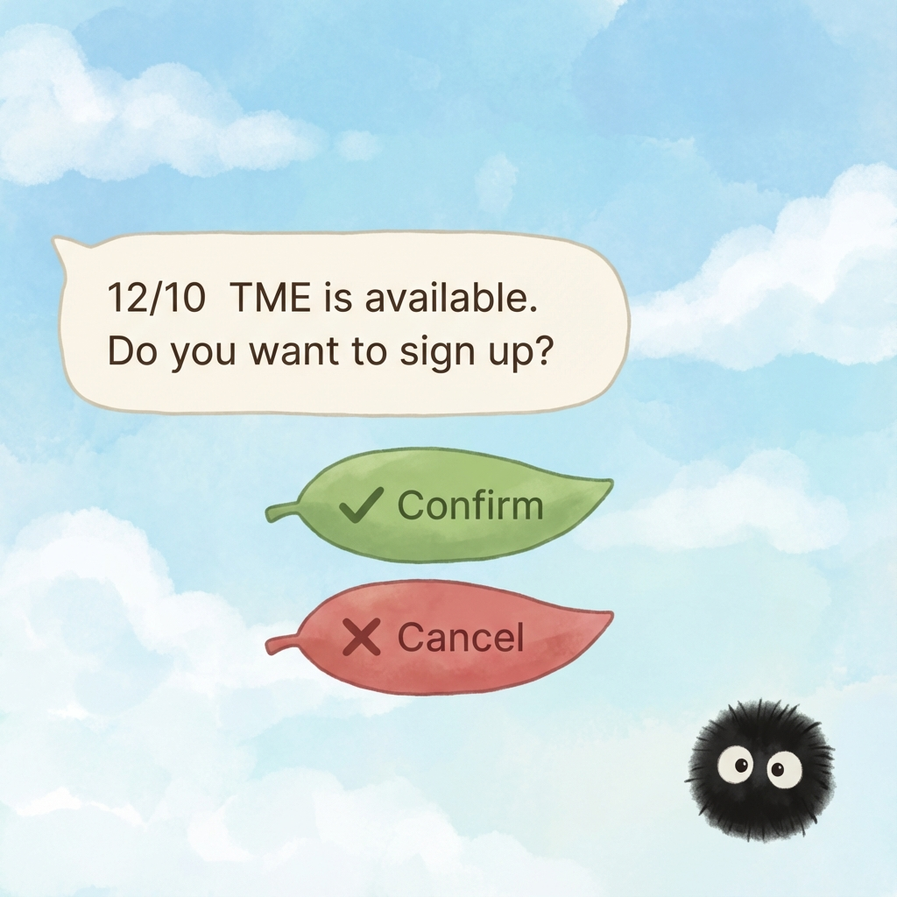
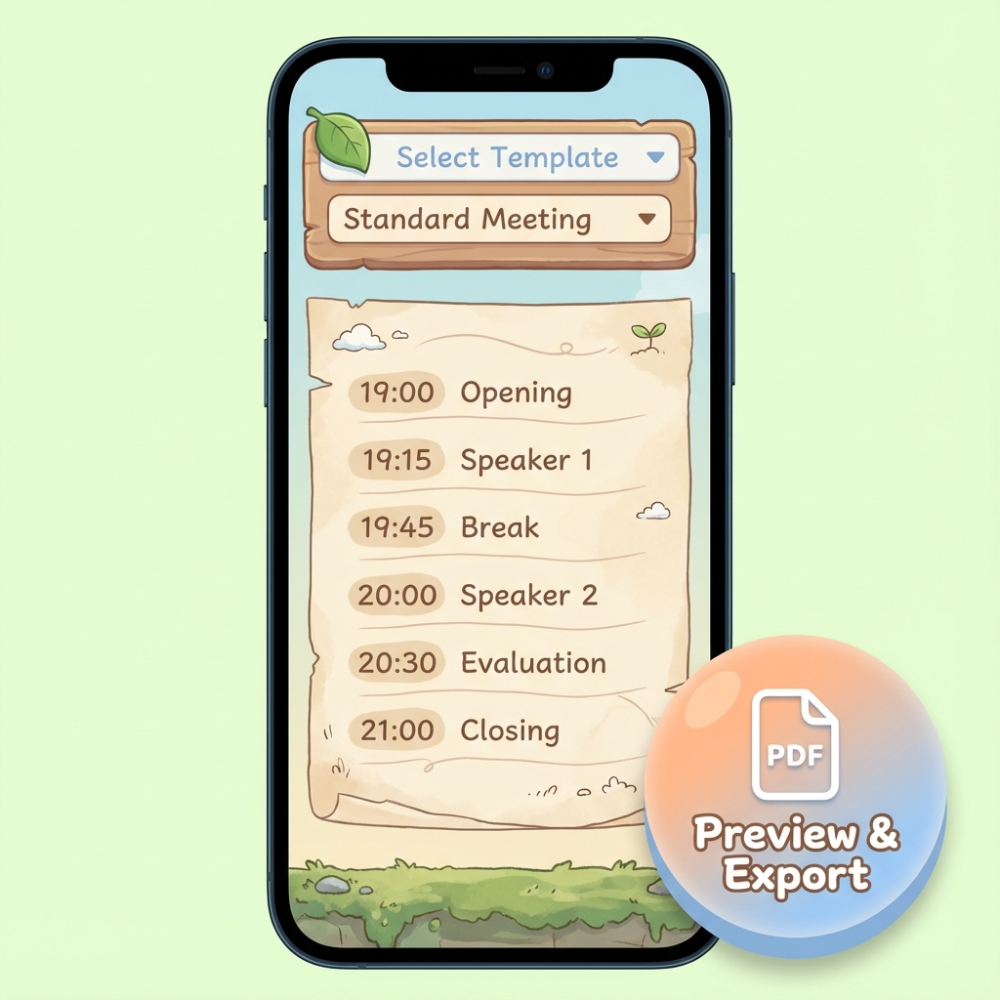

# Toastlabplus 專案實作計畫

Flutter App（宮崎駿風 UI + Chat）+ Azure 雲端服務。

## 1. 系統架構與資料流 (System Architecture)

本系統採用前後端分離架構，以 Azure 為核心雲端平台。

- **Client Side**: 使用 Flutter 建構跨平台 App，包含標準 UI 操作介面與 In-App Chat 聊天介面。
- **AI Service**: 透過 OpenAI ADK 框架建構 Chat Backend，連接 Azure OpenAI GPT-5 模型，負責理解用戶自然語言指令並調度 MCP Server。
- **Core Backend**: Spring Boot MCP Server 作為核心資料服務，處理所有業務邏輯與資料庫存取。
- **Database**: 使用 Azure SQL Serverless，兼顧效能與成本效益。

---

## 2. 使用者註冊與身分選擇 (User Registration)

系統支援多種身分註冊，確保不同角色的使用者能獲得對應的權限與功能。

1. **註冊入口**：使用者下載 App 後，可選擇「註冊新帳號」。
2. **身分選擇**：
   - **Guest (來賓)**：適用於非 Toastmasters 會員或參觀者。僅需填寫基本姓名與 Email，註冊後可瀏覽公開會議資訊，但無法報名角色。
   - **Member (會員)**：適用於正式會員。註冊時需選擇所屬分會 (Club)，提交後狀態為 `PENDING`，需等待分會管理員審核通過後才能啟用完整功能（如報名角色）。
3. **平台管理員**：系統預設一組最高權限帳號，用於建立分會與指派初始管理員。

---

## 3. 角色權限設計 (Role Permissions)

系統定義了四種權限階級，嚴格控管功能存取。

### 權限矩陣 (Permission Matrix)

| 功能模組 | 功能項目 | Platform Admin | Club Admin | Member | Guest |
|:---:|:---|:---:|:---:|:---:|:---:|
| **系統管理** | 新增/刪除分會 | ✅ | ❌ | ❌ | ❌ |
| | 指定分會管理員 | ✅ | ❌ | ❌ | ❌ |
| | 維護角色定義 | ✅ | ❌ | ❌ | ❌ |
| **分會管理** | 審核會員註冊 | ✅ | ✅ | ❌ | ❌ |
| | 指派分會職位 (VPE等) | ✅ | ✅ | ❌ | ❌ |
| | 編輯分會資訊 | ✅ | ✅ | ❌ | ❌ |
| **會議管理** | 建立/編輯會議 | ✅ | ✅ | ❌ | ❌ |
| | 產生/匯出 Agenda | ✅ | ✅ | ❌ | ❌ |
| | 管理 Agenda 模板 | ✅ | ✅ | ❌ | ❌ |
| **角色報名** | 報名會議角色 | ✅ | ✅ | ✅ | ❌ |
| | 取消自己角色 | ✅ | ✅ | ✅ | ❌ |
| | 強制移除他人角色 | ✅ | ✅ | ❌ | ❌ |
| **資訊瀏覽** | 查看會議議程 | ✅ | ✅ | ✅ | ✅ |
| | 查看分會資訊 | ✅ | ✅ | ✅ | ✅ |

### 分會職位 (Club Officers)
分會管理員可將以下職位指派給會員（一職一人），這些職位在 App 中會有特殊標識，且 VPE 擁有產生 Agenda 的權限：
- **President** (會長)
- **VPE** (教育副會長) - **核心操作者**
- **VPM** (會員副會長)
- **VPPR** (公關副會長)
- **Secretary** (秘書)
- **Treasurer** (財務長)
- **SAA** (場控)

---

## 4. 會議角色註冊流程 (Role Registration)

提供「Chat 對話」與「UI 介面」兩種操作方式，資料即時同步。

### 4.1 Chat 對話式註冊
透過自然語言與 AI 互動。AI 會先檢查角色空缺狀態，若有空缺則顯示互動式按鈕（Button）供用戶確認，避免誤操作。
- **指令範例**：「我要報名下週五的 Timer」、「取消我的 TME 角色」。
- **防呆機制**：若角色已滿，AI 會建議其他空缺角色或候補。

### 4.2 UI 介面註冊
視覺化的角色列表。
- **狀態顯示**：每個角色卡片會顯示「空缺（可報名）」、「已額滿（顯示頭像）」或「已報名（顯示取消按鈕）」。
- **操作流程**：點擊空缺卡片 -> 彈出確認窗 -> 完成報名。

---

## 5. Agenda 模板管理與產生 (Agenda Management)

此功能專為 VPE (教育副會長) 設計，用於快速產生標準化的會議議程。

1. **模板管理**：
   - **上傳**：支援上傳 Excel 格式的議程範本。
   - **解析與編輯**：後端解析 Excel 後，VPE 可在 App 介面上調整時段順序、時間長度與負責職位。
   - **儲存**：將調整好的結構儲存為「標準例會」、「比賽」、「特別活動」等不同模板。

2. **議程產生**：
   - **選擇**：選擇會議日期與要套用的模板。
   - **自動合併**：系統自動將該次會議「已報名的角色」（如 TME, Speaker 1, Timer）填入模板對應的欄位。
   - **微調與發布**：VPE 可手動修改講題、調整臨時變動，確認無誤後匯出 PDF 或產生分享連結。

---

## 6. 資料庫設計 (Database Schema)

主要實體關係說明：
- **CLUB**: 分會基本資料。
- **MEMBER**: 會員資料，包含權限角色 (Role) 與狀態。
- **MEETING**: 會議主檔，包含日期、主題。
- **ROLE_ASSIGNMENT**: 記錄誰在該次會議擔任什麼角色。
- **AGENDA_TEMPLATE**: 儲存議程結構的 JSON 定義。

---

## 7. 技術棧與部署 (Tech Stack)

| 組件 | 技術 | Azure 服務 | 規格 |
|------|------|-----------|------|
| **Mobile App** | Flutter 3.x, Provider, Dio | - | iOS / Android |
| **MCP Server** | Spring Boot 3.x, JPA | Container Apps | 0.5 vCPU, 1GB |
| **Chat Backend** | OpenAI ADK (Python) | Container Apps | 0.5 vCPU, 1GB |
| **Database** | Azure SQL | SQL Database | Serverless Tier |
| **AI Model** | GPT-5 | AI Foundry | Standard |

---

## 8. 功能雛型畫面 (UI Mockups)

以下為 App 的核心功能畫面設計，採用宮崎駿風格的簡約可愛設計語言。

### 8.1 首頁 (Home Screen)
包含主要功能入口（Make Agenda）與快速導航。

### 8.2 角色報名 (Role Signup)
視覺化的角色列表，清晰顯示空缺與已佔用狀態。

### 8.3 In-App Chat (Chat Interface)
對話式操作介面，支援互動式按鈕以簡化確認流程。

### 8.4 議程產生 (Agenda Generation)
VPE 專用介面，支援模板選擇與預覽匯出。

