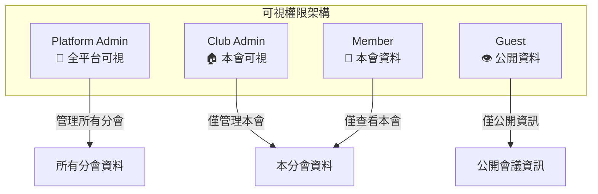
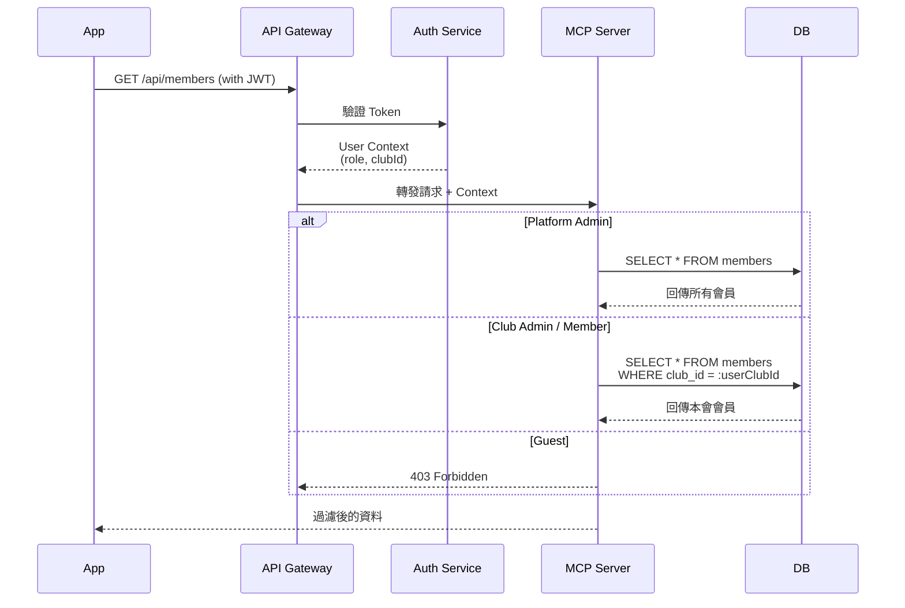

# 3. 角色權限設計

[← 返回目錄](./README.md) | [← 上一章](./02-user-registration.md)

---

## 3.1 權限階級

系統定義了四種權限階級，嚴格控管功能存取：
- **Platform Admin** (平台管理員)
- **Club Admin** (分會管理員)
- **Member** (會員)
- **Guest** (來賓)

## 3.2 資料可視範圍原則

系統採用「分會隔離」原則，確保各分會資料互不可見。

## 3.3 Club Admin 可視權限詳細矩陣

| 資料類型 | 本會資料 | 他會資料 | 說明 |
|:---:|:---:|:---:|:---|
| **會員列表** | ✅ 完整資料 | ❌ 不可見 | 含姓名、Email、狀態、職位 |
| **待審核會員** | ✅ 完整資料 | ❌ 不可見 | 可執行審核操作 |
| **會議列表** | ✅ 完整 | 🔵 僅公開 | 他會僅見已發布的公開會議 |
| **角色報名狀態** | ✅ 含會員姓名 | 🔵 僅統計 | 他會僅見「已報名 X 人」 |
| **Agenda 模板** | ✅ 可編輯 | ❌ 不可見 | 模板屬於各分會私有 |
| **Agenda 文件** | ✅ 可編輯 | 🔵 僅已發布 | 他會僅見最終版 Agenda |
| **分會設定** | ✅ 可編輯 | 🔵 僅基本資訊 | 名稱、聯絡方式等公開資訊 |

## 3.4 API 資料過濾機制

## 3.5 功能權限矩陣

| 功能模組 | 功能項目 | Platform Admin | Club Admin | Member | Guest |
|:---:|:---|:---:|:---:|:---:|:---:|
| **系統管理** | 新增/刪除分會 | ✅ | ❌ | ❌ | ❌ |
| | 指定分會管理員 | ✅ | ❌ | ❌ | ❌ |
| | 維護角色定義 | ✅ | ❌ | ❌ | ❌ |
| **分會管理** | 審核會員註冊 | ✅ | ✅ | ❌ | ❌ |
| | 指派分會職位 (VPE等) | ✅ | ✅ | ❌ | ❌ |
| | 編輯分會資訊 | ✅ | ✅ | ❌ | ❌ |
| **會議管理** | 建立/編輯會議 | ✅ | ✅ | ❌ | ❌ |
| | 產生/匯出 Agenda | ✅ | ✅ | ❌ | ❌ |
| | 管理 Agenda 模板 | ✅ | ✅ | ❌ | ❌ |
| **角色報名** | 報名會議角色 | ✅ | ✅ | ✅ | ❌ |
| | 取消自己角色 | ✅ | ✅ | ✅ | ❌ |
| | 強制移除他人角色 | ✅ | ✅ | ❌ | ❌ |
| | 代理報名他人 | ✅ | ✅ | ❌ | ❌ |
| **資訊瀏覽** | 查看會議議程 | ✅ | ✅ | ✅ | ✅ |
| | 查看分會資訊 | ✅ | ✅ | ✅ | ✅ |

## 3.6 分會職位

分會管理員可將以下職位指派給會員（一職一人），這些職位在 App 中會有特殊標識，且 VPE 擁有產生 Agenda 的權限：

- **President** (會長)
- **VPE** (教育副會長) - *核心操作者*
- **VPM** (會員副會長)
- **VPPR** (公關副會長)
- **Secretary** (秘書)
- **Treasurer** (財務長)
- **SAA** (場控)

---

[下一章：會議管理細部流程 →](./04-meeting-management.md)
