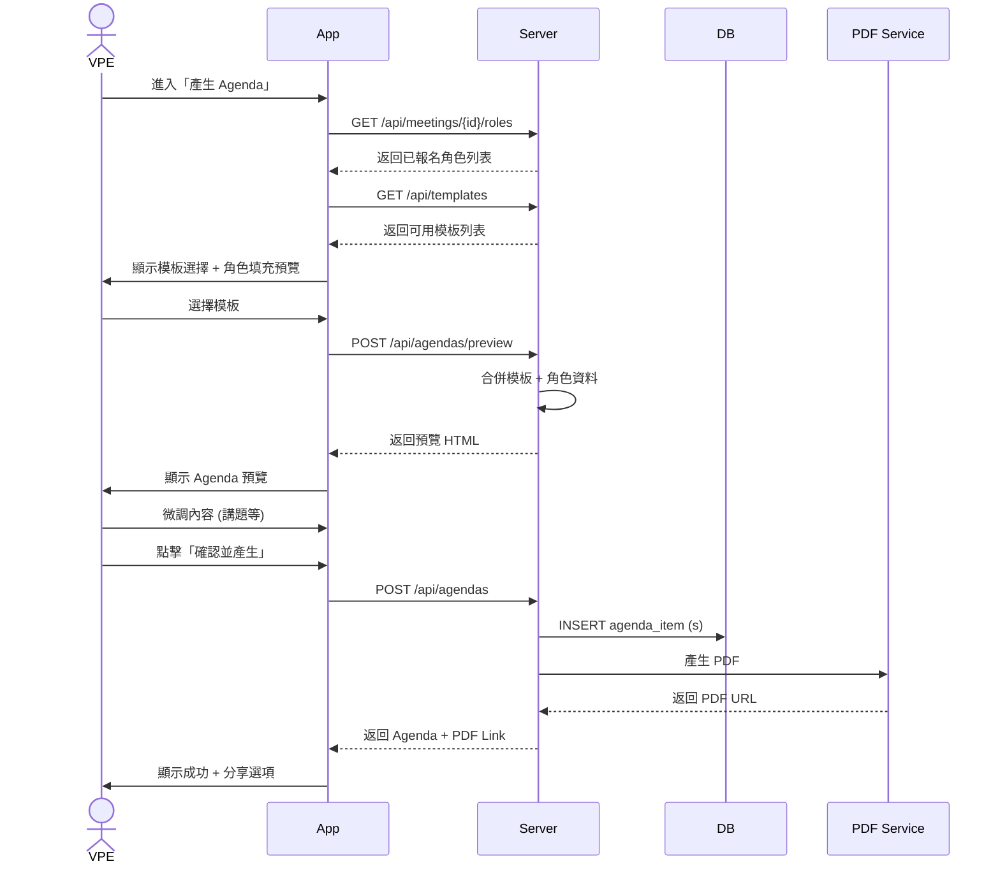
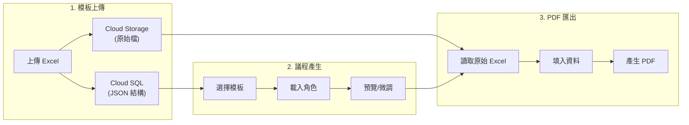

# 6. Agenda 模板管理與產生

[← 返回目錄](./README.md) | [← 上一章](./05-role-registration.md)

---

此功能專為 VPE（教育副會長）設計，用於快速產生標準化的會議議程。

## 6.1 模板管理

**功能流程**:

1. **上傳**: 支援上傳 Excel 格式的議程範本
2. **儲存原始檔**: 將原始 Excel 檔案儲存至 Cloud Storage（保留排版樣式）
3. **解析與編輯**: 後端解析 Excel 結構後，VPE 可在 App 介面上調整時段順序、時間長度與負責職位
4. **儲存結構**: 將解析後的結構儲存為 JSON（用於 UI 編輯與角色對應）

**儲存架構**:

| 資料類型 | 儲存位置 | 用途 |
|:---|:---|:---|
| 原始 Excel 檔 | Cloud Storage | PDF 產生時作為排版模板 |
| 結構 JSON | Cloud SQL | UI 編輯、角色對應 |

## 6.2 模板結構設計

```json
{
  "templateId": "standard-meeting-v1",
  "name": "標準例會",
  "sections": [
    {
      "order": 1,
      "name": "開場",
      "duration": 10,
      "items": [
        { "name": "Sergeant at Arms", "role": "SAA", "duration": 3 },
        { "name": "Opening", "role": "President", "duration": 2 },
        { "name": "TME Welcome", "role": "TME", "duration": 5 }
      ]
    },
    {
      "order": 2,
      "name": "準備演講",
      "duration": 35,
      "items": [
        { "name": "Speaker 1", "role": "Speaker", "duration": 7 },
        { "name": "Speaker 2", "role": "Speaker", "duration": 7 },
        { "name": "Speaker 3", "role": "Speaker", "duration": 7 }
      ]
    }
  ]
}
```

## 6.3 議程產生

**功能流程**:

1. **選擇**: 選擇會議日期與要套用的模板
2. **自動合併**: 系統自動將該次會議「已報名的角色」（如 TME, Speaker 1, Timer）填入模板對應的欄位
3. **微調與發布**: VPE 可手動修改講題、調整臨時變動，確認無誤後匯出 PDF 或產生分享連結

## 6.4 議程產生流程



## 6.5 Agenda 狀態與權限

| 狀態 | VPE 操作 | Club Admin 操作 | 會員可見 |
|:---|:---|:---|:---|
| **DRAFT** | 編輯、刪除、預覽 | 查看、編輯 | ❌ |
| **PUBLISHED** | 小幅修正、發布更新 | 查看、修正 | ✅ 查看 |
| **ARCHIVED** | 查看 | 查看 | ✅ 查看 |

## 6.6 模板與產生流程圖



---

[下一章：會議投票機制 →](./07-voting.md)
