# Toastlabplus 撠?撖虫?閮

> **撠?璁膩**: Flutter App嚗悅撏尿憸?UI + Chat嚗? Google Cloud ?脩垢??

---

## 1. 蝟餌絞?嗆?????

### 1.1 ?嗆?璁膩

?祉頂蝯望?典?敺垢??嗆?嚗誑 Google Cloud Platform ?箸敹蝡臬像?啜€?

**?詨?蝯辣**:
- **Client Side**: 雿輻 Flutter 撱箸?頝典像??App嚗??急?皞?UI ??隞??In-App Chat ?予隞
- **AI Service**: ?? Google Generative AI SDK 撱箸? Chat Backend嚗€? Gemini Developer API嚗?鞎祉?閫??嗉?嗉?閮€?誘銝西矽摨?MCP Server
- **Core Backend**: Spring Boot MCP Server 雿?詨?鞈???嚗????平??頛航?鞈?摨怠???
- **Database**: 雿輻 Cloud SQL (PostgreSQL)嚗憿扳??質????

### 1.2 蝟餌絞?嗆???

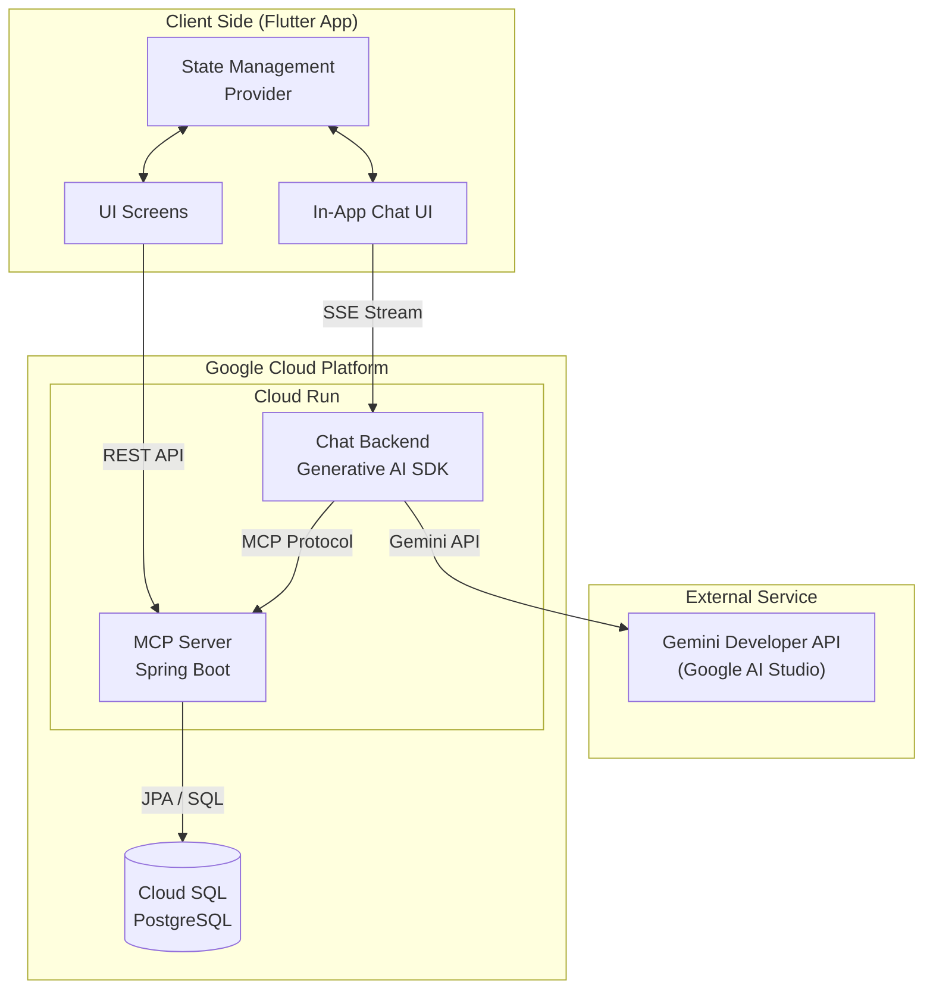

---

## 2. 雿輻?酉??頨怠??豢?

### 2.1 閮餃?瘚?

蝟餌絞?舀憭車頨怠?閮餃?嚗Ⅱ靽????脩?雿輻??脣?撠????????

**閮餃?甇仿?**:

1. **閮餃??亙**: 雿輻??頛?App 敺??舫?€酉?撣唾???

2. **頨怠??豢?**:
   - **Guest (靘?)**: ?拍?潮? Toastmasters ???閫€??
     - ??憛怠神?箸憪???Email
     - 閮餃?敺?汗?祇??降鞈?
     - ?⊥??勗?閫
   
   - **Member (?)**: ?拍?潭迤撘???
     - 閮餃????豢??€撅砍???(Club)
     - ?漱敺?? `PENDING`
     - ?€蝑???蝞∠??∪祟?賊€?敺??賢??典??游??踝?憒???莎?

3. **撟喳蝞∠???*: 蝟餌絞?身銝€蝯?擃??董???冽撱箇?????瘣曉?憪恣?

### 2.2 閮餃?瘚???

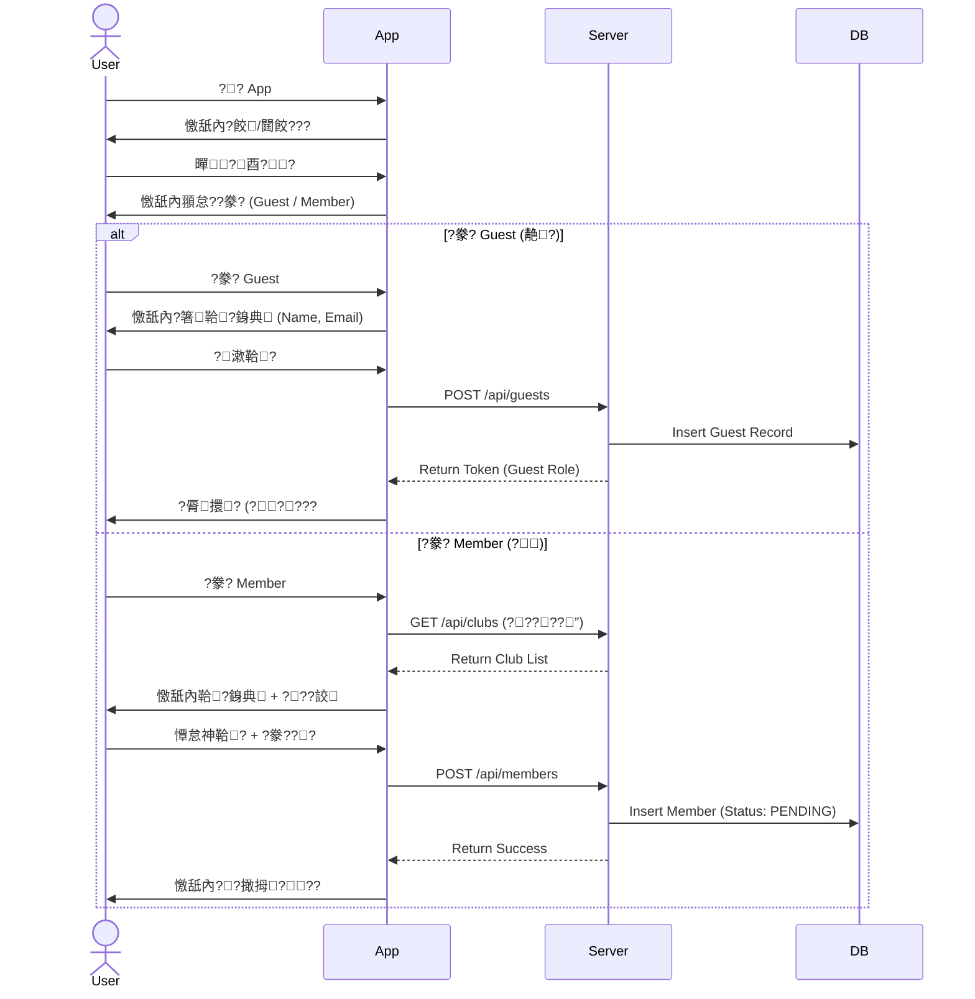

### 2.3 ?撖拇?€??

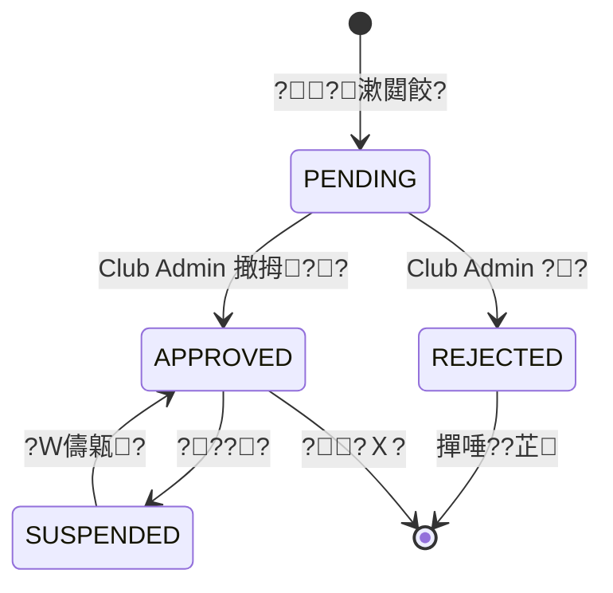

### 2.4 撖拇??瘚?

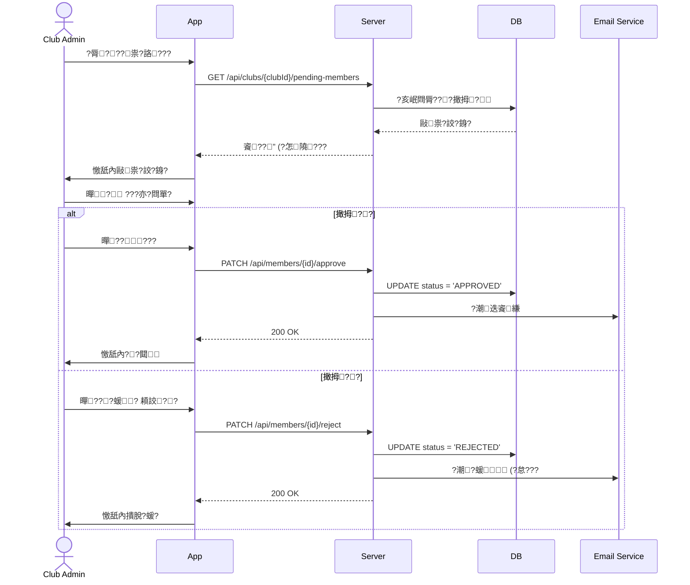

### 2.5 撖拇?璈

| 鈭辣 | ?撠情 | ??孵? | ?批捆 |
|:---|:---|:---|:---|
| ?啁隢?鈭?| Club Admin | App Push + Email | ???唳??∠隢??乓€?|
| 撖拇?? | ?唾???| Email + App ? | 甇∟?靽?+ ?撠汗??? |
| 撖拇?? | ?唾???| Email | ???? + ??唾?撘? |
| 撖拇頞? (7憭拇??) | Club Admin | App Push | ????敺祟?貊隢?|

---

## 3. 閫甈?閮剛?

### 3.1 甈???

蝟餌絞摰儔鈭?蝔格???蝝??湔?抒恣?摮?嚗?
- **Platform Admin** (撟喳蝞∠???
- **Club Admin** (??蝞∠???
- **Member** (?)
- **Guest** (靘?)

### 3.2 鞈??航?蝭???

蝟餌絞?∠?????Ｕ€???蝣箔???????銝閬€?

```mermaid
flowchart TB
    subgraph Visibility ["?航?甈??嗆?"]
        PA["Platform Admin<br/>?? ?典像?啣閬?]
        CA["Club Admin<br/>?? ?祆??航?"]
        MB["Member<br/>? ?祆?鞈?"]
        GT["Guest<br/>??儭??祇?鞈?"]
    end
    
    PA --> |"蝞∠??€????| AllClubs["?€??????]
    CA --> |"?恣???| OwnClub["?砍?????]
    MB --> |"????| OwnClub
    GT --> |"???閮?| PublicInfo["?祇??降鞈?"]
```

### 3.3 Club Admin ?航?甈?閰喟敦?拚

| 鞈?憿? | ?祆?鞈? | 隞?鞈? | 隤芣? |
|:---:|:---:|:---:|:---|
| **??”** | ??摰鞈? | ??銝閬?| ?怠??€mail???€雿?|
| **敺祟?豢???* | ??摰鞈? | ??銝閬?| ?臬銵祟?豢?雿?|
| **?降?”** | ??摰 | ? ???| 隞???撌脩撣??祇??降 |
| **閫?勗??€??* | ???急??∪???| ? ?絞閮?| 隞????歇?勗? X 鈭箝€?|
| **Agenda 璅⊥** | ???舐楊頛?| ??銝閬?| 璅⊥撅祆??????|
| **Agenda ?辣** | ???舐楊頛?| ? ?歇?澆? | 隞????€蝯? Agenda |
| **??閮剖?** | ???舐楊頛?| ? ??祈?閮?| ?迂?蝯⊥撘??祇?鞈? |

### 3.4 API 鞈??蕪璈

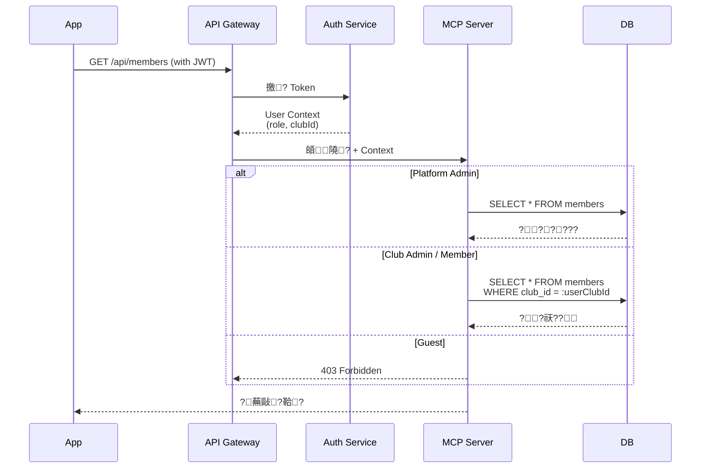

### 3.5 ?甈??拚

| ?璅∠? | ?? | Platform Admin | Club Admin | Member | Guest |
|:---:|:---|:---:|:---:|:---:|:---:|
| **蝟餌絞蝞∠?** | ?啣?/?芷?? | ??| ??| ??| ??|
| | ????蝞∠???| ??| ??| ??| ??|
| | 蝬剛風閫摰儔 | ??| ??| ??| ??|
| **??蝞∠?** | 撖拇?閮餃? | ??| ??| ??| ??|
| | ?晷???瑚? (VPE蝑? | ??| ??| ??| ??|
| | 蝺刻摩??鞈? | ??| ??| ??| ??|
| **?降蝞∠?** | 撱箇?/蝺刻摩?降 | ??| ??| ??| ??|
| | ?Ｙ?/?臬 Agenda | ??| ??| ??| ??|
| | 蝞∠? Agenda 璅⊥ | ??| ??| ??| ??|
| **閫?勗?** | ?勗??降閫 | ??| ??| ??| ??|
| | ???芸楛閫 | ??| ??| ??| ??|
| | 撘瑕蝘駁隞犖閫 | ??| ??| ??| ??|
| | 隞???勗?隞犖 | ??| ??| ??| ??|
| **鞈??汗** | ?亦??降霅啁? | ??| ??| ??| ??|
| | ?亦???鞈? | ??| ??| ??| ??|

### 3.6 ???瑚?

??蝞∠??∪撠誑銝雿?瘣曄策?嚗??瑚?鈭綽?嚗€??瑚???App 銝剜??畾?霅?銝?VPE ???Ｙ? Agenda ????

- **President** (?)
- **VPE** (??舀??? - *?詨?????
- **VPM** (??舀???
- **VPPR** (?祇??舀???
- **Secretary** (蝘)
- **Treasurer** (鞎∪???
- **SAA** (?湔)

---

## 4. ?降蝞∠?蝝圈瘚?

### 4.1 ?降??望?

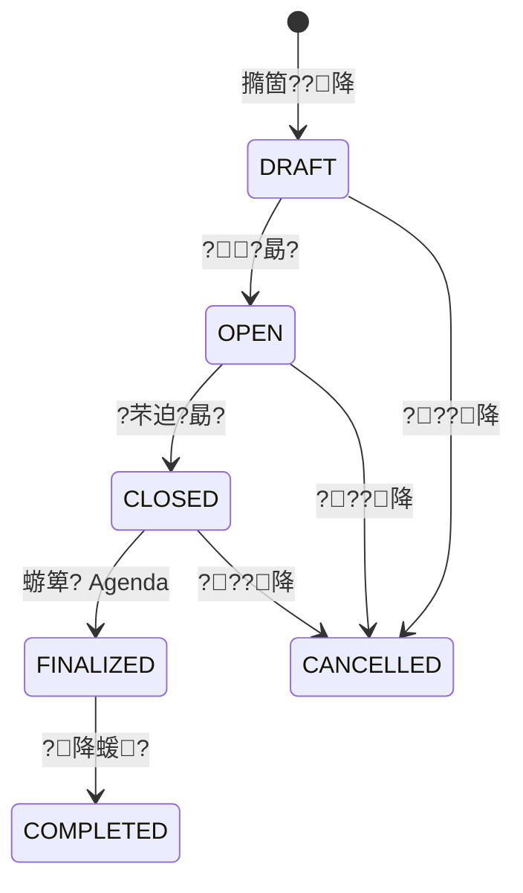

### 4.2 ?降撱箇?瘚?

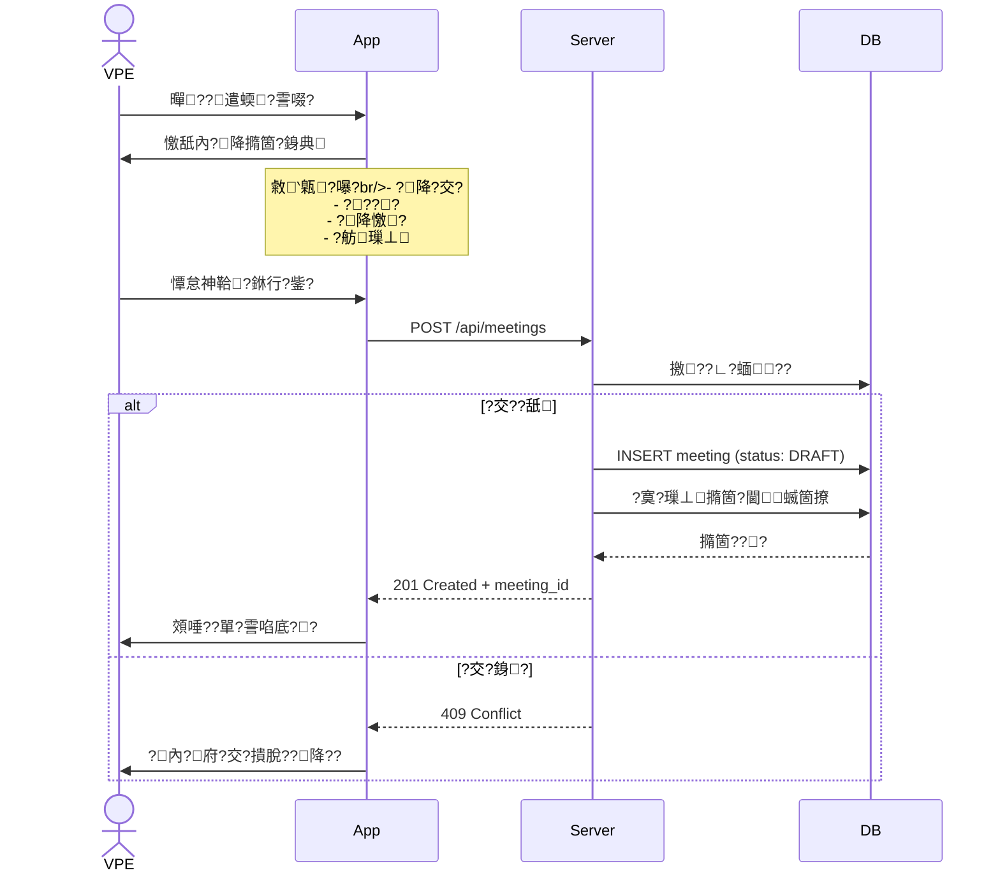

### 4.3 ?降蝺刻摩甈?

| ?? | DRAFT | OPEN | CLOSED | FINALIZED |
|:---|:---:|:---:|:---:|:---:|
| 靽格?交?/?? | ??| ?? ?€? | ??| ??|
| 靽格?降憿? | ??| ??| ??| ??|
| 憓?閫 | ??| ??| ?? ?€蝣箄? | ??|
| ??勗? | ??| - | - | - |
| ?芣迫?勗? | - | ??| - | - |
| ?Ｙ? Agenda | - | - | ??| ??(敺株矽) |
| ???降 | ??| ???€? | ???€蝣箄? | ??|

---

## 5. ?降閫閮餃?瘚?

???hat 撠店???I 隞?蝔格?雿撘?鞈??單??郊??

### 5.1 閫憿?????

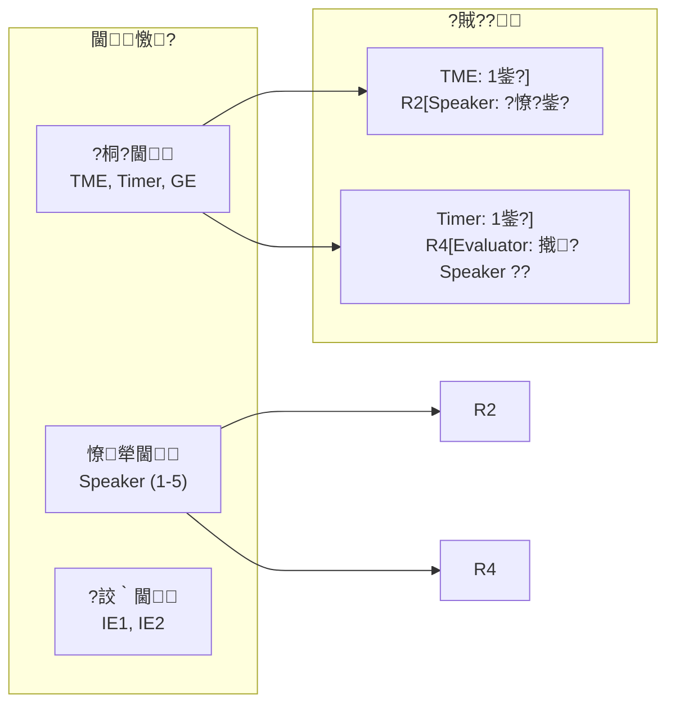

### 5.2 Chat 撠店撘酉??

???芰隤???AI 鈭??I ??瑼Ｘ閫蝛箇撩?€???交?蝛箇撩?＊蝷箔?????嚗utton嚗??冽蝣箄?嚗?炊????

**??寥?**:
- **?誘蝭?**: ??閬???曹???Timer?€€?瘨???TME 閫??
- **?脣?璈**: ?亥??脣歇皛選?AI ?遣霅啣隞征蝻箄??脫???

**撠店瘚???*:

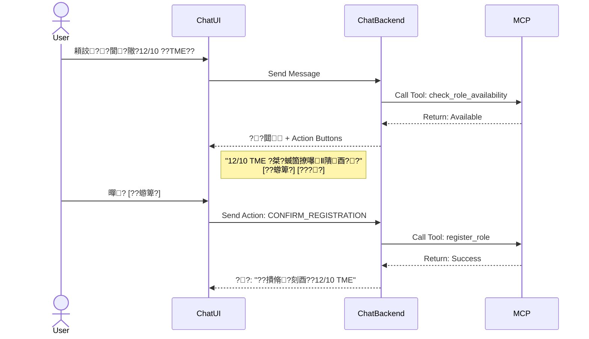

### 5.3 UI 隞閮餃?

閬死??閫?”嚗?靘閬箇???擃???

**??寥?**:
- **?€?＊蝷?*: 瘥€??脣??憿舐內?征蝻綽??臬???€€歇憿遛嚗＊蝷粹?????歇?勗?嚗＊蝷箏?瘨?????
- **??瘚?**: 暺?蝛箇撩?∠? ??敶蝣箄?蝒???摰??勗?

**??瘚???*:

```mermaid
flowchart TD
    A["?脣?降?”"] --> B["?豢??格??降"]
    B --> C["?脣閫?勗???]
    C --> D{"瑼Ｘ閫?€??}
    
    D -->|"蝛箇撩"| E["憿舐內??€???]
    D -->|"撌脤?皛?| F["憿舐內雿???]
    D -->|"?芸楛撌脣??| G["憿舐內??瘨€???]
    
    E --> H["暺??勗?"]
    H --> I["敶蝣箄?閬?"]
    I -->|"蝣箄?"| J["?澆 API 閮餃?"]
    J --> K["?湔 UI 憿舐內?芸楛?剖?"]
    
    G --> L["暺???"]
    L --> M["?澆 API ??"]
    M --> N["?湔 UI 憿舐內蝛箇撩"]
```

### 5.4 閫?勗??脣?瘚?

```mermaid
flowchart TD
    Start["?冽暺??勗?"] --> CheckAuth{"瑼Ｘ頨怠?"}
    
    CheckAuth -->|"Guest"| Deny1["????嚗????箸???]
    CheckAuth -->|"Member (PENDING)"| Deny2["????嚗董?祟?訾葉"]
    CheckAuth -->|"Member (APPROVED)"| CheckRole{"瑼Ｘ閫?€??}
    
    CheckRole -->|"閫撌脫遛"| Deny3["????嚗??脣歇鋡怠??]
    CheckRole -->|"撌脣?隞???| CheckConflict{"銵?瑼Ｘ"}
    CheckRole -->|"閫蝛箇撩"| Confirm["憿舐內蝣箄?撠店獢?]
    
    CheckConflict -->|"??畾菔?蝒?| Deny4["????嚗?撌脣???脰?蝒?]
    CheckConflict -->|"?∟?蝒?| Confirm
    
    Confirm -->|"蝣箄?"| Register["?瑁??勗?"]
    Confirm -->|"??"| End["蝯?"]
    
    Register --> Success["???勗???"]
```

### 5.5 閫銵?閬?

| 閫 A | ?臬隞?| 銝?潔遙 |
|:---|:---|:---|
| **TME** | - | Speaker, GE, Timer, Evaluator |
| **Speaker** | IE (???? | TME, Evaluator (??鈭? |
| **Timer** | AH Counter, Grammarian | TME |
| **GE** | - | TME, Speaker, Evaluator |
| **Evaluator** | Timer, AH Counter | TME, GE, 撠? Speaker |

### 5.6 蝞∠??∩誨???

Club Admin ?臭誨?踵??∪?????勗?嚗?

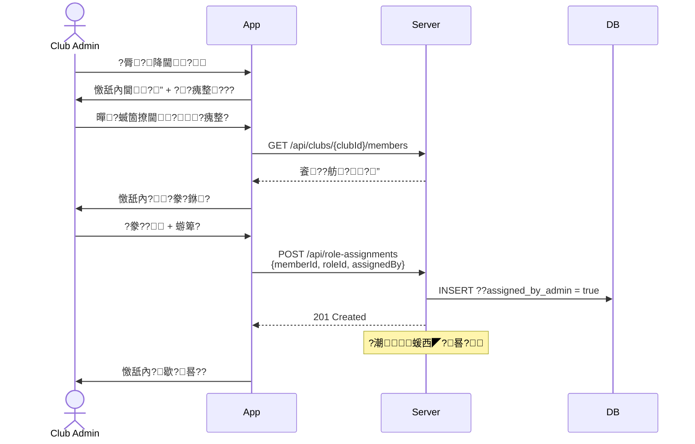

---

## 6. Agenda 璅⊥蝞∠????

甇文??賢???VPE嚗??脣?嚗身閮??冽敹恍€??皞???霅啗降蝔€?

### 6.1 璅⊥蝞∠?

**?瘚?**:

1. **銝**: ?舀銝 Excel ?澆??降蝔???
2. **閫???楊頛?*: 敺垢閫?? Excel 敺?VPE ?臬 App 隞銝矽?湔?畾菟?摨€??摨西?鞎痊?瑚?
3. **?脣?**: 撠矽?游末??瑽摮??皞??€€€?鞈賬€€€?交暑?€?銝?璅⊥

### 6.2 璅⊥蝯?閮剛?

```json
{
  "templateId": "standard-meeting-v1",
  "name": "璅?靘?",
  "sections": [
    {
      "order": 1,
      "name": "?",
      "duration": 10,
      "items": [
        { "name": "Sergeant at Arms", "role": "SAA", "duration": 3 },
        { "name": "Opening", "role": "President", "duration": 2 },
        { "name": "TME Welcome", "role": "TME", "duration": 5 }
      ]
    },
    {
      "order": 2,
      "name": "皞?瞍?",
      "duration": 35,
      "items": [
        { "name": "Speaker 1", "role": "Speaker", "duration": 7 },
        { "name": "Speaker 2", "role": "Speaker", "duration": 7 },
        { "name": "Speaker 3", "role": "Speaker", "duration": 7 }
      ]
    }
  ]
}
```

### 6.3 霅啁??Ｙ?

**?瘚?**:

1. **?豢?**: ?豢??降?交???憟?芋??
2. **?芸??蔥**: 蝟餌絞?芸?撠府甈⊥?霅啜€歇?勗????脯€?憒?TME, Speaker 1, Timer嚗‵?交芋?踹???甈?
3. **敺株矽?撣?*: VPE ?舀??耨?寡?憿€矽?渲????蝣箄??∟炊敺??PDF ???鈭恍€??

### 6.4 霅啁??Ｙ?瘚?

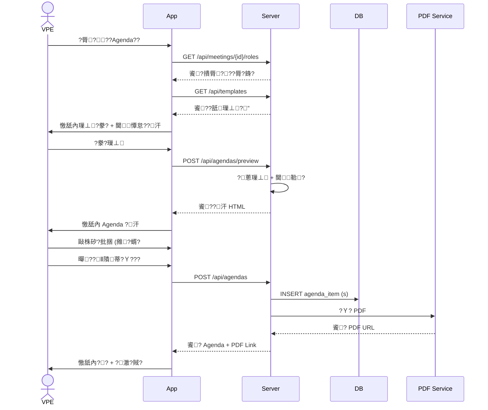

### 6.5 Agenda ?€??甈?

| ?€??| VPE ?? | Club Admin ?? | ??航? |
|:---|:---|:---|:---|
| **DRAFT** | 蝺刻摩??扎€?閬?| ?亦??楊頛?| ??|
| **PUBLISHED** | 撠?靽格迤?撣??| ?亦??耨甇?| ???亦? |
| **ARCHIVED** | ?亦? | ?亦? | ???亦? |

### 6.6 璅⊥???蝔?

```mermaid
flowchart TD
    subgraph TemplateMgmt ["璅⊥蝞∠? (Template Management)"]
        Upload["銝 Excel 蝭"] --> Parse["敺垢閫??蝯?"]
        Parse --> Edit["UI 蝺刻摩隞<br/>隤踵?挾/??/?"]
        Edit --> Save["?脣??箸芋??]
        Save --> DB_Template[("?脣??唾??澈")]
    end
    
    subgraph AgendaGen ["霅啁??Ｙ? (Agenda Generation)"]